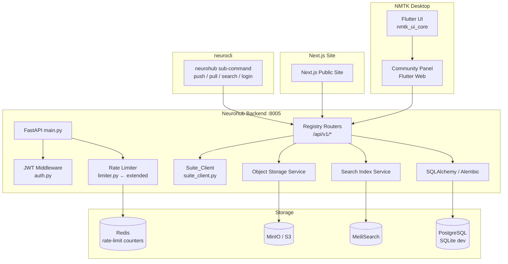
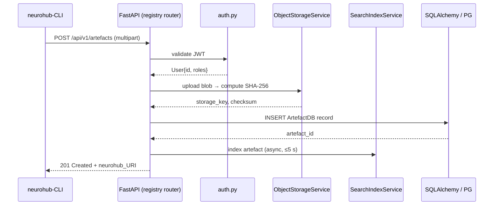

# Design Document — Neurohub Global Registry

## Overview

The Neurohub Global Registry evolves the existing `Neurohub` module from a local metadata service
into a production-grade, publicly-hostable community registry for the neuromorphic AI ecosystem.
It introduces three tightly-coupled workstreams that each live within their respective ownership
boundaries:

1. **Registry Backend** — a scalable FastAPI service extending the existing Neurohub backend with
   artefact CRUD, semantic versioning, S3-compatible object storage, MeiliSearch full-text search,
   JWT authentication, rate limiting, structured observability, and Docker-based production
   deployment.
2. **Community Portal** — a Flutter Web in-app discovery panel (primary NMTK integration surface)
   and a companion Next.js public-facing site for artefact discovery, model cards,
   ratings/comments/follows, and Share-to-Neurohub UI integration.
3. **neurohub-CLI** — a `neurohub` sub-command group inside `neurocli` providing `push`, `pull`,
   `search`, and `login` commands using `neurohub://` URIs, reading module configuration from
   `nmtk/neuro_toolkit/assets/modules.json`.

### Ownership Boundaries (unchanged)

| Concern | Owner |
|---|---|
| Artefact metadata, community interactions, sharing surfaces | **Neurohub** |
| Suite lifecycle, workspace hosting, runtime health | **nmtk** |
| CLI scaffolding, launcher manifest semantics | **neurocli** |
| All outbound HTTP from Neurohub | **`suite_client.py`** |


---

## Architecture

### High-Level Component Diagram



### Request Flow — Artefact Push (CLI → Backend)




---

## Components and Interfaces

### Workstream 1 — Registry Backend

#### 1.1 URI Parser (`neurohub/app/utils/uri_parser.py`)

A standalone pure-function module with no I/O dependencies.

```python
@dataclass(frozen=True)
class NeurohubURI:
    scheme: str           # always "neurohub"
    type: ArtefactType    # one of the seven canonical keys
    owner: str            # "{username}" or "{org}/{username}"
    slug: str
    version: str | None   # None when absent; semver when present

class URIParseError(ValueError): ...

def parse_uri(uri: str) -> NeurohubURI: ...
def build_uri(parsed: NeurohubURI) -> str: ...
```

`parse_uri` raises `URIParseError` for: wrong scheme prefix, structurally invalid segment count,
missing type/slug, invalid semver in `@version` position.  
`build_uri(parse_uri(s)) == s` is a hard invariant (round-trip, Requirement 16.2).  
`parse_uri(parse_uri(s)) == parse_uri(s)` is the idempotence invariant (Requirement 16.3).

#### 1.2 Pydantic v2 Contracts (`neurohub/contracts/registry_contracts.py`)

New contract file following the existing pattern in `neurohub/contracts/`.

```python
class ArtefactType(str, Enum):
    cnl_template = "cnl_template"
    cnlspace = "cnlspace"
    snn_model = "snn_model"
    dataset = "dataset"
    hardware_profile = "hardware_profile"
    encoding_preset = "encoding_preset"
    benchmark_baseline = "benchmark_baseline"

class ModelCard(BaseModel):
    architecture: str | None = None
    training_framework: str | None = None
    training_dataset: str | None = None
    hardware_targets: list[str] = []
    neurobench_scores: list[NeuroBenchScore] = []
    licence: str | None = None
    ethical_considerations: str | None = None
    readme_md: str | None = Field(None, max_length=65535)

class ArtefactCreate(BaseModel): ...    # POST body
class ArtefactResponse(BaseModel): ...  # full response including pre-signed URL
class ArtefactListItem(BaseModel): ...  # card-grid projection
class RatingCreate(BaseModel):
    value: int = Field(..., ge=1, le=5)
class CommentCreate(BaseModel):
    content: str = Field(..., min_length=1, max_length=4000)
class SearchResponse(BaseModel):
    items: list[ArtefactListItem]
    total: int
    page: int
    page_size: int
    next_cursor: str | None
    search_degraded: bool = False
```


#### 1.3 Registry Routers (`neurohub/app/routers/`)

New router files added alongside the existing ones and registered in `main.py` under
`/api/v1` prefix (distinct from the existing `/api/neurohub` prefix to signal the public
registry surface):

| Router file | Prefix | Purpose |
|---|---|---|
| `registry_artefacts.py` | `/api/v1/artefacts` | CRUD, versioning, download URL |
| `registry_search.py` | `/api/v1/search` | Full-text + filter search |
| `registry_auth.py` | `/api/v1/auth` | register / login / refresh |
| `registry_community.py` | `/api/v1/artefacts/{owner}/{slug}` | ratings, comments, follows |
| `registry_health.py` | `/api/v1/health` | structured health check |

All mutating endpoints require `Depends(get_current_user)`.  
Rate-limiting decorators use the extended `limiter` instance (§1.5).

#### 1.4 Services

**`ObjectStorageService` (`neurohub/app/services/object_storage.py`)**  
Wraps `aioboto3` / `boto3` for S3-compatible backends (MinIO in dev, AWS S3 in cloud).  
Key responsibilities: presigned-URL generation, SHA-256 computation at upload, checksum
verification at download, 5 GB size guard, multipart upload orchestration for blobs ≥ 100 MB.  
Raises `StorageUnavailableError` (→ HTTP 503) if the endpoint is unreachable.

**`SearchIndexService` (`neurohub/app/services/search_index.py`)**  
Wraps the MeiliSearch Python client.  
Indexed fields per artefact: `name`, `description`, `tags`, `readme`, `owner`, `type`.  
Synchronisation is fire-and-forget with a retry within 30 s on failure; a failure does NOT block
the artefact write. `search_degraded` flag is set in response when the index is unavailable.  
Falls back to SQLAlchemy `ILIKE` queries on `name` + `description` when MeiliSearch is
unreachable at query time (Requirement 4.7).

**`RegistryAuthService` (`neurohub/app/services/registry_auth_service.py`)**  
Extends `auth_service.py` patterns with:
- bcrypt password hashing (already present in existing `passlib` dependency)
- JWT issue/verify/refresh using `python-jose`; expiry from `JWT_EXPIRY_HOURS` env var
- Refresh token persistence in the Redis-compatible store (`CACHE_URL`)

**`ActivityFeedService` (`neurohub/app/services/activity_feed.py`)**  
Writes follow/new-artefact activity entries within 10 s via a background task.  
Stores entries in `RegistryActivityEntryDB` (separate table from existing `activity_entries`).

#### 1.5 Rate Limiter Extension (`neurohub/app/limiter.py`)

The existing `limiter` instance is extended with per-endpoint keys:

| Endpoint scope | Limit | Key function |
|---|---|---|
| Unauthenticated (`/api/v1/*`) | 60 req / 60 s | IP (`get_remote_address`) |
| Authenticated (`/api/v1/*`) | 300 req / 60 s | `user_id` from JWT |
| `POST /api/v1/auth/login` | 10 req / 60 s | IP |

Counter storage backend is the Redis-compatible store at `CACHE_URL`.  
If a counter fails to persist it is treated as zero (allow) and logged at WARN level
(Requirement 8.6).  
Every rate-enforced response includes `X-RateLimit-Limit`, `X-RateLimit-Remaining`,
`X-RateLimit-Reset` headers (Requirement 8.5).


### Workstream 2 — Community Portal

#### 2.1 Flutter Web In-App Panel

New screens added alongside existing Neurohub screens in `frontend/lib/screens/`:

| Screen | Purpose |
|---|---|
| `RegistryDiscoveryScreen` | Paginated card grid (default 20/page), search bar, type filter |
| `ArtefactDetailScreen` | Full detail view: model card, neurobench scores table, comments, rating |
| `ShareToNeurohubSheet` | Bottom sheet / dialog for slug + version + description prompt |

New widgets in `frontend/lib/widgets/`:
- `ArtefactCard` — displays name, type badge, owner, version, avg rating, download count
- `TypeBadge` — seven canonical badges + neutral "unknown" badge (Requirement 11.7)
- `ModelCardView` — renders model card fields; `neurobench_scores` as a sortable `DataTable`;
  "Ethical Considerations" section heading always rendered when the field is present
- `SearchDegradedBanner` — non-blocking info banner shown when `search_degraded: true`
  (Requirement 11.8)
- `ImportProgressIndicator` — wraps CLI pull operation with 120 s timeout (Requirement 11.6)

Shell integration:
- `NeurohubShellSection.registry` (already kept for backward compatibility) activates this panel
- Passes `mode: NmtkShellMode.command` to `NmtkDesktopScaffold` per existing shell conventions
- Uses `NmtkShellTokens` semantic colour palette for all status indicators (Requirement 11.4)

Responsive layout (Requirement 11.3):
- `≥ 1440 px` → two-column card grid
- `< 768 px` → single-column

`ProjectLinks.registryRefs` field added to the existing `ProjectLinks` contract in
`neurohub/contracts/project_contracts.py` to hold imported `neurohub://` URIs
(Requirement 11.5).

#### 2.2 Next.js Public-Facing Site (`Neurohub/frontend-nextjs/`)

A separate Next.js 14 (App Router) project co-located under `Neurohub/frontend-nextjs/`.

Key pages:

| Route | Purpose |
|---|---|
| `/` | Landing + search hero |
| `/artefacts` | Paginated discovery feed (SSR + client search) |
| `/artefacts/[type]/[owner]/[slug]` | Artefact detail + model card |
| `/artefacts/[type]/[owner]/[slug]/versions` | Version history |
| `/u/[username]` | Publisher profile |

The Next.js site is a thin consumer of the Registry REST API — it holds no business logic.
Search debouncing: 300 ms inactivity before issuing request (Requirement 4.6).
Served as a separate Docker container from the existing `neurohub-frontend` service.


### Workstream 3 — neurohub-CLI

The CLI lives in `neurocli/` as the `neurohub` sub-command group.  
`neurocli` is currently planning-only (per `neurocli/AGENTS.md`), so this workstream
creates the initial package structure together with commands and tests.

Package layout:

```
neurocli/
├── neurohub_cli/
│   ├── __init__.py
│   ├── __main__.py        # entry point: python -m neurohub_cli
│   ├── commands/
│   │   ├── login.py       # neurohub login --registry <url>
│   │   ├── push.py        # neurohub push <file> ...
│   │   ├── pull.py        # neurohub pull <neurohub_URI> ...
│   │   └── search.py      # neurohub search <query> ...
│   ├── uri_parser.py      # shared with backend via importable package (or copy)
│   ├── credentials.py     # OS keyring / file-based credential store
│   └── http_client.py     # thin httpx wrapper
├── tests/
│   └── properties/
│       └── test_uri_properties.py
└── pyproject.toml
```

**CLI commands:**

`neurohub login --registry <url>` — prompts for username + password, obtains JWT, persists
endpoint URL + token in OS credential store via `keyring` library, falling back to
`~/.config/neurohub/credentials.json`.

`neurohub push <file> --type <type> --slug <slug> --version <version>
[--description <desc>] [--tag <tag>]...` — validates type (exits 1 on invalid),
validates slug format, caps description at 1000 chars, accepts up to 20 `--tag` flags,
uploads file, registers metadata; prints canonical URI to stdout on success (exit 0);
exit 1 on user error (HTTP 409/422/401/403); exit 2 on infrastructure error (HTTP 5xx, network).

`neurohub pull <neurohub_URI> [--output <path>]` — resolves URI, downloads blob, verifies
SHA-256 checksum; on mismatch: deletes file, prints error to stderr, exits non-zero.
Default output filename: `{slug}@{version}.{ext}` where `{ext}` is derived from artefact type's
canonical extension.

`neurohub search <query> [--type <type>] [--hardware <target>] [--limit <n>]` — issues
`GET /api/v1/search`; prints formatted table (columns: name, type, owner, version, rating);
default limit 20, max 100.

The CLI reads module identifiers from `nmtk/neuro_toolkit/assets/modules.json` and must not
introduce a separate endpoint catalog (Requirement 13.7).

Exit codes: 0 = success, 1 = user error, 2 = infrastructure error (Requirement 13.8).


---

## Data Models

### New SQLAlchemy Models (`neurohub/db/models.py` additions)

```python
class ArtefactDB(Base):
    __tablename__ = "registry_artefacts"
    id: Mapped[str]          # UUID v4
    type: Mapped[str]        # ArtefactType enum value
    owner: Mapped[str]       # "{username}" or "{org}/{username}"
    slug: Mapped[str]
    version: Mapped[str]     # semver string
    description: Mapped[str | None]
    tags: Mapped[list[str]]  # JSON
    readme: Mapped[str | None]   # Text
    sha256: Mapped[str]
    storage_key: Mapped[str]     # Object_Storage key
    file_size_bytes: Mapped[int]
    download_count: Mapped[int]  = 0
    average_rating: Mapped[float] = 0.0
    rating_count: Mapped[int]    = 0
    model_card: Mapped[dict | None]  # JSON, only for snn_model
    created_at: Mapped[str]      # UTC ISO 8601
    updated_at: Mapped[str]
    deleted_at: Mapped[str | None]  # soft-delete timestamp; None = active
    # Unique constraint: (owner, slug, version)

class RatingDB(Base):
    __tablename__ = "registry_ratings"
    id: Mapped[str]
    artefact_id: Mapped[str]   # FK → registry_artefacts.id
    user_id: Mapped[str]
    value: Mapped[int]         # 1-5
    created_at: Mapped[str]
    # Unique constraint: (artefact_id, user_id)

class CommentDB(Base):
    __tablename__ = "registry_comments"
    id: Mapped[str]
    artefact_id: Mapped[str]   # FK → registry_artefacts.id
    author_id: Mapped[str]
    content: Mapped[str]       # Text, max 4000 chars enforced at API layer
    created_at: Mapped[str]    # UTC ISO 8601

class FollowDB(Base):
    __tablename__ = "registry_follows"
    id: Mapped[str]
    follower_id: Mapped[str]
    followed_user_id: Mapped[str]
    created_at: Mapped[str]
    # Unique constraint: (follower_id, followed_user_id)
    # Check constraint: follower_id != followed_user_id

class RegistryActivityEntryDB(Base):
    __tablename__ = "registry_activity"
    id: Mapped[str]
    follower_id: Mapped[str]
    followed_user_id: Mapped[str]
    artefact_id: Mapped[str]
    event_type: Mapped[str]    # e.g. "new_artefact"
    created_at: Mapped[str]
```

All new models are added via a single Alembic migration file.  
Every schema change goes through `neurohub/db/migrations/` — no bare `create_all()` calls.

### Object Storage Key Pattern

```
{artefact_type}/{owner}/{slug}/{version}/{original_filename}
```

Example: `snn_model/yoshilab/lif-base/1.0.0/lif_base_1.0.0.nir`


---

## Correctness Properties

*A property is a characteristic or behavior that should hold true across all valid executions of a
system — essentially, a formal statement about what the system should do. Properties serve as the
bridge between human-readable specifications and machine-verifiable correctness guarantees.*

**Property reflection before writing:** After prework analysis, the following consolidations were
applied:

- Requirements 1.8, 9.2, 9.3 all test SHA-256 blob integrity at different points in the
  lifecycle. They combine into one comprehensive checksum round-trip property.
- Requirements 1.9, 6.10, 7.6 all test ownership-based access control. They combine into one
  non-owner authorization property.
- Requirements 16.2 and 2.7 both state URI round-trip correctness. Requirement 16.2 is the
  canonical statement; 2.7 maps to it.
- Requirements 1.5 (409 on duplicate) and 1.7 (422 on invalid type) are distinct error conditions
  of 2.1 (identifier validation); kept as distinct properties because they cover different
  validation axes.
- Rating aggregation properties (6.1 and 6.2) are combined into one aggregate invariant property.
- Properties 7.5 and 7.7 (unauthenticated → 401) cover the same guard from different angles and
  are merged into one authentication enforcement property.

---

### Property 1: Artefact creation round-trip

*For any* valid artefact payload with a unique `{owner}/{slug}@{version}` identifier, creating the
artefact and then retrieving it by the same identifier SHALL return metadata fields identical to
those submitted.

**Validates: Requirements 1.1, 1.2**

---

### Property 2: Immutable field preservation under update

*For any* existing artefact and any update payload that modifies mutable fields (`description`,
`tags`, `readme`), the updated artefact's immutable fields (`type`, `owner`, `slug`, `version`,
`sha256`, `created_at`) SHALL remain byte-for-byte identical to their values before the update.

**Validates: Requirements 1.3**

---

### Property 3: Soft-delete visibility invariant

*For any* artefact that has been soft-deleted, every subsequent `GET` request for that artefact's
`{owner}/{slug}@{version}` SHALL return HTTP 404, and the artefact SHALL NOT appear in any search
result page.

**Validates: Requirements 1.4, 1.6**

---

### Property 4: Blob checksum integrity round-trip

*For any* artefact blob uploaded to Object Storage, the SHA-256 checksum computed from the raw
uploaded bytes SHALL equal the checksum persisted in the database, and the download endpoint SHALL
only serve a pre-signed URL when those two values match.

**Validates: Requirements 1.8, 9.2, 9.3**

---

### Property 5: Non-owner modification forbidden

*For any* artefact owned by user A and any authenticated user B where B ≠ A and B does not hold
the admin role, any update or delete request from B SHALL return HTTP 403 and the artefact record
SHALL remain unchanged.

**Validates: Requirements 1.9, 6.10, 7.6**

---

### Property 6: Identifier format validation

*For any* artefact creation or update request, if the `owner`, `slug`, or `version` field
violates its format constraint (owner/slug: 1–64 lowercase alphanumeric + hyphens starting with
alphanumeric; version: MAJOR.MINOR.PATCH), the Registry SHALL return HTTP 422 with a validation
error identifying the offending field and constraint.

**Validates: Requirements 2.1, 2.6**

---

### Property 7: Latest-version resolution

*For any* set of artefact versions registered under `{owner}/{slug}`, a request for
`{owner}/{slug}` without an explicit version SHALL resolve to the version that is the semantic
maximum of all non-prerelease versions in that set.

**Validates: Requirements 2.2**

---

### Property 8: Version list descending order

*For any* artefact with N registered versions, `GET /api/v1/artefacts/{owner}/{slug}/versions`
SHALL return all N versions in strictly descending semantic order such that `versions[i] >
versions[i+1]` for all `i`.

**Validates: Requirements 2.4**

---

### Property 9: URI round-trip

*For any* conformant `neurohub://` URI string, parsing the URI into its component fields and then
reconstructing the URI string from those fields SHALL produce a string byte-for-byte identical to
the original input.

**Validates: Requirements 2.7, 16.2**

---

### Property 10: URI parse idempotence

*For any* conformant `neurohub://` URI string, parsing the URI twice in succession SHALL produce
component fields identical to parsing it once.

**Validates: Requirements 16.3**

---

### Property 11: URI parse error — wrong scheme

*For any* string whose scheme prefix is not `neurohub://`, `parse_uri` SHALL raise a
`URIParseError` whose message contains the actual received scheme prefix.

**Validates: Requirements 16.4**

---

### Property 12: URI parse error — invalid semver in @version

*For any* string that is a structurally valid `neurohub://` URI except that its `@version`
segment does not conform to MAJOR.MINOR.PATCH, `parse_uri` SHALL raise a `URIParseError` whose
message identifies the invalid version value. A URI with no `@version` segment SHALL NOT raise a
`URIParseError`.

**Validates: Requirements 16.5**

---

### Property 13: URI parse error — missing required fields

*For any* string that begins with `neurohub://` but is missing the type or slug field, or has an
invalid segment count, `parse_uri` SHALL raise a `URIParseError` identifying the missing or
malformed field.

**Validates: Requirements 16.7**

---

### Property 14: CLI–backend URI parse equivalence

*For any* `neurohub://` URI string, the CLI `uri_parser` module and the backend `uri_parser`
module SHALL produce identical component field values for valid inputs, and SHALL raise an
equivalent error type for the same class of invalid input.

**Validates: Requirements 16.6**

---

### Property 15: Search result filter consistency

*For any* search request with one or more filter parameters (`type`, `hardware_target`,
`neuron_model`, `owner`), every artefact returned in the result list SHALL satisfy all specified
filters as case-insensitive exact matches. When multiple `tags` values are specified, every
returned artefact SHALL match at least one of the specified tags.

**Validates: Requirements 4.2, 4.8**

---

### Property 16: Search pagination invariant

*For any* search query that returns `total` matching artefacts split across pages of size
`page_size`, the sum of items across all pages SHALL equal `total`, the last page SHALL have
`next_cursor: null`, and no artefact SHALL appear more than once across all pages.

**Validates: Requirements 4.2**

---

### Property 17: Comment content round-trip

*For any* comment whose `content` is a non-empty string of length 1–4000 characters, posting the
comment and then retrieving it SHALL return a `content` field byte-for-byte identical to the
submitted string, preserving all Unicode code points.

**Validates: Requirements 6.3**

---

### Property 18: Comment length boundary enforcement

*For any* string of length 0 or length > 4000 characters, a comment POST SHALL return HTTP 422
and no comment record SHALL be persisted. For any string of length 1–4000, the POST SHALL
succeed.

**Validates: Requirements 6.4**

---

### Property 19: Comments returned in descending order

*For any* artefact with N comments, `GET /api/v1/artefacts/{owner}/{slug}/comments` SHALL return
comments in strictly descending `created_at` order such that `comments[i].created_at ≥
comments[i+1].created_at` for all `i`.

**Validates: Requirements 6.5**

---

### Property 20: Rating aggregate invariant

*For any* sequence of ratings submitted to an artefact by a set of distinct users, the artefact's
`average_rating` SHALL equal `round(sum(latest_rating_per_user) / count(distinct_raters), 2)` and
`rating_count` SHALL equal the count of distinct raters. When a user re-submits a rating, only
their most recent rating is included in the aggregate.

**Validates: Requirements 6.1, 6.2**

---

### Property 21: Authentication enforcement on mutating endpoints

*For any* mutating endpoint (POST, PUT, PATCH, DELETE under `/api/v1/`) and any request that
either presents no Bearer token, presents an expired JWT, presents a JWT with a missing required
claim, or presents a JWT with an invalid signature, the Registry SHALL return HTTP 401 with a
`WWW-Authenticate: Bearer` header and SHALL NOT execute the mutation.

**Validates: Requirements 7.5, 7.7**

---

### Property 22: JWT claims completeness

*For any* successful login, the issued JWT SHALL decode to a payload containing `user_id`,
`username`, `roles`, and `exp` claims, where `exp` equals the issue time plus `JWT_EXPIRY_HOURS`
(in seconds), within a tolerance of ±5 seconds.

**Validates: Requirements 7.1**

---

### Property 23: Password storage safety

*For any* registration request with any password string, the stored credential record SHALL NOT
contain the plaintext password, and `bcrypt.checkpw(plaintext, stored_hash)` SHALL return `True`.

**Validates: Requirements 7.3**

---

### Property 24: Object storage key pattern

*For any* artefact with valid `type`, `owner`, `slug`, `version`, and `filename` fields, the
constructed Object Storage key SHALL match the pattern
`{type}/{owner}/{slug}/{version}/{filename}` and SHALL NOT contain path traversal sequences.

**Validates: Requirements 9.1**

---

### Property 25: Model card unrecognised field stripping

*For any* `model_card` payload containing one or more fields not in the defined schema, the
Registry SHALL accept the artefact creation, strip the unrecognised fields from the stored record,
and return a `warnings` array containing every stripped field name exactly once.

**Validates: Requirements 5.5**

---

### Property 26: Model card storage round-trip

*For any* `snn_model` artefact created with a valid `model_card` object containing a subset of
defined fields, retrieving the artefact SHALL return a `model_card` nested object whose known
fields are byte-for-byte identical to the submitted values.

**Validates: Requirements 5.2**

---

### Property 27: Structured log entry completeness

*For any* HTTP request handled by the Registry, the emitted JSON log entry SHALL contain
`timestamp`, `method`, `path`, `status_code`, `duration_ms`, and `request_id` fields. The
`user_id` field SHALL be present for authenticated requests and absent for unauthenticated
requests.

**Validates: Requirements 14.1**

---

### Property 28: Request ID propagation

*For any* incoming request, if an `X-Request-ID` header is present its value SHALL appear
unchanged in the response `X-Request-ID` header and in all outbound HTTP calls via `suite_client`.
If absent, a UUID v4 value (≤ 128 chars) SHALL be generated and propagated identically.

**Validates: Requirements 14.5**

---

### Property 29: Alembic migration reversibility

*For any* Alembic migration file that includes a non-empty `downgrade()` implementation, applying
`upgrade()` followed by `downgrade()` SHALL return the database schema to the state it was in
before the `upgrade()` was applied, with all pre-existing data intact.

**Validates: Requirements 10.4**

---

### Property 30: Invalid artefact type rejection

*For any* artefact creation request where the `type` field value is not one of the seven canonical
type keys (`cnl_template`, `cnlspace`, `snn_model`, `dataset`, `hardware_profile`,
`encoding_preset`, `benchmark_baseline`), the Registry SHALL return HTTP 422 with a Contract
validation error identifying the invalid type field.

**Validates: Requirements 1.7**


---

## Error Handling

### HTTP Error Response Envelope

All error responses use the existing FastAPI `HTTPException` pattern and return a consistent JSON
body:

```json
{ "detail": "<human-readable message>", "warnings": ["field1", "field2"] }
```

`warnings` is only included when applicable (e.g., stripped model card fields, Req 5.5).

### Error Map

| Scenario | Status | Notes |
|---|---|---|
| Duplicate `{owner}/{slug}@{version}` | 409 | Req 1.5 |
| Invalid artefact type | 422 | Req 1.7 |
| Not found / soft-deleted | 404 | Req 1.6, 2.3, 2.5 |
| Invalid semver version string | 422 | Req 2.6 |
| Unauthenticated mutating request | 401 + `WWW-Authenticate: Bearer` | Req 7.5 |
| Expired / invalid JWT | 401 | Req 7.7 |
| Non-owner attempting modification | 403 | Req 1.9 |
| Object_Storage unreachable | 503 | Req 9.4 — metadata NOT persisted |
| Blob checksum mismatch | 500 + structured log | Req 9.3 |
| Blob exceeds 5 GB | 413 | Req 9.6 |
| Rate limit exceeded | 429 + Retry-After headers | Req 8.4 |
| Comment out of bounds (0 or > 4000 chars) | 422 | Req 6.4 |
| Self-follow attempted | 400 | Req 6.7 |
| Duplicate follow | 409 | Req 6.9 |
| Duplicate username / email on register | 409 | Req 7.4 |
| Invalid search parameters | 422 | Req 4.3 |
| URIParseError | 422 (backend) / stderr + exit 1 (CLI) | Req 16.4–16.7 |
| `JWT_SECRET` absent at startup | FATAL log + exit non-zero | Req 15.5 |
| `UVICORN_WORKERS` out of range | FATAL log + exit non-zero | Req 15.6 |
| DB unreachable at startup | ERROR log + exit non-zero | Req 10.5 |
| Alembic migration failure | ERROR log + exit non-zero | Req 10.6 |
| Unhandled exception | 500 (no stack trace in body) + ERROR log with traceback | Req 14.2 |

### Startup Sequence (fast-fail guard order)

1. Validate `JWT_SECRET` — exit FATAL if absent/empty
2. Validate `UVICORN_WORKERS` — exit FATAL if out of range 1–64
3. Connect to database — exit ERROR if unreachable
4. Run pending Alembic migrations — exit ERROR on failure
5. Begin accepting requests (health endpoint first, then all others)

### Search Degraded Mode

When MeiliSearch is unreachable at query time:
- Fall back to `ILIKE` SQL filter on `name` + `description`
- Set `"search_degraded": true` in `SearchResponse`
- Log the MeiliSearch connection failure at WARN level
- The `search_degraded` flag is NOT set when the index is available (even if slow)

### Object Storage Atomicity

If Object_Storage upload fails: return 503, do NOT write any `ArtefactDB` record.  
If `ArtefactDB` insert fails after a successful upload: attempt to delete the uploaded blob, then
return 500. This is a best-effort cleanup — a dead-letter log entry is written if blob deletion
also fails.


---

## Testing Strategy

### Backend (Python)

**Test runner:** `pytest` (already configured in `pyproject.toml`)  
**Property-based testing library:** `hypothesis>=6.0.0` (already in dev dependencies)  
**Async test support:** `pytest-asyncio` (already present)

#### Unit and Integration Tests (`neurohub/tests/`)

New test files that follow the existing naming pattern:

| File | Coverage |
|---|---|
| `test_registry_artefacts.py` | CRUD happy-path + error cases |
| `test_registry_versioning.py` | semver resolution, version listing |
| `test_registry_search.py` | search + filter + degraded fallback |
| `test_registry_auth.py` | JWT issue/verify/refresh, bcrypt storage |
| `test_registry_community.py` | ratings, comments, follows |
| `test_registry_rate_limiting.py` | limit counters, headers, Redis fallback |
| `test_registry_object_storage.py` | upload, checksum, presigned URL, 5 GB guard |
| `test_registry_model_cards.py` | model_card validation, stripping, render |
| `test_registry_health.py` | health endpoint format + degraded status |
| `test_registry_migrations.py` | upgrade/downgrade cycle (extends existing alembic test) |

Integration tests use `pytest` fixtures to start a real MinIO container and a real MeiliSearch
container using `testcontainers-python`. Unit tests mock these services with `httpx.MockTransport`
following the existing `mock_suite_server.py` pattern.

#### Property-Based Tests (`neurohub/tests/properties/`)

New file: **`test_registry_properties.py`**

Each property-based test is tagged with a comment in the format:
`# Feature: neurohub-global-registry, Property <N>: <property_text>`  
Each test runs a minimum of 100 iterations (configured via `@settings(max_examples=100)`).

| Test function | Properties validated |
|---|---|
| `test_artefact_creation_round_trip` | Property 1 |
| `test_immutable_field_preservation` | Property 2 |
| `test_soft_delete_visibility` | Property 3 |
| `test_blob_checksum_integrity` | Property 4 |
| `test_non_owner_modification_forbidden` | Property 5 |
| `test_identifier_format_validation` | Property 6 |
| `test_latest_version_resolution` | Property 7 |
| `test_version_list_descending_order` | Property 8 |
| `test_uri_round_trip` | Property 9 |
| `test_uri_parse_idempotence` | Property 10 |
| `test_uri_parse_error_wrong_scheme` | Property 11 |
| `test_uri_parse_error_invalid_semver` | Property 12 |
| `test_uri_parse_error_missing_fields` | Property 13 |
| `test_cli_backend_uri_parse_equivalence` | Property 14 |
| `test_search_filter_consistency` | Property 15 |
| `test_search_pagination_invariant` | Property 16 |
| `test_comment_content_round_trip` | Property 17 |
| `test_comment_length_boundary` | Property 18 |
| `test_comments_descending_order` | Property 19 |
| `test_rating_aggregate_invariant` | Property 20 |
| `test_authentication_enforcement` | Property 21 |
| `test_jwt_claims_completeness` | Property 22 |
| `test_password_storage_safety` | Property 23 |
| `test_storage_key_pattern` | Property 24 |
| `test_model_card_unknown_field_stripping` | Property 25 |
| `test_model_card_storage_round_trip` | Property 26 |
| `test_structured_log_completeness` | Property 27 |
| `test_request_id_propagation` | Property 28 |
| `test_alembic_migration_reversibility` | Property 29 |
| `test_invalid_artefact_type_rejection` | Property 30 |

Properties 4, 5, 21, 22, 23 use `httpx.AsyncClient` with mocked Object Storage and Search Index
to keep tests fast and cost-free. Properties 9–14 are pure-function tests against `uri_parser.py`
with no I/O.

### Frontend — Flutter (in-app panel)

**Test runner:** `flutter test`  
**Mocking:** `mocktail` (already in `pubspec.yaml`)

New test files:

| File | Coverage |
|---|---|
| `test/screens/registry_discovery_screen_test.dart` | card grid rendering, type badges |
| `test/screens/artefact_detail_screen_test.dart` | model card, neurobench table, comments |
| `test/widgets/search_degraded_banner_test.dart` | banner shown iff `search_degraded: true` |
| `test/widgets/import_progress_indicator_test.dart` | 120s timeout, dismissal |
| `test/screens/registry_responsive_test.dart` | two-column ≥1440px, single-column <768px |

No property-based Flutter tests — UI layout tests use widget tests with specific viewport widths.

### Frontend — Next.js public site

**Test runner:** Vitest + React Testing Library  
**Tests:** `__tests__/` alongside each component  
Covers: search debounce (300ms), artefact card data projection, model card rendering, empty
result state.

### CLI (neurohub-cli)

**Test runner:** `pytest`  
**Property-based:** `hypothesis`  
File: `neurocli/tests/properties/test_uri_properties.py` — co-located property tests for the CLI
`uri_parser` module (Properties 9–14). These run against the same logical function as the backend
tests and serve as the behavioural equivalence check (Property 14).

Validation commands (unchanged from existing Neurohub practice):

```bash
PYTHONPATH=. pytest neurohub/tests/ -v
ruff check neurohub/
mypy neurohub/
cd frontend && flutter test
```

Additional commands for new workstreams:

```bash
# CLI property tests
PYTHONPATH=. pytest neurocli/tests/ -v

# Next.js unit tests
cd Neurohub/frontend-nextjs && npx vitest --run
```
