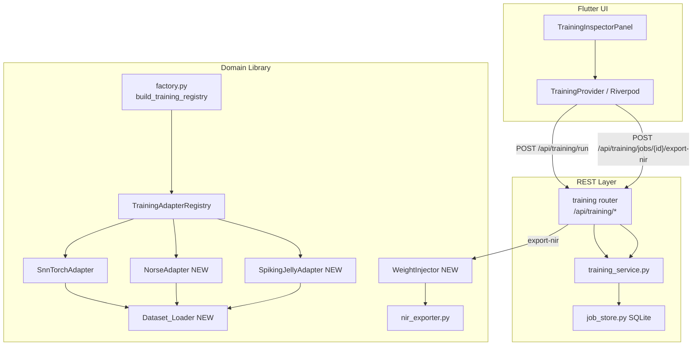

# Design Document: Neurotraining Extensions

## Overview

This document describes the technical design for the Neurotraining Extensions feature,
which extends the NMTK training pipeline with three orthogonal capabilities:

1. **File-system dataset ingestion** — `Dataset_Loader` replaces the hardcoded
   synthetic N-MNIST fixture with a path-based loader that accepts `.npy` frame
   directories and `.aedat4` DVS event files.
2. **New framework adapters** — `NorseAdapter` and `SpikingJellyAdapter` join the
   adapter registry, implementing `BaseTrainingAdapter` with their own frameworks'
   LIF/multi-step neuron models.
3. **Weight export to NIR** — `WeightInjector` maps `TrainingResult.learned_weights`
   back into a `nir.NIRGraph`, exposed via a new REST endpoint and a Flutter UI button.

All three extensions preserve the existing adapter contract (`training_registry.py`),
the REST job pipeline (`routers/training.py` + `training_service.py`), and the
Flutter `TrainingInspectorPanel`.

---

## Architecture

### Component Diagram



### Data Flow — Training Run with Real Dataset

```
User selects "Local Path" in TIP
  → payload { dataset_path: "/data/events", ... }
  → POST /api/training/run
  → training_service.submit_training_job()
  → job_store.submit(adapter.run)          [thread pool]
  → SnnTorchAdapter._resolve_fixture()
  → Dataset_Loader.load(dataset_path)
      ├─ path is dir  → scan .npy files → EventDatasetFixture(synthetic=False)
      ├─ path is .aedat4 → parse events → EventDatasetFixture(synthetic=False)
      └─ path missing  → ValueError
  → TrainingResult(metadata={"dataset_path":..., "synthetic":False})
  → job_store sets status=complete
  ← poll GET /api/training/jobs/{id}
  ← TrainingProvider.status = success
  ← TrainingInspectorPanel shows "Real dataset" badge
```

### Data Flow — NIR Export

```
User taps "Export to NIR" in TIP
  → POST /api/training/jobs/{job_id}/export-nir { spec: "..." }
  → training router fetches job from job_store
  → validate job.status == "complete" and learned_weights non-null
  → parse spec → NetworkIR → nir.NIRGraph (via nir_exporter.materialize_to_nir)
  → WeightInjector.inject(nir_graph, learned_weights)
  → nir.write() → bytes buffer
  → Response(content=bytes, media_type="application/octet-stream",
             headers={"Content-Disposition": "attachment; filename=trained_network.nir"})
  ← Flutter triggers file save dialog
```

---

## Components and Interfaces

### Dataset_Loader (`neurocnl/neurocnl/training/dataset_loader.py`)

Resolves a `dataset_path` string to an `EventDatasetFixture`.

```python
from __future__ import annotations
from pathlib import Path
from neurocnl.training.dataset_fixtures import EventDatasetFixture, build_nmnist_fixture

class DatasetLoader:
    """Resolves a dataset_path string to an EventDatasetFixture."""

    # Supported extensions
    NPY_GLOB = "*.npy"
    AEDAT4_SUFFIX = ".aedat4"

    def load(
        self,
        *,
        dataset_path: str | None,
        num_classes: int = 2,
        input_size: int | None = None,
        timesteps: int | None = None,
    ) -> EventDatasetFixture:
        """Return an EventDatasetFixture.

        Falls back to synthetic N-MNIST when dataset_path is None or empty.
        Raises ValueError for missing paths, unrecognised formats, or empty data.
        """
        ...

    def _load_npy_directory(
        self, path: Path, num_classes: int
    ) -> EventDatasetFixture:
        """Scan directory for .npy frame files and build EventDatasetFixture."""
        ...

    def _load_aedat4(
        self, path: Path, num_classes: int
    ) -> EventDatasetFixture:
        """Parse .aedat4 event stream into EventDatasetFixture."""
        ...

    @staticmethod
    def _validate_array(arr: "np.ndarray", path: Path) -> None:
        """Raise ValueError if arr is empty or contains non-finite values."""
        ...
```

Key algorithm — `_load_npy_directory`:
1. `glob("*.npy")` on the directory; raise `ValueError` if list is empty (lists `.npy` and `.aedat4` as expected formats).
2. For each file, `np.load(file)`, call `_validate_array` (checks `arr.size > 0` and `np.all(np.isfinite(arr))`).
3. Files that fail validation are skipped; if **no** files survive validation, raise `ValueError`.
4. Stack surviving arrays along axis 0; infer `timesteps` and `input_size` from shape `[samples, timesteps, features]`.
5. Assign labels round-robin modulo `num_classes`.
6. Return `EventDatasetFixture(name=path.name, ..., synthetic=False)`.

Key algorithm — `_load_aedat4`:
1. Lazy-import `dv` (from `dv-processing` / `aedat` library).
2. Open file, iterate events into `(x, y, t, p)` tuples.
3. If zero events, raise `ValueError("No events decoded from <path>")`.
4. Bin events into frames of fixed duration; shape into `[samples, timesteps, features]`.
5. Return `EventDatasetFixture(name=path.name, ..., synthetic=False)`.


### NorseAdapter (`neurocnl/neurocnl/training/norse_adapter.py`)

Subclasses `BaseTrainingAdapter`. Uses `norse.torch` functional API with LIF neurons.

```python
from __future__ import annotations
import time
from importlib import import_module
from neurocnl.training_registry import (
    AdapterCapability, BaseTrainingAdapter,
    TrainingAvailability, TrainingRequest, TrainingResult,
    UnavailableReason, UnavailableReasonCode,
)
from neurocnl.training.dataset_loader import DatasetLoader

_PARAM_RANGES = {
    "n_epochs":       (1, 1000),
    "learning_rate":  (1e-6, 1.0),
    "hidden_neurons": (1, 4096),
}

class NorseAdapter(BaseTrainingAdapter):
    capability = AdapterCapability(
        backend_name="norse",
        supported_training_modes=("functional_gradient",),
        default_training_mode="functional_gradient",
        output_format="weights",
    )

    def is_available(self) -> TrainingAvailability: ...
    def run(self, request: TrainingRequest) -> TrainingResult: ...
    def _validate_params(self, payload: dict) -> str | None:
        """Return error message string if any param is out of range, else None."""
        ...
    def _run_real(self, payload: dict, training_mode: str, start: float) -> TrainingResult: ...
```

Network architecture (LIF via `norse.torch.LIFState`):
- `nn.Linear(input_size, hidden_neurons)` → `norse.torch.LIFRecurrent` → `nn.Linear(hidden_neurons, num_classes)`
- Forward loop over timesteps, accumulate spikes
- Loss: `nn.MSELoss` on spike counts vs one-hot targets
- `learned_weights` = `fc_out.weight.detach().cpu().tolist()`

Parameter validation — `_validate_params`:
```
for each (name, (lo, hi)) in _PARAM_RANGES:
    val = payload.get(name, default)
    if not (lo <= val <= hi):
        return f"Parameter '{name}' value {val} is outside valid range [{lo}, {hi}]"
return None
```
If `_validate_params` returns a non-None string, `run()` immediately returns:
```python
TrainingResult(adapter_name="norse", training_mode=..., status="failed", error=<msg>, ...)
```

---

### SpikingJellyAdapter (`neurocnl/neurocnl/training/spikingjelly_adapter.py`)

Subclasses `BaseTrainingAdapter`. Uses `spikingjelly.activation_based` multi-step mode.

```python
from __future__ import annotations
import time
from importlib import import_module
from neurocnl.training_registry import (
    AdapterCapability, BaseTrainingAdapter,
    TrainingAvailability, TrainingRequest, TrainingResult,
    UnavailableReason, UnavailableReasonCode,
)
from neurocnl.training.dataset_loader import DatasetLoader

class SpikingJellyAdapter(BaseTrainingAdapter):
    capability = AdapterCapability(
        backend_name="spikingjelly",
        supported_training_modes=("multi_step",),
        default_training_mode="multi_step",
        output_format="weights",
    )

    def is_available(self) -> TrainingAvailability: ...
    def run(self, request: TrainingRequest) -> TrainingResult: ...
    def _validate_params(self, payload: dict) -> str | None: ...
    def _run_real(self, payload: dict, training_mode: str, start: float) -> TrainingResult: ...
```

Network architecture (multi-step, `T ≥ 2` timesteps):
- `functional.set_step_mode(net, step_mode='m')` puts network in multi-step mode
- `nn.Linear(input_size, hidden_neurons)` → `neuron.LIFNode(surrogate_function=surrogate.ATan())` → `nn.Linear(hidden_neurons, num_classes)`
- Input shaped as `[T, batch, features]`; `functional.reset_net(net)` called each epoch
- `learned_weights` = `fc_out.weight.detach().cpu().tolist()`
- Same `_PARAM_RANGES` and `_validate_params` pattern as `NorseAdapter`


### WeightInjector (`neurocnl/neurocnl/export/weight_injector.py`)

Immutably injects a `learned_weights` dict into a `nir.NIRGraph`.

```python
from __future__ import annotations
import copy
import logging
import numpy as np
import nir

logger = logging.getLogger(__name__)

class WeightInjector:
    """Injects learned_weights into nir.Linear nodes of a nir.NIRGraph.

    The injector is stateless. All methods are pure functions over their inputs.
    The input graph is never mutated; a new graph is always returned.
    """

    def inject(
        self,
        graph: nir.NIRGraph,
        learned_weights: dict[str, "array-like"] | None,
    ) -> nir.NIRGraph:
        """Return a new NIRGraph with updated Linear node weights.

        Raises ValueError for shape mismatches.
        Logs warnings for unmatched keys or non-Linear node targets.
        """
        ...

    @staticmethod
    def _copy_graph(graph: nir.NIRGraph) -> nir.NIRGraph:
        """Return a deep copy of the graph to preserve immutability."""
        return copy.deepcopy(graph)

    @staticmethod
    def _replace_linear_weight(
        node: nir.Linear, new_weight: np.ndarray, node_name: str
    ) -> nir.Linear:
        """Return a new nir.Linear with the weight replaced.

        Raises ValueError if shapes do not match.
        All other node attributes are preserved via dataclasses.replace.
        """
        ...
```

Key algorithm — `inject`:
```
if learned_weights is None or len(learned_weights) == 0:
    return _copy_graph(graph)

new_nodes = dict(graph.nodes)   # shallow copy of node dict
for name, weight_array in learned_weights.items():
    if name not in new_nodes:
        logger.warning("WeightInjector: key %r not found in graph nodes", name)
        continue
    node = new_nodes[name]
    if not isinstance(node, nir.Linear):
        logger.warning("WeightInjector: node %r is %s, not nir.Linear", name, type(node).__name__)
        continue
    w = np.asarray(weight_array, dtype=float)
    new_nodes[name] = _replace_linear_weight(node, w, name)

return nir.NIRGraph(nodes=new_nodes, edges=list(graph.edges))
```

`_replace_linear_weight` shape check:
```
expected = node.weight.shape
provided = w.shape
if expected != provided:
    raise ValueError(
        f"WeightInjector: node {node_name!r} expects weight shape {expected}, "
        f"but provided shape is {provided}."
    )
return dataclasses.replace(node, weight=w)
```

---

### REST Endpoint — Export NIR (`neurocnl/backend/app/routers/training.py`)

New route added to the existing `training` router:

```python
@router.post("/training/jobs/{job_id}/export-nir")
@limiter.limit("10/minute")
async def export_training_nir(
    request: Request,
    response: Response,
    job_id: str,
    body: ExportNirRequest,
) -> Response:
    ...
```

New Pydantic schema (`backend/app/schemas/training.py`):
```python
class ExportNirRequest(BaseModel):
    spec: str = Field(..., description="CNL text to parse into NetworkIR")
```

Handler logic (pseudocode):
```
job = await job_store.get(job_id)
if job is None:                          → 404 {"detail": "...", "code": "job_not_found"}
if job["status"] != "complete":          → 409 {"detail": "...", "code": "job_not_completed", "job_status": ...}

result_dict = job["result"]
learned_weights = result_dict.get("learned_weights")
if not learned_weights:                  → 422 {"detail": "...", "code": "no_learned_weights"}

spec = body.spec.strip()
if not spec:                             → 422 {"detail": "...", "code": "spec_required"}
try:
    parsed = parse_spec_text(spec)
    network_ir = lower_to_ir([r["parsed"] for r in parsed if r["valid"]])
    nir_graph = materialize_to_nir(network_ir)
except Exception as exc:                 → 422 {"detail": str(exc), "code": "spec_parse_error"}

try:
    injected = WeightInjector().inject(nir_graph, learned_weights)
except ValueError as exc:               → 422 {"detail": str(exc), "code": "weight_shape_mismatch"}

try:
    buf = io.BytesIO()
    nir.write(buf, injected)             # nir.write supports file-like objects
    nir_bytes = buf.getvalue()
except Exception as exc:                 → 500 {"detail": "NIR serialization failed", "code": "nir_write_error"}

return Response(
    content=nir_bytes,
    media_type="application/octet-stream",
    headers={"Content-Disposition": 'attachment; filename="trained_network.nir"'},
)
```

Rate limiting reuses the existing `slowapi` `limiter` instance (`10/minute` per client IP,
resolving `X-Forwarded-For` via `get_client_ip`). On limit exceeded, slowapi raises
`RateLimitExceeded`; the existing exception handler in `main.py` returns HTTP 429.
The 429 response body is extended to include `retry_after` (seconds until window resets)
by reading the `Retry-After` header set by slowapi.


### Factory Update (`neurocnl/neurocnl/training/factory.py`)

```python
from neurocnl.training.norse_adapter import NorseAdapter
from neurocnl.training.spikingjelly_adapter import SpikingJellyAdapter
from neurocnl.training.sleep_pes_adapter import SleepPesAdapter
from neurocnl.training.snntorch_adapter import SnnTorchAdapter
from neurocnl.training_registry import TrainingAdapterRegistry

def build_training_registry() -> TrainingAdapterRegistry:
    return TrainingAdapterRegistry([
        SleepPesAdapter(),
        SnnTorchAdapter(),
        NorseAdapter(),
        SpikingJellyAdapter(),
    ])
```

Both new adapters are always instantiated regardless of whether their optional
dependencies are installed; their `is_available()` methods handle the unavailable
state gracefully.

---

### SnnTorchAdapter Patch

`_resolve_fixture` is replaced by a call to `DatasetLoader`:

```python
def _resolve_fixture(self, payload: dict[str, Any]) -> EventDatasetFixture:
    return DatasetLoader().load(
        dataset_path=payload.get("dataset_path"),
        num_classes=int(payload.get("num_classes", 2) or 2),
        timesteps=int(payload.get("timesteps", 12) or 12),
        input_size=int(payload.get("input_size", 8) or 8),
    )
```

`_run_real` gains two metadata fields:
```python
metadata={
    ...,
    "dataset_path": payload.get("dataset_path", "") or "",
    "synthetic": fixture.synthetic,
}
```

---

### Flutter UI Additions (`neurocnl/frontend/lib/widgets/training_inspector_panel.dart`)

Four additions to `_TrainingInspectorPanelState`:

**1. Dataset source toggle + path field** (shown when selected capability is `snntorch`):

```dart
// New state fields
bool _useLocalDataset = false;
final _datasetPathController = TextEditingController();
String? _datasetPathError;
bool _isExporting = false;
String? _exportError;
```

In `_buildIdleContent`, after the capability dropdown, insert:
```dart
if (_selectedCapability?.backendName == 'snntorch') ...[
  _label('Dataset Source'),
  SegmentedButton<bool>(
    segments: const [
      ButtonSegment(value: false, label: Text('Synthetic (N-MNIST)')),
      ButtonSegment(value: true,  label: Text('Local Path')),
    ],
    selected: {_useLocalDataset},
    onSelectionChanged: (s) => setState(() {
      _useLocalDataset = s.first;
      _datasetPathError = null;
    }),
  ),
  if (_useLocalDataset) ...[
    const SizedBox(height: 8),
    TextField(
      controller: _datasetPathController,
      maxLength: 4096,
      decoration: InputDecoration(
        hintText: '/data/events or /data/recording.aedat4',
        errorText: _datasetPathError,
      ),
    ),
  ],
],
```

**2. Payload construction in `_startTraining`**:
```dart
if (_useLocalDataset) {
  final path = _datasetPathController.text.trim();
  if (path.isEmpty) {
    setState(() => _datasetPathError = 'Dataset path is required');
    return;  // do not submit
  }
  payload['dataset_path'] = path;
}
```

**3. Dataset badge in `_buildSuccessContent`**:
```dart
final isSynthetic = result.metadata?['synthetic'] != false;
Chip(
  label: Text(isSynthetic ? 'Synthetic dataset' : 'Real dataset'),
  backgroundColor: isSynthetic ? Colors.grey[200] : Colors.green[100],
)
```

**4. Export to NIR button in `_buildSuccessContent`**:
```dart
if (result.learnedWeights.isNotEmpty) ...[
  const SizedBox(height: 12),
  if (_exportError != null)
    Text(_exportError!, style: const TextStyle(color: Colors.red, fontSize: 12)),
  SizedBox(
    width: double.infinity,
    child: FilledButton.tonal(
      onPressed: _isExporting ? null : _exportNir,
      child: _isExporting
          ? const SizedBox(
              width: 16, height: 16,
              child: CircularProgressIndicator(strokeWidth: 2),
            )
          : const Text('Export to NIR'),
    ),
  ),
],
```

`_exportNir` method:
```dart
Future<void> _exportNir() async {
  final spec = ref.read(specTextProvider).trim();
  if (spec.isEmpty) {
    setState(() => _exportError = 'CNL spec is required for export');
    return;
  }
  final jobId = ref.read(trainingProvider).jobId;
  if (jobId == null) return;
  setState(() { _isExporting = true; _exportError = null; });
  try {
    final bytes = await ref.read(apiClientProvider).exportTrainingNir(jobId, spec);
    // Trigger file save via file_saver or url_launcher (platform-specific)
    await FileSaver.instance.saveFile(
      name: 'trained_network',
      bytes: bytes,
      ext: 'nir',
      mimeType: MimeType.other,
    );
  } on ApiException catch (e) {
    final detail = _parseApiError(e.body);
    setState(() => _exportError = 'Export failed (${e.statusCode}): $detail');
  } catch (e) {
    setState(() => _exportError = 'Export failed: $e');
  } finally {
    if (mounted) setState(() => _isExporting = false);
  }
}
```

**5. Adapter lock-state display** (existing dropdown, enhanced):

The existing `DropdownMenuItem` already renders a lock icon and grey reason text.
Two enhancements:

- Truncate `unavailableReason` to 120 characters before display:
  ```dart
  final reason = (cap.unavailableReason ?? 'Unavailable').length > 120
      ? '${(cap.unavailableReason ?? 'Unavailable').substring(0, 120)}…'
      : (cap.unavailableReason ?? 'Unavailable');
  ```
- For `OPTIONAL_DEPENDENCY_MISSING`, show a `Tooltip` with the pip install command:
  ```dart
  // TrainingCapability model gains optional dependencyName field
  if (cap.unavailableReason != null && cap.dependencyName != null)
    Tooltip(
      message: 'pip install ${cap.dependencyName}',
      child: Icon(Icons.info_outline, size: 14, color: Colors.grey[500]),
    ),
  ```


---

## Data Models

### New Pydantic schema — `ExportNirRequest`

```python
# backend/app/schemas/training.py
class ExportNirRequest(BaseModel):
    spec: str = Field(..., description="CNL text to parse into a NetworkIR")
```

### Updated `TrainingCapability` Dart model

```dart
class TrainingCapability {
  // ... existing fields ...
  final String? dependencyName;      // NEW — populated when unavailableReasonCode == OPTIONAL_DEPENDENCY_MISSING

  factory TrainingCapability.fromJson(Map<String, dynamic> json) {
    return TrainingCapability(
      // ... existing ...
      dependencyName: json['dependency_name'] as String?,
    );
  }
}
```

### Updated `CapabilityResponse` Pydantic schema

```python
class CapabilityResponse(BaseModel):
    # ... existing fields ...
    dependency_name: str | None = None   # NEW — forwarded from UnavailableReason.dependency_name
```

The `training_service.list_capabilities()` method must be updated to include
`dependency_name` when `unavailableReason` is of type `OPTIONAL_DEPENDENCY_MISSING`:

```python
result.append({
    ...
    "unavailable_reason": reason_msg,
    "dependency_name": (
        avail.unavailable_reason.dependency_name
        if avail.unavailable_reason and avail.unavailable_reason.dependency_name
        else None
    ),
})
```

### `EventDatasetFixture` — no changes required

The existing frozen dataclass already has the `synthetic: bool` field (default `True`).
`DatasetLoader` sets it to `False` for real data paths.

---

## Correctness Properties

*A property is a characteristic or behavior that should hold true across all valid
executions of a system — essentially, a formal statement about what the system should
do. Properties serve as the bridge between human-readable specifications and
machine-verifiable correctness guarantees.*

### Property 1: DatasetLoader — real path produces non-synthetic fixture

*For any* non-empty `dataset_path` that points to a directory containing at least one
valid `.npy` array file, `DatasetLoader().load(dataset_path=path)` SHALL return an
`EventDatasetFixture` with `synthetic == False`, `len(samples) > 0`, and
`len(samples[0]) > 0` (timesteps non-empty).

**Validates: Requirements 1.1**

---

### Property 2: DatasetLoader — .npy directory produces all-finite sample values

*For any* directory of `.npy` files where every array is finite (no NaN, no Inf),
the `EventDatasetFixture.samples` tensor returned by `DatasetLoader` SHALL contain
only finite values — i.e., `np.all(np.isfinite(np.array(fixture.samples)))` is True.

**Validates: Requirements 1.3**

---

### Property 3: DatasetLoader — non-existent path raises ValueError containing the path

*For any* string that does not correspond to an existing file-system path,
`DatasetLoader().load(dataset_path=path)` SHALL raise `ValueError` and the exception
message SHALL contain the provided path string.

**Validates: Requirements 1.5**

---

### Property 4: SnnTorchAdapter — metadata fields reflect dataset source

*For any* `TrainingRequest` payload, the `TrainingResult` returned by
`SnnTorchAdapter.run()` with `status == "completed"` SHALL include
`metadata["dataset_path"]` equal to `payload.get("dataset_path", "") or ""` and
`metadata["synthetic"]` equal to `True` when no `dataset_path` is supplied, or
`False` when a valid real dataset path is supplied.

**Validates: Requirements 1.8**

---

### Property 5: NorseAdapter — valid parameters produce a completed result

*For any* `(n_epochs, learning_rate, hidden_neurons)` triple within the valid ranges
(n_epochs ∈ [1, 1000], learning_rate ∈ [1e-6, 1.0], hidden_neurons ∈ [1, 4096]),
`NorseAdapter.run()` with `norse` installed SHALL return a `TrainingResult` with
`status == "completed"`, `n_epochs` matching the requested value, and
`learned_weights` that is not None and not empty.

**Validates: Requirements 3.4**

---

### Property 6: SpikingJellyAdapter — valid parameters produce a completed result

*For any* `(n_epochs, learning_rate, hidden_neurons)` triple within the valid ranges,
`SpikingJellyAdapter.run()` with `spikingjelly` installed SHALL return a
`TrainingResult` with `status == "completed"`, `n_epochs` matching the requested
value, and `learned_weights` that is not None and not empty.

**Validates: Requirements 4.4**

---

### Property 7: Adapter parameter validation — out-of-range values produce failed result

*For any* adapter in `{NorseAdapter, SpikingJellyAdapter}` and *for any* parameter
value that falls outside that parameter's declared valid range, `adapter.run()` SHALL
return a `TrainingResult` with `status == "failed"` and `error` containing a non-empty
description that identifies the parameter name and its valid range.

**Validates: Requirements 3.8, 4.7**

---

### Property 8: TrainingAdapterRegistry — all registered adapters appear in capabilities

*For any* list of N registered adapters (mix of available and unavailable),
`TrainingAdapterRegistry.list_capabilities()` SHALL return a list of exactly N entries,
one per registered adapter, in sorted order by `backend_name`.

**Validates: Requirements 5.4, 9.3**

---

### Property 9: WeightInjector — round-trip injection preserves immutability and equality

*For any* `nir.NIRGraph` containing at least one `nir.Linear` node, and *for any*
`learned_weights` dict where every key matches a `nir.Linear` node name and every
weight matrix has the same shape as the existing node weight, the following hold after
`result = WeightInjector().inject(graph, learned_weights)`:

1. **Round-trip**: For every injected key `k`, `np.allclose(result.nodes[k].weight, np.asarray(learned_weights[k]))` is True.
2. **Immutability**: The original graph's nodes are identical to their pre-injection state (no mutation).
3. **Non-injected nodes**: All nodes whose names are not in `learned_weights` are equal in `result` and `graph`.

**Validates: Requirements 6.1, 6.2, 6.6, 6.8**

---

### Property 10: WeightInjector — unmatched keys leave all nodes unchanged

*For any* `nir.NIRGraph` and *for any* `learned_weights` dict where no key matches any
node name in the graph, `WeightInjector().inject(graph, learned_weights)` SHALL return a
graph whose nodes are numerically equal to the original graph's nodes for every node.

**Validates: Requirements 6.3**

---

### Property 11: WeightInjector — shape mismatch raises ValueError

*For any* `nir.NIRGraph` containing a `nir.Linear` node with a known weight shape, and
*for any* weight matrix whose shape differs from that node's weight shape,
`WeightInjector().inject(graph, {node_name: mismatched_weight})` SHALL raise
`ValueError` with a message that includes the node name, the expected shape, and the
provided shape.

**Validates: Requirements 6.5**

---

### Property 12: TrainingAdapterRegistry — duplicate backend names raise AdapterSelectionError

*For any* pair of adapters whose `backend_name` values are equal after
`.strip().lower()`, constructing a `TrainingAdapterRegistry` with both adapters SHALL
raise `AdapterSelectionError`. This must hold for all casing variants and leading/trailing
whitespace variants of the same logical name.

**Validates: Requirements 9.2**

---

### Property 13: TrainingAdapterRegistry.dispatch() — unavailable or unknown backend raises AdapterSelectionError

*For any* registered adapter whose `is_available()` returns `available == False`,
calling `registry.dispatch(TrainingRequest(backend_name=adapter.capability.backend_name, ...))` SHALL
raise `AdapterSelectionError`; it SHALL NOT return a `TrainingResult`. Similarly, *for
any* backend name that is not registered, `dispatch()` SHALL raise `AdapterSelectionError`.

**Validates: Requirements 9.4**


---

## Error Handling

### DatasetLoader

| Condition | Behaviour |
|-----------|-----------|
| `dataset_path` is `None` or `""` | Returns synthetic N-MNIST fixture; no exception |
| Path does not exist | `ValueError("Dataset path not found: <path>")` |
| Directory exists but no `.npy` files | `ValueError("No .npy files found in <path>. Expected: .npy directory or .aedat4 file.")` |
| Single file with unsupported extension | Same message as above |
| All `.npy` files contain non-finite values | `ValueError("No valid samples found in <path>: all files failed validation (NaN/Inf).")` |
| Fixture has zero samples | `ValueError("Dataset at <path> contains 0 samples.")` |
| Fixture has zero timesteps | `ValueError("Dataset at <path> contains 0 timesteps.")` |
| `.aedat4` parses to zero events | `ValueError("No events decoded from <path>.")` |

### NorseAdapter / SpikingJellyAdapter

Both adapters wrap `_run_real` in a top-level `try/except Exception` and return
`TrainingResult(status="failed", error=str(exc), ...)` for any unhandled exception.
Parameter validation is checked before the heavy import chain; out-of-range values
return `status="failed"` immediately without touching the framework.

### WeightInjector

- Shape mismatch → `ValueError` (propagates to caller; router converts to HTTP 422)
- Unmatched key → `logger.warning`; node left unchanged
- Non-Linear node target → `logger.warning`; node left unchanged
- `None` / empty `learned_weights` → returns deep copy without modification; no exception

### REST Export Endpoint

All error responses use `Content-Type: application/json` and contain `detail` and `code` fields:

| Condition | HTTP Status | `code` |
|-----------|-------------|--------|
| `job_id` not found | 404 | `job_not_found` |
| Job not completed | 409 | `job_not_completed` |
| No `learned_weights` | 422 | `no_learned_weights` |
| Empty or unparseable `spec` | 422 | `spec_required` / `spec_parse_error` |
| Shape mismatch from `WeightInjector` | 422 | `weight_shape_mismatch` |
| `nir.write` failure | 500 | `nir_write_error` |
| Rate limit exceeded | 429 | `rate_limit_exceeded` (+ `retry_after` field) |

### Flutter UI

- Validation errors (`dataset_path` empty, `spec` empty at export time) are shown as
  inline `errorText` / `_exportError` strings within the panel; they never throw.
- HTTP errors from the export endpoint surface as `_exportError` text without resetting
  the training result state.
- Network failures during export surface as `_exportError = 'Export failed: $e'`.

---

## Testing Strategy

### Unit Tests — Python

All Python unit tests live in `neurocnl/tests/unit/training/` and
`neurocnl/tests/unit/export/`.

**Example-based tests** (pytest):
- `DatasetLoader.load(dataset_path=None)` → synthetic fixture returned
- `DatasetLoader.load(dataset_path="")` → synthetic fixture returned
- `.aedat4` mock returning zero events → `ValueError`
- `DatasetLoader` on empty directory → `ValueError` listing expected formats
- `NorseAdapter.is_available()` with mocked missing import → `available=False, dependency_name="norse"`
- `SpikingJellyAdapter.is_available()` same pattern
- `build_training_registry()` → list of backend names includes `["norse", "sleep_pes", "snntorch", "spikingjelly"]`
- `WeightInjector.inject(graph, None)` and `inject(graph, {})` → deep copy returned
- Non-Linear node injection → warning logged, node unchanged
- Export endpoint with missing `job_id` → HTTP 404
- Export endpoint with non-completed job → HTTP 409
- Export endpoint with empty `spec` → HTTP 422

**Property-based tests** (Hypothesis, min 100 examples each):

Each test is tagged with a comment in the format:
`# Feature: neurotraining-extensions, Property N: <property_text>`

| Test | Property | Library |
|------|----------|---------|
| `test_dataset_loader_real_path_not_synthetic` | P1 | Hypothesis |
| `test_dataset_loader_finite_samples` | P2 | Hypothesis |
| `test_dataset_loader_missing_path_raises` | P3 | Hypothesis |
| `test_snntorch_metadata_fields` | P4 | Hypothesis |
| `test_norse_valid_params_completed` | P5 | Hypothesis |
| `test_spikingjelly_valid_params_completed` | P6 | Hypothesis |
| `test_adapter_param_validation` | P7 | Hypothesis |
| `test_registry_all_adapters_in_capabilities` | P8 | Hypothesis |
| `test_weight_injector_round_trip` | P9 | Hypothesis |
| `test_weight_injector_unmatched_key` | P10 | Hypothesis |
| `test_weight_injector_shape_mismatch` | P11 | Hypothesis |
| `test_registry_duplicate_name_raises` | P12 | Hypothesis |
| `test_registry_dispatch_unavailable_raises` | P13 | Hypothesis |

Hypothesis configuration (in `conftest.py` or `settings` decorator):
```python
from hypothesis import settings
settings.register_profile("ci", max_examples=100)
settings.load_profile("ci")
```

Generators:
- `st.from_regex(r'[a-z_][a-z0-9_]{0,15}')` for node names
- `st.integers(1, 16).flatmap(lambda r: st.integers(1, 16).map(lambda c: (r, c)))` for shapes
- `st.floats(allow_nan=False, allow_infinity=False)` for weight values
- `st.integers(1, 50)` for n_epochs in property tests (keep runs fast)

### Unit Tests — Flutter (Dart)

All Dart widget tests live in `neurocnl/frontend/test/widgets/`.

- `TrainingInspectorPanel` with snntorch capability → dataset source toggle visible
- Toggle to `Local Path` → path text field visible
- Toggle to `Synthetic` → path text field hidden
- Submit with `Local Path` and empty path → inline error, no API call made
- Success state with `metadata["synthetic"] == false` → "Real dataset" badge present
- Success state with `learnedWeights` non-empty → "Export to NIR" button present
- Success state with `learnedWeights` empty → "Export to NIR" button absent
- Tap "Export to NIR" with empty CNL editor → inline "CNL spec is required for export" error
- Tap "Export to NIR" with non-empty CNL → button disabled during in-flight request
- Export API returns binary → file save triggered (mock `FileSaver`)
- Export API returns 422 → error message with status code and detail
- Unavailable adapter → lock icon visible, reason truncated to ≤ 120 chars
- `OPTIONAL_DEPENDENCY_MISSING` adapter → `pip install <dep>` in tooltip

### Integration Tests

- `POST /api/training/jobs/{job_id}/export-nir` end-to-end with a completed snntorch job
  (synthetic fixture, small weights, minimal CNL spec)
- Rate-limit test: 11 rapid requests → 10 succeed, 11th returns 429 with `retry_after`
- `GET /api/training/capabilities` with Norse and SpikingJelly unavailable → both listed
  with `available: false` and non-empty `unavailable_reason`
