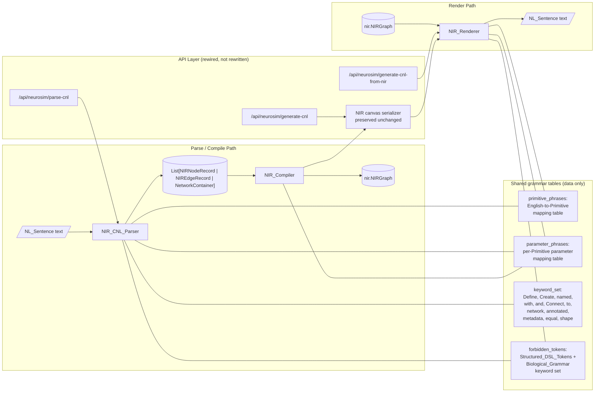

# Design Document: NIR-Native Controlled Natural Language

## Overview

This feature replaces the existing structured-DSL CNL surface in
`neurocnl/neurocnl/nir_cnl/` with a true natural-language Controlled Natural
Language (CNL) for describing `nir.NIRGraph` instances. Every sentence reads
as English prose and uses no quoted identifiers, no arrow operators, and no
bare `key value, key value` parameter lists. The previous biological
reflex-arc grammar and the structured `LIF "id" tau 0.01, r 1` grammar are
both removed. The same backend, frontend, and CLI entry points
(`neurocnl.compile.compile_to_nir`, `neurocnl.pipeline.generate_cnl_from_nir`,
`neurocnl.pipeline.parse_spec_text`, `/api/neurosim/generate-cnl-from-nir`,
`/api/neurosim/generate-cnl`, `/api/neurosim/parse-cnl`) are kept, but their
implementation is rewired to the new grammar. The NIR canvas serializer
(`backend/app/services/nir_graph_serializer.py`,
`backend/app/services/nir_canvas.py`) is preserved unchanged.

The primary acceptance test loads each of the eight reference NIR graphs in
`<workspace_root>/NIR graphs/` and asserts that
`load → render → parse → compile → compare` is a round-trip identity on the
graph's nodes, edges, scalar parameters, and array parameters (Requirement 6,
Requirement 5).

### Worked Example: A Three-Node Graph

The following `nir.NIRGraph` containing one `Input`, one `LIF`, one `Linear`
(2×2 weight matrix), and one `Output`:

```python
graph = nir.NIRGraph(
    nodes={
        "in1":   nir.Input(input_type=np.array([1])),
        "lif1":  nir.LIF(tau=np.array([0.02]), r=np.array([1.0]),
                         v_leak=np.array([0.0]), v_threshold=np.array([1.0])),
        "fc1":   nir.Linear(weight=np.array([[0.5, 0.7], [0.1, 0.9]])),
        "out1":  nir.Output(output_type=np.array([2])),
    },
    edges=[("in1", "lif1"), ("lif1", "fc1"), ("fc1", "out1")],
)
```

renders as the following NIR-Native CNL text:

```
# Generated by NIR_Renderer v1.
Define a network named graph.
Define an input port named in1 with shape (1,).
Define a leaky integrate-and-fire neuron named lif1 with time constant 0.02, resistance 1.0, leak voltage 0.0, and firing threshold 1.0.
Define a linear transformation named fc1 with weight matrix shape (2, 2) and weight matrix values (0.5, 0.7, 0.1, 0.9).
Define an output port named out1 with shape (2,).
Connect in1 to lif1.
Connect lif1 to fc1.
Connect fc1 to out1.
```

Every sentence is a stand-alone English clause terminated by a period; every
identifier (`graph`, `in1`, `lif1`, `fc1`, `out1`) is unquoted; parameters
are joined by `with`, commas, and a final `and`; and edges use the `Connect
... to ...` form. Feeding this text back through `NIR_CNL_Parser` followed
by `NIR_Compiler` recovers the original `nir.NIRGraph` with bit-equal
parameter values (Requirement 5.3, 5.5, 5.11).

---

## Architecture



### Module Layout

```
neurocnl/neurocnl/nir_cnl/
  __init__.py                     # Public re-exports
  grammar_tables.py               # NEW — primitive_phrases, parameter_phrases,
                                  #       keyword_set, forbidden_tokens
                                  #       (replaces grammar.py)
  ir_types.py                     # NIRNodeRecord, NIREdgeRecord,
                                  #       NetworkContainer, ArraySpec
                                  #       (rewritten in place)
  parser.py                       # NIR_CNL_Parser (rewritten in place)
  renderer.py                     # NIR_Renderer (rewritten in place)
  compiler.py                     # NIR_Compiler (rewritten in place)
  errors.py                       # NEW — ParseError, RenderError, CompileError
                                  #       with structured Diagnostic records
                                  #       compatible with neurocnl.compile
  validator.py                    # NEW — pre-render and post-parse legacy-token
                                  #       scanner (Requirement 8.4, 8.5)
```

### Component Responsibilities

| Component | Input | Output | Owning module |
|-----------|-------|--------|---------------|
| `NIR_Renderer` | `nir.NIRGraph` | NL_Sentence text (`str`) | `nir_cnl/renderer.py` |
| `NIR_CNL_Parser` | NL_Sentence text (`str`) | `list[NIRNodeRecord \| NIREdgeRecord \| NetworkContainer]` | `nir_cnl/parser.py` |
| `NIR_Compiler` | record list | `nir.NIRGraph` | `nir_cnl/compiler.py` |
| Grammar tables | n/a (data only) | `dict` lookups | `nir_cnl/grammar_tables.py` |
| Legacy-token validator | NL_Sentence text or rendered text | raises `CompileError`/`RenderError` | `nir_cnl/validator.py` |

The three executable components share the grammar tables module so there is
exactly one source of truth for which English noun phrase maps to which
`nir.*` class and which English parameter phrase maps to which constructor
argument.

### Data Flow

**NIR → CNL (render):**

1. `NIR_Renderer.render(graph)` receives a `nir.NIRGraph`.
2. For each node `(name, node)` in `graph.nodes` (preserving dict-iteration
   order — Requirement 3.2), the renderer dispatches on `type(node)` to a
   per-Primitive emitter function. Each emitter looks up the canonical noun
   phrase from `primitive_phrases` and the parameter phrases from
   `parameter_phrases` for that Primitive.
3. Scalar parameters render as a single numeric literal via `repr(float)`
   (which guarantees `float(repr(x)) == x` for all finite IEEE 754 floats).
   Array parameters on Round-Trip-asserted Primitives (Requirement 5.3–5.10
   / 5.13) render as two parameter clauses: `<phrase> shape (d1, ..., dN)`
   plus `<phrase> values (v1, v2, ..., vM)` where the value list flattens
   the tensor in C-order.
4. Each node's `metadata` dict is rendered, in ascending lexicographic order
   of keys, as `annotated with metadata <key> equal to <value>` parameter
   clauses (Requirement 10.1). Unsupported value types produce a comment
   line and no clause (Requirement 10.5).
5. Unsupported node types (anything outside the 18 Primitives) produce a
   `# unsupported node type <T> for node <name>` comment line in place of a
   node sentence (Requirement 3.6).
6. Edges render as `Connect <src> to <target>.` sentences in
   `graph.edges` source order (Requirement 3.2). Edges incident on
   unsupported or absent nodes render as
   `# unsupported edge from <src> to <target>` comment lines
   (Requirement 3.7).
7. Before returning the assembled text, the legacy-token validator scans
   the output for any Structured_DSL_Token or Biological_Grammar keyword
   appearing outside double-quoted string literals. A match raises
   `RenderError(code="legacy_grammar_emission")` and the renderer returns
   no partial output (Requirement 8.5).

**CNL → NIR (parse + compile):**

1. `NIR_CNL_Parser.parse(text)` receives the CNL text.
2. The legacy-token validator scans the text first; any
   Structured_DSL_Token raises
   `ParseError(code="structured_dsl_token")` and any Biological_Grammar
   keyword raises `ParseError(code="legacy_grammar")`
   (Requirement 1.8, Requirement 8.4).
3. The parser tokenizes line-by-line. Lines whose first non-whitespace
   character is `#` are treated as comments and ignored (Requirement 1.9).
4. For each non-comment, non-blank logical sentence (terminated by `.`),
   the parser dispatches on the leading verb-phrase form:
   - `Define a network named <id>.` or `Create a network named <id>.` →
     emit a `NetworkContainer` record (Requirement 1.7).
   - `Connect <src> to <target>.` → emit an `NIREdgeRecord`
     (Requirement 1.6).
   - `Define <noun-phrase> named <id> with <param-clauses>.` or the
     `Create` variant → look up the noun phrase in `primitive_phrases`
     to determine the Primitive type, parse the `with` clauses against
     `parameter_phrases[primitive]`, emit an `NIRNodeRecord`
     (Requirement 1.2–1.5).
5. Every parse failure is collected with its 1-indexed line number,
   verbatim source, error code, message, and hint (Requirement 9.1, 9.3).
   Up to 10,000 diagnostics accumulate before the parser raises a single
   `ParseError` carrying the full list (Requirement 9.3, 9.4).
6. `NIR_Compiler.compile(records)` receives the record list and validates
   structural invariants (ghost nodes, duplicate edges, missing endpoints,
   shape rank, scalar-vs-array). Any failure raises a single `CompileError`
   carrying every collected diagnostic (Requirement 4.5–4.7,
   Requirement 9.4).
7. Surviving records are materialized into `nir.*` instances. Shape-only
   array parameters become `numpy.zeros(shape, dtype=float)` Dummy_Arrays
   (Requirement 11.1). Explicit value lists become `numpy.asarray(values,
   dtype=float).reshape(shape)`. Metadata pairs are stored on each node's
   `metadata` dict preserving the parser-recovered Python types
   (Requirement 10.3).
8. The compiler returns a `nir.NIRGraph(nodes=..., edges=...,
   type_check=False)`.

---

## Components and Interfaces

### `NIR_Renderer`

```python
class NIR_Renderer:
    def render(self, graph: nir.NIRGraph) -> str: ...
```

- All node-declaration NL_Sentences are emitted before any
  edge-declaration NL_Sentence (Requirement 3.2).
- Node identifiers are taken verbatim from `graph.nodes` keys
  (Requirement 3.3).
- Each Primitive renders via exactly one canonical sentence form
  (Requirement 2.1). Scalars use explicit numeric literals;
  Round-Trip-asserted arrays use the `<phrase> shape (...)` +
  `<phrase> values (...)` two-clause form (Requirement 5.13).
- Output text is scanned for legacy tokens before return; a match raises
  `RenderError(code="legacy_grammar_emission")` (Requirement 8.5).

### `NIR_CNL_Parser`

```python
class NIR_CNL_Parser:
    def parse(self, text: str) -> list[NIRNodeRecord | NIREdgeRecord | NetworkContainer]: ...
```

- Accumulates every diagnostic before raising; raises a single
  `ParseError` carrying the full list (Requirement 9.3, 9.4).
- Performs only grammatical validation. Structural validation (ghost
  nodes, duplicate edges, endpoint presence) is the compiler's job.
- Recognizes case-insensitive keywords (`Define`, `Create`, `named`,
  `with`, `and`, `Connect`, `to`, `network`, `annotated`, `metadata`,
  `equal`, `shape`) and case-sensitive identifiers and parameter values
  (Requirement 1.10).

### `NIR_Compiler`

```python
class NIR_Compiler:
    def compile(
        self,
        records: list[NIRNodeRecord | NIREdgeRecord | NetworkContainer],
    ) -> nir.NIRGraph: ...
```

- Performs structural validation in this order: ghost nodes
  (`code="ghost_node"`), duplicate edges (`code="duplicate_edge"`),
  missing endpoints (`code="missing_endpoint"`), shape-vs-scalar
  (`code="shape_for_scalar"`), missing required parameter
  (`code="missing_required_parameter"`), missing array
  (`code="missing_shape"`), shape rank
  (`code="shape_rank_mismatch"`).
- Materializes Dummy_Arrays via `numpy.zeros(shape, dtype=float)` for
  shape-only array declarations (Requirement 11.1).
- Auto-derives `bias` for `nir.Affine`/`nir.Conv2d` from the weight's
  out-channel dimension when the user supplies a weight clause but no
  bias clause (Requirement 11.3, 11.4); an explicit bias clause always
  wins over the auto-derivation (Requirement 11.5).

### `grammar_tables.py`

A pure-data module; no imports from `numpy`, `nir`, or any non-stdlib
package. Exports:

- `primitive_phrases: dict[str, str]` — Primitive class name (`"LIF"`,
  `"Conv2d"`, ...) to canonical English noun phrase
  (`"leaky integrate-and-fire neuron"`, `"2D convolution layer"`, ...).
- `noun_phrase_to_primitive: dict[str, str]` — inverse table for parser
  lookup.
- `parameter_phrases: dict[str, dict[str, ParamSpec]]` — Primitive class
  name to dict of `nir.*` constructor argument name to a `ParamSpec`
  describing the canonical English phrase, the value kind (`scalar`,
  `vector`, `tensor`, `int_tuple`, `int_scalar`, `metadata_string`),
  the rank for shape-rank-mismatch checks, and whether the parameter
  has a default value.
- `keyword_set: frozenset[str]` — case-insensitive grammar keywords.
- `forbidden_biological_keywords: frozenset[str]` — `{"sensory",
  "motor", "MUST", "MUST NOT", "threshold_firing", "refractory_period",
  "STDP"}` (Requirement 8.1).
- `structured_dsl_token_patterns: list[re.Pattern]` — compiled patterns
  for the four Structured_DSL_Token forms.

### `errors.py`

```python
@dataclass(slots=True)
class Diagnostic:
    code: str
    message: str
    line: int
    raw: str
    hint: str
    stage: str  # "parser" | "materializer" | "validator"

class ParseError(Exception):
    errors: list[Diagnostic]

class RenderError(Exception):
    code: str
    offending_token: str

# CompileError is re-exported from neurocnl.compile to keep one
# definition in the codebase. Its `diagnostics` list now carries
# Diagnostic objects whose `stage` is one of "parser", "materializer",
# "validator" (Requirement 9.2).
```

### Public Entry Points (rewired, not rewritten)

| Function | Module | Behavior |
|----------|--------|----------|
| `compile_to_nir(spec, *, save_to=None)` | `neurocnl.compile` | Routes only to NIR-native path. Removes the legacy biological branch. Routes legacy input shapes through the validator first; any Biological_Grammar or Structured_DSL_Token raises `CompileError(code="legacy_grammar")` (Requirement 8.4). |
| `generate_cnl_from_nir(graph)` | `neurocnl.pipeline` | Calls `NIR_Renderer().render(graph)`. |
| `parse_spec_text(text)` | `neurocnl.pipeline` | Calls `NIR_CNL_Parser().parse(text)` and adapts records to the existing `ParseResult` shape. The legacy `_is_nir_native` discriminator is removed; every input is treated as NIR-native CNL. |
| `POST /api/neurosim/generate-cnl-from-nir` | `neurocnl/neurosim/app/routers/generation.py` | Reads `.nir` payload, calls `NIR_Renderer`, returns CNL text. Size cap 10 MB (Requirement 7.1). |
| `POST /api/neurosim/generate-cnl` | same | Receives `CanvasGraph`, calls canvas serializer's `deserialize_canvas_graph` once, calls `NIR_Renderer` (Requirement 7.2, Requirement 12.4). |
| `POST /api/neurosim/parse-cnl` | same | Receives CNL text, calls `NIR_CNL_Parser` and `NIR_Compiler`, then calls canvas serializer's `serialize_nir_to_canvas_graph` once (Requirement 7.3, Requirement 12.3). |

---

## Data Models

### Intermediate Records (`ir_types.py`)

```python
@dataclass(slots=True, frozen=True)
class ArraySpec:
    """Shape-only array declaration (Requirement 2.4)."""
    shape: tuple[int, ...]

@dataclass(slots=True, frozen=True)
class ArrayValues:
    """Explicit array declaration with shape and flattened values
    (Requirement 5.13)."""
    shape: tuple[int, ...]
    values: tuple[float, ...]   # flattened in C-order

@dataclass(slots=True)
class NIRNodeRecord:
    name: str
    primitive: str               # Primitive class name, e.g. "LIF"
    params: dict[str, int | float | ArraySpec | ArrayValues | tuple[int, ...]]
    metadata: dict[str, str | int | float]
    line: int                    # 1-indexed source line

@dataclass(slots=True)
class NIREdgeRecord:
    src: str
    target: str
    line: int

@dataclass(slots=True)
class NetworkContainer:
    name: str
    line: int
```

### English-to-Primitive Mapping Table (Requirement 1.2, 2.1)

The table below is the complete contract surface. Every Primitive has
**exactly one** canonical noun phrase. The phrases are case-insensitive
when matched by the parser; the renderer always emits them in lowercase
(except where noted for clarity).

| Primitive (`nir.*`) | Canonical English noun phrase |
|---------------------|-------------------------------|
| `nir.Input` | `input port` |
| `nir.Output` | `output port` |
| `nir.IF` | `integrate-and-fire neuron` |
| `nir.LIF` | `leaky integrate-and-fire neuron` |
| `nir.LI` | `leaky integrator neuron` |
| `nir.CubaLIF` | `current-based leaky integrate-and-fire neuron` |
| `nir.CubaLI` | `current-based leaky integrator neuron` |
| `nir.I` | `integrator neuron` |
| `nir.Linear` | `linear transformation` |
| `nir.Affine` | `affine transformation` |
| `nir.Scale` | `scale transformation` |
| `nir.Conv1d` | `1D convolution layer` |
| `nir.Conv2d` | `2D convolution layer` |
| `nir.AvgPool2d` | `2D average pooling layer` |
| `nir.SumPool2d` | `2D sum pooling layer` |
| `nir.Flatten` | `flatten layer` |
| `nir.Delay` | `delay element` |
| `nir.Threshold` | `threshold element` |

The verb phrase is `Define a` or `Define an` (chosen by the leading
vowel of the noun phrase), or the synonym `Create a`/`Create an`
(Requirement 1.2). The parser accepts both verbs; the renderer always
emits `Define`.


### Parameter-Phrase Mapping Table (Requirement 1.5, 2.1)

For every Primitive, the table below lists every constructor argument
exposed in the CNL surface, the canonical English parameter phrase, and
the value kind. Parameter phrases are case-insensitive on parse and
emitted in lowercase on render. Every entry maps one-to-one between
phrase and `nir.*` constructor argument (Requirement 1.5).

#### `nir.Input`

| `nir.*` arg | English phrase | Kind |
|-------------|----------------|------|
| `input_type` | `shape` | int_tuple (rank 1) |

Canonical sentence:
```
Define an input port named in1 with shape (1, 28, 28).
```

#### `nir.Output`

| `nir.*` arg | English phrase | Kind |
|-------------|----------------|------|
| `output_type` | `shape` | int_tuple (rank 1) |

Canonical sentence:
```
Define an output port named out1 with shape (10,).
```

#### `nir.IF`

| `nir.*` arg | English phrase | Kind |
|-------------|----------------|------|
| `r` | `resistance` | scalar or vector |
| `v_threshold` | `firing threshold` | scalar or vector |

Canonical sentence:
```
Define an integrate-and-fire neuron named if1 with resistance 1.0 and firing threshold 1.0.
```

#### `nir.LIF`

| `nir.*` arg | English phrase | Kind |
|-------------|----------------|------|
| `tau` | `time constant` | scalar or vector |
| `r` | `resistance` | scalar or vector |
| `v_leak` | `leak voltage` | scalar or vector |
| `v_threshold` | `firing threshold` | scalar or vector |

Canonical sentence:
```
Define a leaky integrate-and-fire neuron named lif1 with time constant 0.02, resistance 1.0, leak voltage 0.0, and firing threshold 1.0.
```

#### `nir.LI`

| `nir.*` arg | English phrase | Kind |
|-------------|----------------|------|
| `tau` | `time constant` | scalar or vector |
| `r` | `resistance` | scalar or vector |
| `v_leak` | `leak voltage` | scalar or vector |

Canonical sentence:
```
Define a leaky integrator neuron named li1 with time constant 0.02, resistance 1.0, and leak voltage 0.0.
```

#### `nir.CubaLIF`

| `nir.*` arg | English phrase | Kind |
|-------------|----------------|------|
| `tau_syn` | `synaptic time constant` | scalar or vector |
| `tau_mem` | `membrane time constant` | scalar or vector |
| `r` | `resistance` | scalar or vector |
| `v_leak` | `leak voltage` | scalar or vector |
| `v_threshold` | `firing threshold` | scalar or vector |
| `w_in` | `input weight` | scalar or vector |

Canonical sentence:
```
Define a current-based leaky integrate-and-fire neuron named cuba1 with synaptic time constant 0.005, membrane time constant 0.02, resistance 1.0, leak voltage 0.0, firing threshold 1.0, and input weight 1.0.
```

#### `nir.CubaLI`

| `nir.*` arg | English phrase | Kind |
|-------------|----------------|------|
| `tau_syn` | `synaptic time constant` | scalar or vector |
| `tau_mem` | `membrane time constant` | scalar or vector |
| `r` | `resistance` | scalar or vector |
| `v_leak` | `leak voltage` | scalar or vector |
| `w_in` | `input weight` | scalar or vector |

Canonical sentence:
```
Define a current-based leaky integrator neuron named cubali1 with synaptic time constant 0.005, membrane time constant 0.02, resistance 1.0, leak voltage 0.0, and input weight 1.0.
```

#### `nir.I`

| `nir.*` arg | English phrase | Kind |
|-------------|----------------|------|
| `r` | `resistance` | scalar or vector |

Canonical sentence:
```
Define an integrator neuron named i1 with resistance 1.0.
```

#### `nir.Linear`

| `nir.*` arg | English phrase | Kind |
|-------------|----------------|------|
| `weight` | `weight matrix` | tensor (rank 2) |

Canonical sentence (with explicit values for round-trip):
```
Define a linear transformation named fc1 with weight matrix shape (2, 3) and weight matrix values (0.5, 0.7, 0.1, 0.9, -0.2, 0.4).
```

Shape-only convenience form (compile-from-CNL only; the renderer never
emits this for round-trip-asserted graphs — Requirement 5.13):
```
Define a linear transformation named fc1 with weight matrix shape (2, 3).
```

#### `nir.Affine`

| `nir.*` arg | English phrase | Kind |
|-------------|----------------|------|
| `weight` | `weight matrix` | tensor (rank 2) |
| `bias` | `bias vector` | vector (rank 1) |

Canonical sentence:
```
Define an affine transformation named aff1 with weight matrix shape (2, 3), weight matrix values (0.5, 0.7, 0.1, 0.9, -0.2, 0.4), bias vector shape (2,), and bias vector values (0.0, 0.0).
```

When the user writes only a `weight matrix shape` clause and omits the
bias, the compiler auto-derives `bias = numpy.zeros((M,), dtype=float)`
where `M = weight.shape[0]` (Requirement 11.4).

#### `nir.Scale`

| `nir.*` arg | English phrase | Kind |
|-------------|----------------|------|
| `scale` | `scale factor` | scalar or vector |

Canonical sentence:
```
Define a scale transformation named s1 with scale factor 2.5.
```

#### `nir.Conv1d`

| `nir.*` arg | English phrase | Kind |
|-------------|----------------|------|
| `weight` | `weight kernel` | tensor (rank 3) |
| `bias` | `bias vector` | vector (rank 1) |
| `stride` | `stride` | int_tuple (rank 1) |
| `padding` | `padding` | int_tuple (rank 1) |
| `dilation` | `dilation` | int_tuple (rank 1) |
| `groups` | `groups` | int_scalar |
| `input_shape` | `input length` | int_scalar |

Canonical sentence:
```
Define a 1D convolution layer named c1 with weight kernel shape (8, 1, 3), weight kernel values (...), bias vector shape (8,), bias vector values (...), stride (1,), padding (0,), dilation (1,), groups 1, and input length 28.
```

#### `nir.Conv2d`

| `nir.*` arg | English phrase | Kind |
|-------------|----------------|------|
| `weight` | `weight kernel` | tensor (rank 4) |
| `bias` | `bias vector` | vector (rank 1) |
| `stride` | `stride` | int_tuple (rank 2) |
| `padding` | `padding` | int_tuple (rank 2) |
| `dilation` | `dilation` | int_tuple (rank 2) |
| `groups` | `groups` | int_scalar |
| `input_shape` | `input height and width` | int_tuple (rank 2) |

Canonical sentence:
```
Define a 2D convolution layer named c2 with weight kernel shape (16, 1, 5, 5), weight kernel values (...), bias vector shape (16,), bias vector values (...), stride (1, 1), padding (2, 2), dilation (1, 1), groups 1, and input height and width (28, 28).
```

#### `nir.AvgPool2d`

| `nir.*` arg | English phrase | Kind |
|-------------|----------------|------|
| `kernel_size` | `kernel size` | int_tuple (rank 2) |
| `stride` | `stride` | int_tuple (rank 2) |
| `padding` | `padding` | int_tuple (rank 2) |

Canonical sentence:
```
Define a 2D average pooling layer named avgp1 with kernel size (2, 2), stride (2, 2), and padding (0, 0).
```

#### `nir.SumPool2d`

| `nir.*` arg | English phrase | Kind |
|-------------|----------------|------|
| `kernel_size` | `kernel size` | int_tuple (rank 2) |
| `stride` | `stride` | int_tuple (rank 2) |
| `padding` | `padding` | int_tuple (rank 2) |

Canonical sentence:
```
Define a 2D sum pooling layer named sump1 with kernel size (2, 2), stride (2, 2), and padding (0, 0).
```

#### `nir.Flatten`

| `nir.*` arg | English phrase | Kind |
|-------------|----------------|------|
| `start_dim` | `start dimension` | int_scalar |
| `end_dim` | `end dimension` | int_scalar |

Canonical sentence:
```
Define a flatten layer named fl1 with start dimension 1 and end dimension -1.
```

#### `nir.Delay`

| `nir.*` arg | English phrase | Kind |
|-------------|----------------|------|
| `delay` | `delay value` | scalar or vector |

Canonical sentence:
```
Define a delay element named d1 with delay value 0.001.
```

#### `nir.Threshold`

| `nir.*` arg | English phrase | Kind |
|-------------|----------------|------|
| `threshold` | `threshold value` | scalar or vector |

Canonical sentence:
```
Define a threshold element named th1 with threshold value 0.5.
```

### Network Container, Edge, and Comment Forms (Requirement 1.6, 1.7, 1.9)

| Form | NL_Sentence |
|------|-------------|
| Network container | `Define a network named <id>.` |
| Edge | `Connect <src> to <target>.` |
| Comment line | `# <free text>` (whole line ignored by parser) |

### Array Serialization Format (Requirement 5.13)

For every Primitive whose Round-Trip identity is asserted by
Requirement 5.5, 5.6, 5.7, 5.9, or 5.10, the renderer emits **two**
parameter clauses for each array-bearing parameter:

1. `<phrase> shape (d1, d2, ..., dN)` — describes the array's shape
   exactly. For 1-D arrays the trailing comma is mandatory:
   `(N,)` (Requirement 2.5).
2. `<phrase> values (v1, v2, ..., vM)` — the flattened C-order
   sequence of all `M = prod(shape)` elements, each rendered with
   `repr(float(v))` so that `float(repr(v)) == v` exactly under IEEE
   754 float64 (Requirement 5.5).

When the user authors CNL by hand, the values clause may be omitted and
only the shape clause provided — the compiler then synthesizes
`numpy.zeros(shape, dtype=float)` (Requirement 2.8, 11.1). The renderer,
however, **always** emits both clauses for round-trip-asserted nodes,
because emitting only a shape clause would discard the original numeric
values and break `parse(render(G)) == G` (Requirement 5.13).

Examples:

| Original `numpy` value | Rendered clauses |
|------------------------|------------------|
| `np.array([0.5])` | `weight matrix shape (1,) and weight matrix values (0.5,)` |
| `np.array([[0.5, 0.7], [0.1, 0.9]])` | `weight matrix shape (2, 2) and weight matrix values (0.5, 0.7, 0.1, 0.9)` |
| `np.zeros((2,))` | `bias vector shape (2,) and bias vector values (0.0, 0.0)` |

For integer structural parameters (`stride`, `padding`, `dilation`,
`input_shape`, `groups`, `start_dim`, `end_dim`), the renderer emits a
single parenthesised tuple clause (or bare integer for rank-0):
`stride (1, 1)`, `groups 1`. These compare equal under Python `==`
(Requirement 5.6, 5.7, 5.8).

---

## Correctness Properties


*A property is a characteristic or behavior that should hold true across all
valid executions of a system — essentially, a formal statement about what
the system should do. Properties serve as the bridge between human-readable
specifications and machine-verifiable correctness guarantees.*

The properties below result from the prework analysis. Each is universally
quantified, references the requirements clause it validates, and is
implementable as a single Hypothesis property test running 100+ iterations.

### Property 1: Round-trip identity for all supported NIRGraphs

*For all* `nir.NIRGraph` instances whose nodes are drawn exclusively from
the 18 Primitives and whose parameter values lie in the documented numeric
ranges, performing
`NIR_Compiler().compile(NIR_CNL_Parser().parse(NIR_Renderer().render(G)))`
produces a graph `G'` such that:

- `set(G'.nodes.keys()) == set(G.nodes.keys())` (no rename, no add, no drop);
- for every node name `n`, `type(G'.nodes[n]) is type(G.nodes[n])`;
- every scalar parameter (`tau`, `r`, `v_leak`, `v_threshold`, `tau_syn`,
  `tau_mem`, `w_in`, `delay`, `threshold`, `scale`) is bit-equal under
  IEEE 754 float64;
- every array parameter (`weight`, `bias`, `scale`) has identical `shape`,
  identical `dtype`, and is element-wise bit-equal;
- every integer structural parameter (`stride`, `padding`, `dilation`,
  `groups`, `input_shape`, `kernel_size`, `start_dim`, `end_dim`) compares
  equal under Python `==`;
- every node's `metadata` dict satisfies `G'.metadata == G.metadata` and
  every value's Python type matches the original;
- the multiset of directed `(source, target)` edges is identical.

**Validates: Requirements 5.1, 5.2, 5.3, 5.4, 5.5, 5.6, 5.7, 5.8, 5.9, 5.10, 5.11, 5.13, 10.1, 10.2, 10.3, 10.4, 11.1, 11.2, 11.3, 11.4**

### Property 2: Renderer never emits legacy-grammar tokens

*For all* `nir.NIRGraph` instances whose nodes are drawn from the 18
Primitives, the text returned by `NIR_Renderer().render(G)` contains, when
considered outside double-quoted string literals, no Biological_Grammar
keyword (`sensory`, `motor`, `MUST`, `MUST NOT`, `threshold_firing`,
`refractory_period`, `STDP`) and no Structured_DSL_Token (double-quoted
node identifier adjacent to a Primitive keyword, ASCII or Unicode arrow
operator between identifiers, bare comma-separated `<key> <value>` pair
without an English connective).

**Validates: Requirements 3.8, 8.1, 8.2, 8.5**

### Property 3: Parser rejects every legacy-grammar input

*For all* input strings that contain at least one Biological_Grammar
keyword or at least one Structured_DSL_Token outside any double-quoted
string literal, `NIR_CNL_Parser().parse(text)` raises a `ParseError` whose
diagnostics list contains an entry whose `code` is exactly
`"structured_dsl_token"` or `"legacy_grammar"`, and `compile_to_nir(text)`
raises a `CompileError` whose diagnostics list contains an entry whose
`code` is exactly `"legacy_grammar"`.

**Validates: Requirements 1.8, 8.3, 8.4**

### Property 4: Comment lines and keyword casing are parse-output-invariant

*For all* valid NIR-Native CNL texts `T` and *for all* sequences of comment
lines `C = ["# free text", ...]` inserted at any positions in `T`, and *for
all* mappings `K` that flip the case of any subset of the case-insensitive
keywords (`Define`, `Create`, `named`, `with`, `and`, `Connect`, `to`,
`network`, `annotated`, `metadata`, `equal`, `shape`),
`NIR_CNL_Parser().parse(transform(T, C, K))` returns a record list equal
to `NIR_CNL_Parser().parse(T)` under structural equality of the records.

**Validates: Requirements 1.9, 1.10**

### Property 5: Identifier round-trip preservation

*For all* identifier strings matching the regex `[A-Za-z_][A-Za-z0-9_]*`
of length 1 to 64 characters, every node-declaration NL_Sentence and every
edge-declaration NL_Sentence in `NIR_Renderer().render(G)` writes the
identifier verbatim (case-sensitive, unquoted), and parsing the rendered
text recovers exactly the original identifier on the corresponding record.

**Validates: Requirements 1.3, 3.3**

### Property 6: Sentence structural shape

*For all* `nir.NIRGraph` instances whose nodes are drawn from the 18
Primitives, the rendered text satisfies all of the following for every
NL_Sentence:

- character length ≤ 1024 and whitespace-delimited token count ≤ 64;
- the verb phrase is `Define a` or `Define an` for node sentences;
- node sentences with `N ≥ 1` parameter clauses join clauses 1..N-1 with
  commas and place `and ` immediately before clause N (or `, and ` for
  N ≥ 3);
- exactly one node sentence is emitted per dict entry in `graph.nodes`;
- exactly one edge sentence is emitted per entry in `graph.edges`;
- every node sentence appears in source order before every edge sentence;
- the node-sentence order matches `graph.nodes` iteration order;
- the edge-sentence order matches `graph.edges` source order.

**Validates: Requirements 1.1, 1.4, 3.1, 3.2, 3.4**

### Property 7: Unknown phrases and duplicate identifiers raise documented diagnostics

*For all* node-declaration sentences whose noun phrase is not present in
the documented English-to-Primitive mapping table, parsing raises
`ParseError` with `code == "unknown_primitive_phrase"`. *For all*
node-declaration sentences whose `<english_parameter_phrase>` is not
present in the parameter mapping table for the host Primitive, parsing
raises `ParseError` with `code == "unknown_parameter_phrase"` (or
`"unknown_parameter"` from the compiler) and a `hint` field equal to the
ascending case-insensitive comma-joined list of valid phrases for that
Primitive — or the literal string `"unknown primitive"` when the host
Primitive itself is unknown. *For all* CNL texts containing two or more
node-declaration sentences with byte-equal node identifiers inside the
same network container, parsing raises `ParseError` with
`code == "duplicate_identifier"`.

**Validates: Requirements 1.11, 1.12, 1.13, 4.8, 9.5, 9.6**

### Property 8: Compile-time structural validation

*For all* record lists violating exactly one of the structural invariants
below, `NIR_Compiler().compile(records)` raises `CompileError` whose
diagnostics list contains an entry whose `code` matches the corresponding
invariant:

| Invariant | Expected `code` |
|-----------|-----------------|
| Edge references undeclared node | `"ghost_node"` |
| Two edges with identical `(src, target)` | `"duplicate_edge"` |
| No `Input` node, no `Output` node, or both missing | `"missing_endpoint"` |
| Required-no-default parameter omitted | `"missing_required_parameter"` |
| Array-bearing parameter omitted | `"missing_shape"` |
| Shape rank disagrees with Primitive contract | `"shape_rank_mismatch"` |
| Shape literal supplied for a scalar parameter | `"shape_for_scalar"` |

**Validates: Requirements 2.6, 2.9, 2.10, 4.5, 4.6, 4.7, 11.6, 11.8**

### Property 9: Shape literal compiles to `numpy.zeros(shape, dtype=float)`

*For all* shape tuples `S = (d1, ..., dN)` with `1 ≤ N ≤ 4` and every
`di` an integer in the inclusive range `[1, 4096]`, compiling any node
sentence whose array-bearing parameter clause is supplied as
`<phrase> shape (d1, ..., dN)` (with no accompanying `<phrase> values`
clause) produces a parameter value satisfying
`numpy.array_equal(value, numpy.zeros(S, dtype=float))` and
`value.shape == S`, and parser-stage rejection occurs (with
`code == "invalid_shape"`) for any shape tuple containing a non-positive
integer, a non-integer numeric token, or a non-numeric token.

**Validates: Requirements 2.4, 2.5, 2.7, 2.8, 4.3, 4.9, 11.1, 11.7**

### Property 10: Auto-bias derivation for Affine and Conv2d

*For all* `nir.Affine` and `nir.Conv2d` node sentences containing a
weight clause and no bias clause, the compiled node has a `bias` array
equal to `numpy.zeros((out_channels,), dtype=float)` where
`out_channels = weight.shape[0]`. *For all* sentences supplying both a
weight clause and an explicit bias clause, the compiled `bias` value is
the one parsed from the explicit clause and is unaffected by the weight
clause's out-channel dimension.

**Validates: Requirements 11.2, 11.3, 11.4, 11.5**

### Property 11: Diagnostic field contract

*For all* CNL inputs that produce at least one diagnostic, the raised
`ParseError` or `CompileError` carries a non-empty `errors`/`diagnostics`
list of length 1 to 10,000, each entry of which has `code` matching
`[a-z][a-z0-9_]{0,63}`, `message` of length 1 to 500, `line` an integer
in `[1, 1_000_000]`, `raw` of length 0 to 1000, `hint` of length 0 to
1000, and (for `CompileError`) `stage` in `{"parser", "materializer",
"validator"}`; the diagnostics list is ordered by ascending `line` with
ties broken by occurrence order; and neither parser nor compiler returns
a graph or record list while any diagnostic is present.

**Validates: Requirements 9.1, 9.2, 9.3, 9.4**

### Property 12: Metadata unsupported-value and duplicate-key handling

*For all* `nir.NIRNode` instances whose `metadata` dict contains at least
one entry whose value is not in `{str, int, finite float}`, the rendered
text contains exactly one `# metadata <key> on <node_name> omitted: unsupported value type`
comment line per such entry (in ascending lexicographic order of the key)
and emits no `annotated with metadata <key> equal to <value>` clause for
that entry. *For all* CNL node-declaration sentences containing two or
more `annotated with metadata <key> equal to <value>` clauses with
byte-equal keys, parsing raises `ParseError` with
`code == "duplicate_metadata_key"`.

**Validates: Requirements 10.5, 10.6**

### Property 13: Unsupported node and edge handling

*For all* `nir.NIRGraph` instances containing one or more nodes whose
type is not one of the 18 Primitives, the rendered text contains one
`# unsupported node type <T> for node <name>` comment line per such node
and one `# unsupported edge from <src> to <target>` comment line per
edge incident to such a node, and the renderer raises no exception; and
the round-trip identity Property 1 holds on the subgraph obtained by
deleting every unsupported node and every edge incident to it.

**Validates: Requirements 3.6, 3.7, 5.12**

---

## Error Handling

### Error Codes

Every documented error code is owned by exactly one component and carries
a structured `Diagnostic`. The table below is the contract:

| `code` | Raised by | Stage | Meaning |
|--------|-----------|-------|---------|
| `structured_dsl_token` | `NIR_CNL_Parser` | parser | Input contains a Structured_DSL_Token (Requirement 1.8). |
| `legacy_grammar` | `compile_to_nir` | parser | Input matches Biological_Grammar or Structured_Syntax_Grammar shape (Requirement 8.4). |
| `legacy_grammar_emission` | `NIR_Renderer` | validator | Defensive guard: would have emitted a forbidden token (Requirement 8.5). |
| `unknown_primitive_phrase` | `NIR_CNL_Parser` | parser | Noun phrase not in `primitive_phrases` (Requirement 1.11). |
| `unknown_parameter_phrase` | `NIR_CNL_Parser` | parser | Parameter phrase not in `parameter_phrases[primitive]` (Requirement 1.12). |
| `unknown_parameter` | `NIR_CNL_Parser` | parser | Parameter phrase resolves to a name absent from the host Primitive's contract (Requirement 4.8). |
| `duplicate_identifier` | `NIR_CNL_Parser` | parser | Two node sentences share an identifier (Requirement 1.13). |
| `duplicate_metadata_key` | `NIR_CNL_Parser` | parser | One sentence has two `annotated with metadata <key>` clauses sharing a key (Requirement 10.6). |
| `invalid_shape` | `NIR_CNL_Parser` | parser | Shape literal contains a non-positive, non-integer, or non-numeric dim (Requirement 4.9, 11.7). |
| `ghost_node` | `NIR_Compiler` | materializer | Edge references undeclared node (Requirement 4.5). |
| `duplicate_edge` | `NIR_Compiler` | materializer | Two records have identical `(src, target)` (Requirement 4.6). |
| `missing_endpoint` | `NIR_Compiler` | materializer | No `Input` or no `Output` node (Requirement 4.7). |
| `shape_for_scalar` | `NIR_Compiler` | materializer | Shape literal supplied for a scalar parameter (Requirement 2.9). |
| `missing_required_parameter` | `NIR_Compiler` | materializer | Parameter has no default and no value supplied (Requirement 2.10). |
| `missing_shape` | `NIR_Compiler` | materializer | Array-bearing parameter omitted entirely (Requirement 11.6). |
| `shape_rank_mismatch` | `NIR_Compiler` | materializer | Shape literal rank differs from Primitive contract (Requirement 11.8). |

### Error-Collection Strategy

- The parser collects up to 10,000 diagnostics before raising
  `ParseError`. Diagnostics are sorted by `line` (ascending) then by
  source-occurrence order (Requirement 9.3, 9.4).
- The compiler validates structural invariants in the documented order
  (ghost → duplicate edge → missing endpoint → shape → other) and
  collects all diagnostics for each phase before moving to the next.
  Any non-empty phase result raises `CompileError` carrying that phase's
  diagnostics; downstream phases do not run.
- Neither component emits partial output when any diagnostic is present:
  `parse` raises before returning, `compile` raises before constructing
  the `nir.NIRGraph`, and `render` raises before returning the text
  string (Requirement 8.5, 9.4).

### API-Level Error Mapping (Requirement 7.4–7.7)

| Source | HTTP status | Body shape |
|--------|-------------|------------|
| Valid request | 200 | endpoint-specific payload |
| `.nir` payload contains nodes outside 18 Primitives | 422 | `{ "diagnostics": [{ "code": "unsupported_nir_import", "message": ..., "node_id": ..., "primitive": ..., "hint": ... }, ...] }` |
| CNL `ParseError` or `CompileError` | 422 | `{ "diagnostics": [{ "code", "message", "line", "hint" }, ...] }` |
| Invalid `.nir` binary | 400 | `{ "error": "invalid_nir_file: <reason>" }` |
| Non-UTF-8 CNL payload | 400 | `{ "error": "invalid_utf8: <reason>" }` |
| Payload size exceeds cap | 400 | `{ "error": "payload_too_large: ... bytes (max ...)" }` |
| Diagnostic-generation path raises | 500 | `{ "error": "diagnostic_generation_failed: <reason>" }` |

---

## Testing Strategy

The test suite combines property-based tests (for universal correctness
properties), parameterized regression tests (for the eight reference NIR
fixtures), and example-based tests (for canonical-form snapshots and API
error-shape contracts).

### Test Layout

```
neurocnl/neurocnl/tests/nir_native_cnl/
  __init__.py
  conftest.py                       # Hypothesis generators, helpers
  test_grammar_tables.py            # Unit tests for primitive_phrases /
                                    # parameter_phrases coverage
  test_renderer_examples.py         # One snapshot test per Primitive
  test_parser_examples.py           # One example per error code
  test_compiler_examples.py         # One example per compile error code
  test_round_trip_properties.py     # Properties 1, 4, 5, 6
  test_legacy_token_properties.py   # Properties 2, 3
  test_diagnostic_properties.py     # Properties 7, 8, 11
  test_shape_properties.py          # Properties 9, 10, 12, 13
  test_reference_fixtures.py        # Parameterized over the 8 .nir files
  test_static_repo_invariants.py    # Static scan for legacy modules/tests
neurocnl/neurosim/tests/
  test_router_generation_endpoints.py  # API-level integration tests
```

### Property-Based Testing Library

The project already uses Hypothesis for property tests
(`neurocnl/neurocnl/tests/properties/`). The new properties continue with
Hypothesis. Each property test:

- Runs a minimum of 100 iterations (`@given` / `@settings(max_examples=100)`).
- Carries a tag comment of the form
  `# Feature: nir-native-cnl, Property N: <description>` immediately above
  the test function.
- Uses the shared NIRGraph generator in `conftest.py`, which builds
  random `nir.NIRGraph` instances with:
  - between 1 and 6 nodes drawn uniformly from the 18 Primitives,
    plus at least one `Input` and one `Output`;
  - random valid parameter values within the documented numeric ranges;
  - random valid identifiers from `[A-Za-z_][A-Za-z0-9_]*` (length 1–32);
  - random valid metadata dicts with `str | int | float` values.

### Reference NIR Fixtures Regression (Requirement 6)

```python
# test_reference_fixtures.py
import pytest, nir
from pathlib import Path
FIXTURES_DIR = Path(__file__).resolve().parents[4] / "NIR graphs"
FIXTURE_NAMES = [
    "braille_noDelay_bias_zero.nir",
    "braille_noDelay_bias_zero_subgraph.nir",
    "braille_noDelay_noBias_subtract.nir",
    "braille_noDelay_noBias_subtract_subgraph.nir",
    "cnn_sinabs.nir",
    "lif_norse.nir",
    "lif_rockpool.nir",
    "two_lif_neurons.nir",
]

@pytest.mark.parametrize("fixture_name", FIXTURE_NAMES, ids=FIXTURE_NAMES)
def test_reference_fixture_round_trip(fixture_name):
    graph_in = nir.read(str(FIXTURES_DIR / fixture_name))
    cnl = NIR_Renderer().render(graph_in)
    records = NIR_CNL_Parser().parse(cnl)
    graph_out = NIR_Compiler().compile(records)
    assert_round_trip_equal(graph_in, graph_out)
```

Each test is independent so a renderer regression on one fixture does
not block the parser tests for the remaining fixtures (Requirement 6.7,
6.8). The full suite is invoked via `PYTHONPATH=. pytest neurocnl/tests/`
(Requirement 6.6).

### Unit and Snapshot Tests

- `test_renderer_examples.py` contains 18 snapshot tests (one per
  Primitive) that build a known instance, render, and assert byte-equal
  output against the canonical sentence in §Components and Interfaces.
- `test_parser_examples.py` contains one positive example per Primitive
  plus one negative example per `code` (one for each row in the error
  table) showing the exact `(line, raw, code, message, hint)` returned.
- `test_compiler_examples.py` mirrors `test_parser_examples.py` for the
  compiler-stage error codes.

### API Integration Tests (Requirement 7)

Use `fastapi.testclient.TestClient` against the rewired
`/api/neurosim/...` endpoints with three representative payloads:

1. A small valid graph round-trips successfully through each endpoint.
2. A `.nir` containing an unsupported node type returns 422 with the
   documented diagnostics shape.
3. Bad CNL input returns 422 with diagnostics; oversized payload returns
   400; broken `.nir` binary returns 400.

### Static Repo Invariants (Requirement 8.6, 8.7)

`test_static_repo_invariants.py` walks every `.py` under
`neurocnl/neurocnl/` and `neurocnl/neurosim/`, parses each module's AST,
and asserts:

- no module's top-level docstring or `__all__` mentions
  `Biological_Grammar`, `sensory`, `motor`, `MUST`, `MUST NOT`,
  `threshold_firing`, `refractory_period`, `STDP`, or any
  Structured_DSL_Token regex match outside string literals;
- no remaining import targets the legacy
  `neurocnl.cnl._bio_cnl_parser` module or the legacy
  `neurocnl.nir_cnl.grammar` table.

The test runs once and is fast (an AST walk of the package tree).

### Coverage Targets

- Property tests: cover the 13 universal properties; minimum 100
  iterations each.
- Reference fixtures: 8 parameterized cases, each covering load → render
  → parse → compile → compare.
- Per-Primitive snapshot: 18 cases covering Requirement 2.1.
- Per-error-code: 16 cases covering every row in the error table.

---

## Legacy Code Removal Plan

The following files implement the structured-DSL grammar or the
biological-reflex-arc grammar and are FORBIDDEN under Requirement 8.6 /
8.7. They are deleted or rewritten in place by Phase 1 of the task list:

### Library code under `neurocnl/neurocnl/`

| File | Action |
|------|--------|
| `nir_cnl/grammar.py` | **DELETE.** Replaced by `nir_cnl/grammar_tables.py`. |
| `nir_cnl/parser.py` | **REWRITE in place.** Replaced with the natural-language parser described above. |
| `nir_cnl/renderer.py` | **REWRITE in place.** Replaced with the natural-language renderer described above. |
| `nir_cnl/compiler.py` | **REWRITE in place.** Updated to consume the new record types and emit the new error codes. |
| `nir_cnl/ir_types.py` | **REWRITE in place.** Updated `NIRNodeRecord.nir_type` → `primitive`, add `NetworkContainer`, add `ArrayValues`, expand metadata typing. |
| `nir_cnl/__init__.py` | **REWRITE.** Re-exports the new public surface. |
| `cnl/_bio_cnl_parser.py` | **DELETE** if it exists as a module dedicated to the biological grammar. (Confirm via grep — the file is imported by `pipeline.py` and three legacy tests; those imports are removed in the same task.) |
| `pipeline.py` | **EDIT.** Remove the `_is_nir_native` discriminator, remove the legacy biological branch in `parse_spec_text`, and remove the `_NIR_NATIVE_KEYWORDS` set. |
| `compile.py` | **EDIT.** Remove the entire `else:` branch (legacy biological path). The function becomes single-path: route everything through `NIR_CNL_Parser` + `NIR_Compiler` and reject Biological_Grammar/Structured_DSL_Tokens up front via the validator. |

### Tests under `neurocnl/neurocnl/tests/` and module-co-located test files

| File | Action |
|------|--------|
| `tests/test_nir_native_cnl.py` | **DELETE.** Asserts the structured-DSL surface (`LIF "id" tau …`, `Connect "x" -> "y"`). |
| `tests/test_nir_native_cnl_integration.py` | **DELETE.** Same surface, plus mixed biological-keyword fixtures. |
| `tests/properties/test_nir_native_cnl_properties.py` | **DELETE.** Property tests on the structured-DSL form. |
| `tests/test_nir_to_cnl.py` | **REVIEW + DELETE if exclusively legacy.** |
| `tests/test_renderer.py` | **REVIEW + DELETE/REWRITE.** Covers the legacy renderer. |
| `tests/test_parser.py` | **REVIEW + DELETE/REWRITE.** |
| `tests/test_compiler.py` | **REVIEW + DELETE/REWRITE.** |
| `tests/test_compile_nir_native.py` | **REVIEW + DELETE/REWRITE.** |
| `tests/test_grammar.py` | **DELETE** if it pins the legacy grammar tables. |
| `tests/test_array_serialisation.py` | **REVIEW + REWRITE** for the new serialization contract (Requirement 5.13). |
| `neurocnl/cnl/test_*.py` (biological grammar tests) | **DELETE.** |
| `neurocnl/ir/test_ir_lowering.py`, `neurocnl/layers/test_layer1_validator.py`, `neurocnl/test_planner.py`, `neurocnl/generation/test_nengo_generator.py` (every test importing `_bio_cnl_parser`) | **EDIT.** Remove the legacy import and any biological-keyword fixtures. If the test exists solely to exercise the biological path, delete the test. |

### Component manifests under `neurocnl/neurosim/`

Any `manifests/`, `templates/`, or `examples/` payload that contains
Structured_DSL_Tokens (a quoted-id Primitive sentence, an `->` arrow, or
a bare comma-separated key/value pair) is rewritten to the new
NL_Sentence form.

### Boundaries that MUST NOT be touched

- `backend/app/services/nir_graph_serializer.py` — preserved per
  Requirement 12.1.
- `backend/app/services/nir_canvas.py` — preserved per Requirement 12.2.
- The route paths and request/response schemas of the three CNL
  endpoints — preserved per Requirement 7.8.

A scan task at the top of the implementation plan walks the repository
and lists every file containing a forbidden token outside a string
literal so the deletion/rewrite list above can be cross-checked against
the actual repo state at implementation time.
