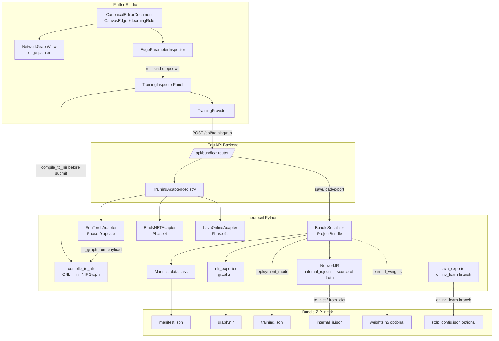

# Design Document: NIR + Training Bundle (`nir-training-bundle`)

## Overview

The NIR + Training Bundle feature formalises the NMTK project format around a single portable
container — the `.nmtk` ZIP — that holds a network's structural representation, learning rule
configuration, and a canonical internal IR from which both generated files are derived. The
feature spans five implementation phases: fixing the adapter–canvas disconnect (Phase 0),
formalising the bundle format (Phase 1), surfacing learning rules on the canvas (Phase 2),
extending the IR and deployment modes (Phase 3), and adding simulation-only (BindsNET) and
Lava online-learning adapters (Phases 4 / 4b), culminating in FastAPI bundle endpoints (Phase 5).

The design principle throughout is **generated outputs, never edited sources**: `graph.nir` and
`training.json` are always produced from `NetworkIR` — they are never read back as sources of
truth. Only `internal_ir.json` is read on load. This eliminates the entire class of orphan-rule
and sync-drift bugs identified in the architecture review.


## Architecture

### System Component Diagram




### Phase-by-Phase Component Ownership

| Phase | Python | Flutter/Dart |
|-------|--------|--------------|
| 0 — Adapter–canvas disconnect | `snntorch_adapter.py` | `training_inspector_panel.dart` |
| 1 — Bundle format | `ir/types.py`, `bundle/serializer.py`, `bundle/manifest.py` | — |
| 2 — Canvas learning rules | `training_registry.py` (projection endpoint) | `canonical_editor_document.dart`, `network_graph_view.dart`, `edge_parameter_inspector.dart` |
| 3 — IR + deployment mode | `ir/types.py`, `training_registry.py`, `snntorch_adapter.py`, `lava_exporter.py` | `training_inspector_panel.dart` |
| 4 — BindsNET adapter | `training/bindsnet_adapter.py`, `training/factory.py` | — |
| 4b — Lava online adapter | `training/lava_online_adapter.py`, `training/factory.py` | — |
| 5 — API endpoints | FastAPI router `api/bundle.py` | `training_provider.dart`, API client |

### Source of Truth Rule

```
NetworkIR (in-memory, persisted as internal_ir.json)
    ↓ generate on every save/export
graph.nir          → NIR-spec HDF5, deployment artifact
training.json      → learning rules + backend config, adapter contract
stdp_config.json   → Lava on-chip plasticity params (online_learn only)
weights.h5         → trained weights (when TrainingResult.learned_weights != None)
```

`ProjectBundle.load()` reads **only** `internal_ir.json`. It ignores `graph.nir` and
`training.json` for reconstruction. Those files are write-only from the editor's perspective.


## Components and Interfaces

### Phase 0 — Adapter–Canvas Topology Connection

#### `SnnTorchAdapter` changes (`neurocnl/neurocnl/training/snntorch_adapter.py`)

```python
def run(self, request: TrainingRequest) -> TrainingResult:
    # New: guard online_learn (Req 9.1)
    deployment_mode = (request.payload or {}).get("deployment_mode") or getattr(request, "deployment_mode", None) or "offline_train"
    if deployment_mode == "online_learn":
        raise AdapterSelectionError(
            "SnnTorchAdapter does not support online_learn; use the Lava backend.",
            UnavailableReasonCode.NOT_IMPLEMENTED,
        )
    ...

def _run_real(self, payload, training_mode, start):
    nir_graph_raw = payload.get("nir_graph")
    if nir_graph_raw is None:
        # Req 1.4: fallback with metadata warning
        model = TinySnn(...)
        metadata["topology_source"] = "fallback_demo"
    elif isinstance(nir_graph_raw, dict):
        model = _build_model_from_nir_dict(nir_graph_raw)
    elif isinstance(nir_graph_raw, nir.NIRGraph):
        model = _build_model_from_nir_graph(nir_graph_raw)
    else:
        raise ValueError(f"Unexpected nir_graph type: {type(nir_graph_raw)!r}")  # Req 1.7
```

#### `TrainingInspectorPanel` changes (`training_inspector_panel.dart`)

```dart
Future<void> _startTraining() async {
  // Req 1.1, 1.2, 1.5: compile first, gate on error
  try {
    final nirGraph = await _compileCnlToNir(ref.read(specTextProvider));
    ref.read(trainingProvider.notifier).submitTraining(
      backendName: _selectedCapability!.backendName,
      trainingMode: _selectedCapability!.defaultTrainingMode,
      payload: {
        'n_epochs': _nEpochs,
        'nir_graph': nirGraph.toJson(),           // serialised graph
        'deployment_mode': _selectedDeploymentMode,
        'learning_rules': _collectEdgeLearningRules(),
      },
    );
  } on CompileError catch (e) {
    _showCompileError(e.diagnostics.first.message);  // Req 1.5: do not dispatch
  }
}
```


### Phase 1 — Bundle Format

#### `BundleSerializer` (`neurocnl/neurocnl/bundle/serializer.py`)

```python
SUPPORTED_BUNDLE_VERSIONS: frozenset[str] = frozenset({"1.0"})
SUPPORTED_TRAINING_SCHEMA_VERSIONS: frozenset[str] = frozenset({"1.0"})

class BundleLoadError(Exception):
    """Raised on any bundle read failure."""

class BundleSerializer:
    def save(self, bundle: ProjectBundle, path: str | Path) -> Path:
        """Write bundle to .nmtk ZIP. Returns absolute path."""

    def load(self, path: str | Path) -> ProjectBundle:
        """Load bundle from .nmtk ZIP. Reads internal_ir.json only."""

    def export(self, bundle: ProjectBundle, deployment_mode: str) -> bytes:
        """Return ZIP bytes suitable for binary download."""

    def migrate(self, path: str | Path, target_version: str) -> None:
        """Migrate bundle in-place; preserves original as .nmtk.bak."""
```

Key invariants enforced by `save()`:
- `graph.nir` and `training.json` are **always generated** from `NetworkIR`; no external copies accepted.
- `weights.h5` is written iff `bundle.training_result.learned_weights is not None`.
- `stdp_config.json` is written iff `deployment_mode == "online_learn"` and `target_backend == "lava"`.
- `manifest.json` is always written with `bundle_schema_version = "1.0"`.

Key invariants enforced by `load()`:
- Raises `BundleLoadError` if path is not a valid ZIP.
- Raises `BundleLoadError` if `internal_ir.json` is absent.
- Raises `BundleLoadError` if `manifest.json` is absent, malformed, or missing `bundle_schema_version`.
- Raises `BundleLoadError` if `bundle_schema_version` not in `SUPPORTED_BUNDLE_VERSIONS`.

#### `Manifest` dataclass (`neurocnl/neurocnl/bundle/manifest.py`)

```python
@dataclass(frozen=True, slots=True)
class Manifest:
    bundle_schema_version: str   # "1.0"
    nmtk_version: str
    created_at: str              # ISO 8601 UTC
    target_backend: str
    deployment_mode: str         # "offline_train" | "online_learn" | "deploy_only"
```

#### `ProjectBundle` dataclass (`neurocnl/neurocnl/bundle/serializer.py`)

```python
@dataclass(slots=True)
class ProjectBundle:
    network_ir: NetworkIR
    manifest: Manifest
    training_config: dict[str, Any]          # mirrors training.json structure
    training_result: TrainingResult | None = None

    def save(self, path: str | Path) -> Path:
        return BundleSerializer().save(self, path)

    @classmethod
    def load(cls, path: str | Path) -> "ProjectBundle":
        return BundleSerializer().load(path)
```


### Phase 2 — Canvas Learning Rule Projection

#### `LearningRuleProjection` (`neurocnl/frontend/lib/models/learning_rule_projection.dart`) — NEW FILE

```dart
class LearningRuleProjection {
  const LearningRuleProjection({
    required this.kind,
    this.rate,
    this.window,
    this.rewardSignal,
  });

  final String kind;           // "stdp" | "surrogate" | "r-stdp"
  final double? rate;
  final double? window;
  final String? rewardSignal;  // null unless kind == "r-stdp"

  factory LearningRuleProjection.fromJson(Map<String, dynamic> json) { ... }
  Map<String, dynamic> toJson() { ... }
}
```

#### `CanvasEdge` changes (`canonical_editor_document.dart`)

Add optional `learningRule` field:

```dart
class CanvasEdge {
  const CanvasEdge({
    required this.source,
    required this.target,
    this.polarity = 'excitatory',
    this.weight,
    this.connectivityPattern,
    this.learningRule,   // NEW — Req 5.1
  });
  final LearningRuleProjection? learningRule;
  // ...
}
```

`fromJson` reads `learning_rule` key (snake_case, matches backend Pydantic contract):
```dart
learningRule: json['learning_rule'] != null
    ? LearningRuleProjection.fromJson(json['learning_rule'] as Map<String, dynamic>)
    : null,
```

#### Backend projection endpoint change

The backend `CanonicalEditorDocument` Pydantic model gains a `learning_rule` field on its edge
contract. When projecting `NetworkIR` to `CanvasProjection`, for each `ConnectionIR`, the
backend scans `NetworkIR.learning_rules` for entries where `source == conn.source` and
`target == conn.target`. If multiple match, the last entry wins (Req 5.2).

#### `network_graph_view.dart` edge painter changes

The existing `_NetworkPainter._paintEdges()` already uses `edge.hasLearningRule` to switch
between dashed and solid strokes (confirmed in code review). The `CanvasEdge.learningRule`
field feeds `hasLearningRule`:

```dart
bool get hasLearningRule => learningRule != null;   // Req 5.3, 5.4
```

The `_drawDashedLine()` helper already exists in `_NetworkPainter`; no new painting logic is
needed — only the data binding to `CanvasEdge.learningRule`.

#### `EdgeParameterInspector` changes

Add a `learningRule` kind dropdown when an edge is selected (Req 5.5 – 5.7):

```dart
DropdownButton<String>(
  value: edge.learningRule?.kind ?? 'static',
  items: const ['static', 'stdp', 'surrogate', 'r-stdp']
      .map((k) => DropdownMenuItem(value: k, child: Text(k)))
      .toList(),
  onChanged: (kind) => _onLearningRuleKindChanged(edge, kind),
)
```

When `kind == 'static'`, the edge's `learningRule` is set to `null` (Req 5.7).
Otherwise the panel upserts a `LearningRuleProjection` into the edge and into the
`TrainingInspectorPanel`'s pending `learning_rules` payload array (Req 5.6).


### Phase 3 — IR Extension and Deployment Mode

#### `TrainingAdapterRegistry` changes (`training_registry.py`)

```python
# deployment_mode enforcement (Req 7.2, 12.5)
def dispatch(self, request: TrainingRequest) -> TrainingResult:
    deployment_mode = getattr(request, "deployment_mode", None) or "offline_train"
    if deployment_mode == "online_learn":
        adapter = self.get_adapter(request.backend_name)
        if adapter.capability.backend_name.lower() != "lava":
            raise AdapterSelectionError(
                "online_learn requires the Lava backend targeting Loihi 2.",
                UnavailableReasonCode.NOT_IMPLEMENTED,
            )
    # rule_mode enforcement (Req 4.3, 4.4)
    rule_mode = (request.payload or {}).get("rule_mode", "advisory")
    learning_rules = (request.payload or {}).get("learning_rules", [])
    adapter = self.get_adapter(request.backend_name)
    if rule_mode == "strict":
        supported = set(getattr(adapter.capability, "supported_rule_kinds", ()))
        for rule in learning_rules:
            if rule.get("kind") not in supported:
                raise AdapterSelectionError(
                    f"Adapter {request.backend_name!r} does not support rule kind "
                    f"{rule['kind']!r} (rule_mode=strict)."
                )
    elif rule_mode == "advisory":
        supported = set(getattr(adapter.capability, "supported_rule_kinds", ()))
        skipped = [r["kind"] for r in learning_rules if r.get("kind") not in supported]
        # skipped list injected into result metadata after adapter.run()
    ...
```

`AdapterCapability` gains two new fields (Req 4.7, 9.4):

```python
@dataclass(frozen=True, slots=True)
class AdapterCapability:
    backend_name: str
    supported_training_modes: tuple[str, ...]
    default_training_mode: str
    output_format: str | None = None
    supported_rule_kinds: tuple[str, ...] = ()        # NEW — Req 4.7
    supported_deployment_modes: tuple[str, ...] = ()  # NEW — Req 9.4
```

`TrainingRequest` gains `deployment_mode` (Req 7.1):

```python
@dataclass(frozen=True, slots=True)
class TrainingRequest:
    backend_name: str
    training_mode: str | None = None
    payload: dict[str, Any] | None = None
    deployment_mode: str | None = None   # NEW; None → "offline_train"
```

#### `LavaOnlineAdapter` registration

`lava_online_adapter.py` registers under `"lava"` with:
```python
capability = AdapterCapability(
    backend_name="lava",
    supported_training_modes=("stdp", "r-stdp"),
    default_training_mode="stdp",
    output_format="nir+stdp_config",
    supported_rule_kinds=("stdp", "r-stdp"),
    supported_deployment_modes=("online_learn",),
)
```

#### `lava_exporter.py` online_learn branch (Req 10.1 – 10.6)

```python
def export_lava(net, hw_mode=False, deployment_mode="offline_train", ir=None, **kwargs):
    code = _generate_lava_code(net, hw_mode, ir)
    if deployment_mode == "online_learn":
        if ir is None or not ir.learning_rules:
            raise LoweringError("online_learn requires at least one learning rule.")
        stdp_config = _generate_stdp_config(ir.learning_rules)  # Req 10.1
        return code, stdp_config
    return code, None   # Req 10.2

def _generate_stdp_config(rules: list[LearningRuleIR]) -> dict:
    result = []
    for rule in rules:
        if rule.kind != "stdp":
            raise LoweringError(f"Lava online_learn does not support rule kind {rule.kind!r}.")
        if rule.source is None or rule.target is None:
            raise LoweringError(f"Rule kind {rule.kind!r} requires both source and target.")
        result.append({
            "kind": rule.kind, "source": rule.source, "target": rule.target,
            "rate": rule.rate, "window": rule.window,
            "weight_min": rule.weight_min, "weight_max": rule.weight_max,
        })
    return {"rules": result}  # Req 10.3
```

#### `TrainingInspectorPanel` UI additions (Req 7.6, 7.7)

```dart
// Inline warning — shown when online_learn + non-lava (Req 7.6)
if (_deploymentMode == 'online_learn' &&
    _selectedCapability?.backendName != 'lava')
  _InlineWarning('Online learning requires the Lava backend targeting Loihi 2.'),

// BindsNET simulation notice (Req 7.7)
if (_selectedCapability?.backendName == 'bindsnet')
  _InlineNotice(
    'BindsNET training produces weights for simulation only. '
    'Export to neuromorphic hardware requires the Lava backend.',
  ),
```


### Phase 4 — BindsNET Adapter (`neurocnl/neurocnl/training/bindsnet_adapter.py`)

```python
class BindsNETAdapter(BaseTrainingAdapter):
    capability = AdapterCapability(
        backend_name="bindsnet",
        supported_training_modes=("stdp", "reward_modulated_stdp"),
        default_training_mode="stdp",
        output_format="weights_only",
        supported_rule_kinds=("stdp", "reward_modulated_stdp"),
        supported_deployment_modes=("offline_train",),  # simulation only
    )

    def is_available(self) -> TrainingAvailability:
        try:
            import_module("bindsnet")
        except ImportError:
            return TrainingAvailability(
                available=False,
                unavailable_reason=UnavailableReason(
                    code=UnavailableReasonCode.OPTIONAL_DEPENDENCY_MISSING,
                    message="bindsnet is not installed.",
                    dependency_name="bindsnet",
                ),
            )
        return TrainingAvailability(available=True)

    def run(self, request: TrainingRequest) -> TrainingResult:
        deployment_mode = getattr(request, "deployment_mode", None) or "offline_train"
        if deployment_mode in ("online_learn", "deploy_only"):
            raise AdapterSelectionError(
                "BindsNET is a simulation-only backend and does not support "
                f"{deployment_mode}.",
                UnavailableReasonCode.NOT_IMPLEMENTED,
            )
        ...
        # Maps learning_rules to BindsNET Connection constructor arguments
        # Returns TrainingResult with learned_weights != None,
        # metadata["output_format"] = "weights_only"
```

`BundleSerializer` behaviour for BindsNET results (Req 11.7, 11.8):
- Writes `learned_weights` to `weights.h5`.
- Overrides `manifest.deployment_mode` to `"offline_train"` regardless of request value.

### Phase 4b — Lava Online Learning Adapter (`neurocnl/neurocnl/training/lava_online_adapter.py`)

```python
class LavaOnlineAdapter(BaseTrainingAdapter):
    capability = AdapterCapability(
        backend_name="lava",
        supported_training_modes=("stdp", "r-stdp"),
        default_training_mode="stdp",
        output_format="nir+stdp_config",
        supported_rule_kinds=("stdp", "r-stdp"),
        supported_deployment_modes=("online_learn",),
    )

    def run(self, request: TrainingRequest) -> TrainingResult:
        rules = (request.payload or {}).get("learning_rules", [])
        if not rules:
            raise ValueError("LavaOnlineAdapter requires at least one learning rule.")
        stdp_config_rules = []
        for rule in rules:
            if rule["kind"] == "stdp":
                cfg = _translate_to_stdp_loihi(rule)
            elif rule["kind"] == "r-stdp":
                cfg = _translate_to_rmax(rule)
            else:
                raise AdapterSelectionError(
                    f"LavaOnlineAdapter does not support rule kind {rule['kind']!r}."
                )
            stdp_config_rules.append(cfg)
        ...
        return TrainingResult(
            ...,
            metadata={"stdp_config": {"rules": stdp_config_rules}},
        )
```

### Phase 5 — FastAPI Bundle Endpoints (`neurocnl/neurocnl/api/bundle.py`)

```python
router = APIRouter(prefix="/api/bundle", tags=["bundle"])

@router.post("/save")              # Req 13.1
async def save_bundle(...) -> {"absolute_path": str}

@router.post("/load")              # Req 13.2
async def load_bundle(...) -> {"network_ir": dict, "manifest": dict}

@router.post("/export")            # Req 13.3
async def export_bundle(...) -> Response(media_type="application/zip")

@router.delete("/connection")      # Req 13.4, 6.6
async def delete_connection(source: str, target: str) -> {"ok": True}
```

Error contracts:
- `POST /save` → HTTP 422 on `BundleLoadError` or serialisation error.
- `POST /load` → HTTP 404 when path does not exist; HTTP 422 on `BundleLoadError`.
- `POST /export` → HTTP 422 when `deployment_mode == "online_learn"` and `target_backend != "lava"`.
- `DELETE /connection` → HTTP 404 when source/target not found; HTTP 422 on rollback failure.

The `DELETE /connection` endpoint performs the atomic removal described in Req 6.1 – 6.4:

```python
@router.delete("/connection")
async def delete_connection(source: str, target: str, state: AppState = Depends(...)):
    ir = state.active_network_ir
    # Check existence first (Req 6.5)
    conn = next((c for c in ir.connections if c.source == source and c.target == target), None)
    if conn is None:
        raise HTTPException(status_code=404, detail=f"Connection {source!r} → {target!r} not found.")
    # Atomic: snapshot → remove → regenerate → commit or rollback (Req 6.1, 6.4)
    snapshot = copy.deepcopy(ir)
    try:
        ir.connections = [c for c in ir.connections if not (c.source == source and c.target == target)]
        ir.learning_rules = [r for r in ir.learning_rules if not (r.source == source and r.target == target)]
        state.bundle.regenerate_outputs()   # Req 6.3
        state.commit()
    except Exception as exc:
        state.rollback(snapshot)            # Req 6.4
        raise HTTPException(status_code=422, detail=str(exc))
```


## Data Models

### Python IR Changes

#### `LearningRuleIR` (`ir/types.py`) — add `reward_signal`

```python
@dataclass(slots=True)
class LearningRuleIR:
    kind: str
    source: str | None = None
    target: str | None = None
    rate: float | None = None
    window: float | None = None
    weight_min: float | None = None
    weight_max: float | None = None
    reward_signal: str | None = None   # NEW — Req 8.1; "r-stdp" rules require this
    provenance: list[SourceProvenance] = field(default_factory=list)
    attributes: dict[str, Any] = field(default_factory=dict)
```

Lowering validation (Req 8.2 – 8.4):
- If `kind == "r-stdp"` and `reward_signal is None` → `LoweringError`.
- If `reward_signal` is set but no `PopulationIR` with `role == "reward_signal"` and matching name exists → `LoweringError`.

#### `NetworkIR` serialisation (`ir/types.py`) — add `to_dict` / `from_dict`

```python
class NetworkIR:
    def to_dict(self) -> dict[str, Any]:
        """Return JSON-serialisable dict. numpy.ndarray weights → nested list."""

    @classmethod
    def from_dict(cls, data: dict[str, Any]) -> "NetworkIR":
        """Reconstruct from to_dict() output.
        Raises ValueError if any of populations, connections, learning_rules,
        timing_declarations, or backend_hints keys are missing.
        Reconstructs list-encoded weights as numpy.ndarray(dtype=float).
        """
```

Weight serialisation contract:
- `ndarray` → `tolist()` in `to_dict()`.
- Nested list → `np.array(..., dtype=float)` in `from_dict()`.
- Scalar float → `np.array(value, dtype=float)` with `shape == ()`.

### `training.json` Schema (`schema_version: "1.0"`)

```json
{
  "schema_version": "1.0",
  "target_backend": "snntorch",
  "training_mode": "surrogate",
  "deployment_mode": "offline_train",
  "rule_mode": "strict",
  "hyperparameters": {
    "n_epochs": 10,
    "learning_rate": 0.005
  },
  "learning_rules": [
    {
      "kind": "stdp",
      "source": "sensory population",
      "target": "motor population",
      "rate": 0.01,
      "window": 0.02,
      "weight_min": 0.0,
      "weight_max": 1.0,
      "reward_signal": null
    }
  ]
}
```

`deploy_only` mode: `learning_rules` array is written as `[]` (Req 7.3).
`offline_train` mode: `learning_rules` contains all `NetworkIR.learning_rules` entries (Req 7.4).

### `manifest.json` Schema

```json
{
  "bundle_schema_version": "1.0",
  "nmtk_version": "0.x.y",
  "created_at": "2026-05-24T22:00:00Z",
  "target_backend": "snntorch",
  "deployment_mode": "offline_train"
}
```

### `stdp_config.json` Schema (online_learn + lava only)

```json
{
  "rules": [
    {
      "kind": "stdp",
      "source": "sensory population",
      "target": "motor population",
      "rate": 0.01,
      "window": 0.02,
      "weight_min": 0.0,
      "weight_max": 1.0
    }
  ]
}
```

No extraneous fields (Req 10.3). `r-stdp` entries are translated to `Rmax` config format.

### Flutter Dart Model Changes

| File | Change |
|------|--------|
| `learning_rule_projection.dart` (NEW) | `LearningRuleProjection` class with `kind`, `rate`, `window`, `rewardSignal` |
| `canonical_editor_document.dart` | Add `learningRule: LearningRuleProjection?` to `CanvasEdge`; update `fromJson`/`toJson` |

No changes to `CanvasNode`, `CanvasProjection`, or `CanonicalEditorDocument` beyond the edge field addition.


## Correctness Properties

*A property is a characteristic or behavior that should hold true across all valid executions
of a system — essentially, a formal statement about what the system should do. Properties serve
as the bridge between human-readable specifications and machine-verifiable correctness
guarantees.*

PBT applies to this feature because the core operations — `NetworkIR` serialisation,
`ProjectBundle` round-trips, adapter dispatch logic, and deployment mode enforcement — are pure
functions (or near-pure with injectable mocks) whose correctness must hold across a large input
space: all possible graph topologies, all possible weight shapes, all possible rule arrays, all
possible adapter capability combinations. Running 100+ generated cases for each property finds
edge cases that no hand-written example set would cover.

---

### Property 1: `NetworkIR` serialisation round-trip

*For any* valid `NetworkIR` instance `ir`, calling `NetworkIR.from_dict(ir.to_dict())`
SHALL produce an instance where every scalar field (string, integer, boolean) compares equal
by value, every list field has equal length with equal entries, and every `ndarray` weight
field is element-wise equal within a tolerance of 1×10⁻⁹. Additionally, `json.dumps(ir.to_dict())`
SHALL succeed without raising `TypeError` (i.e., `to_dict()` returns a JSON-safe structure).

**Validates: Requirements 2.1, 2.2, 2.3, 2.4, 2.5, 2.7, 8.6, 8.7**

---

### Property 2: `ProjectBundle` round-trip

*For any* valid `ProjectBundle` instance `b` saved to a temporary path, loading the saved file
with `ProjectBundle.load(path)` SHALL produce a bundle whose `network_ir` matches `b.network_ir`
field-by-field (string and integer fields exactly equal, float fields equal within 1×10⁻⁶), and
whose `manifest` fields (`bundle_schema_version`, `target_backend`, `deployment_mode`) are
exactly equal. The resulting ZIP SHALL contain at minimum the entries `manifest.json`,
`internal_ir.json`, `graph.nir`, and `training.json`.

**Validates: Requirements 3.1, 3.3, 3.5, 3.10, 14.1, 14.2**

---

### Property 3: Weights inclusion conditional on `TrainingResult`

*For any* `ProjectBundle` saved with `training_result.learned_weights` not `None`, the
resulting ZIP SHALL contain `weights.h5`. *For any* `ProjectBundle` saved with
`training_result` equal to `None` or `training_result.learned_weights` equal to `None`, the
resulting ZIP SHALL NOT contain `weights.h5`.

**Validates: Requirements 3.4, 11.7**

---

### Property 4: `training.json` structure completeness

*For any* `ProjectBundle` instance `b`, the `training.json` entry produced by
`BundleSerializer.save()` SHALL be valid JSON containing all seven required fields:
`schema_version`, `target_backend`, `training_mode`, `deployment_mode`, `rule_mode`,
`hyperparameters`, and `learning_rules`, with `rule_mode` being exactly `"strict"` or
`"advisory"`.

**Validates: Requirements 4.1, 4.2**

---

### Property 5: Strict rule-mode enforcement across all adapter capability sets

*For any* combination of adapter capability (`supported_rule_kinds`) and `learning_rules` array
where `rule_mode == "strict"` and at least one rule kind in the array is absent from the
adapter's `supported_rule_kinds`, `TrainingAdapterRegistry.dispatch()` SHALL raise
`AdapterSelectionError` before calling `adapter.run()`. Conversely, when all rule kinds in
the array are supported, no error SHALL be raised due to rule_mode.

**Validates: Requirements 4.3, 4.4**

---

### Property 6: Backend projection populates `learningRule` on matching edges

*For any* `NetworkIR` instance with at least one `LearningRuleIR` entry that has non-None
`source` and `target`, the `CanvasProjection` produced by the backend SHALL have at least one
`CanvasEdge` with a non-null `learningRule` field whose `kind` equals the rule's `kind`, for
every edge whose `(source, target)` matches a rule's `(source, target)`.

**Validates: Requirements 5.2**

---

### Property 7: Atomic connection + rule removal

*For any* `NetworkIR` with a `ConnectionIR` from source S to target T and any number of
`LearningRuleIR` entries referencing (S, T), after calling the atomic delete operation, the
resulting `NetworkIR` SHALL contain no `ConnectionIR` with `source == S` and `target == T`,
and SHALL contain no `LearningRuleIR` with `source == S` and `target == T`. All other
`ConnectionIR` and `LearningRuleIR` entries SHALL be unchanged.

**Validates: Requirements 6.1, 6.2**

---

### Property 8: `online_learn` rejected for all non-Lava backends

*For any* `TrainingRequest` with `deployment_mode == "online_learn"` dispatched to an adapter
whose `backend_name` is not `"lava"`, `TrainingAdapterRegistry.dispatch()` SHALL raise
`AdapterSelectionError` with a message containing the substring `"online_learn"`.

**Validates: Requirements 7.2, 9.1, 12.5**

---

### Property 9: Deployment mode controls `learning_rules` in `training.json`

*For any* `NetworkIR` with at least one `LearningRuleIR`, saving a `ProjectBundle` with
`deployment_mode == "deploy_only"` SHALL produce a `training.json` whose `learning_rules`
array is empty. Saving with `deployment_mode == "offline_train"` SHALL produce a
`training.json` whose `learning_rules` array has the same length as `NetworkIR.learning_rules`.

**Validates: Requirements 7.3, 7.4**

---

### Property 10: `stdp_config.json` present iff `online_learn` + `lava`

*For any* `ProjectBundle` with `deployment_mode == "online_learn"` and
`target_backend == "lava"`, the resulting ZIP SHALL contain `stdp_config.json`. For any other
combination of `deployment_mode` and `target_backend`, the resulting ZIP SHALL NOT contain
`stdp_config.json`.

**Validates: Requirements 7.5, 10.1, 10.2**

---

### Property 11: Unresolvable `reward_signal` always raises `LoweringError`

*For any* `LearningRuleIR` with `kind == "r-stdp"` and a non-empty `reward_signal` string
that does not match the name of any `PopulationIR` with `role == "reward_signal"` in the same
`NetworkIR`, the lowering stage SHALL raise `LoweringError`. This property must hold for all
possible unresolvable name strings, including names that are empty after normalisation, names
with Unicode characters, and names that match existing populations with the wrong role.

**Validates: Requirements 8.2, 8.4**

---

### Property 12: `SnnTorchAdapter` accepts all graph input forms

*For any* valid `nir.NIRGraph` provided as a dict (i.e., the result of `ir.to_dict()`) or as
a `nir.NIRGraph` object in `TrainingRequest.payload["nir_graph"]`, the `SnnTorchAdapter`
SHALL build the model from the provided graph and SHALL NOT fall back to the `TinySnn` demo
topology (i.e., `TrainingResult.metadata` SHALL NOT contain `topology_source == "fallback_demo"`).

**Validates: Requirements 1.3, 1.6**

---

### Property 13: `BindsNETAdapter` simulation-mode guard

*For any* `TrainingRequest` with `deployment_mode == "online_learn"` or
`deployment_mode == "deploy_only"`, the `BindsNETAdapter.run()` method SHALL raise
`AdapterSelectionError` with `UnavailableReasonCode.NOT_IMPLEMENTED`. For
`deployment_mode == "offline_train"` (or absent), no error SHALL be raised due to
`deployment_mode`.

**Validates: Requirements 11.5**


## Error Handling

### Python-side error taxonomy

| Exception | Where raised | Cause |
|-----------|-------------|-------|
| `BundleLoadError` | `BundleSerializer.load()`, `migrate()` | Bad ZIP, missing `internal_ir.json`, missing/malformed `manifest.json`, unsupported schema version |
| `ValueError` | `NetworkIR.from_dict()` | Missing required key in dict |
| `ValueError` | `SnnTorchAdapter._run_real()` | Unexpected `nir_graph` type |
| `AdapterSelectionError` | `TrainingAdapterRegistry.dispatch()` | Unknown backend, unavailable adapter, online_learn + non-lava, strict rule_mode violation |
| `AdapterSelectionError` | `SnnTorchAdapter.run()`, `BindsNETAdapter.run()`, `LavaOnlineAdapter.run()` | Unsupported `deployment_mode` or rule kind |
| `LoweringError` | `NetworkIR` lowering stage | `r-stdp` without `reward_signal`, unresolvable `reward_signal` ref |
| `LoweringError` | `lava_exporter._generate_stdp_config()` | Unsupported rule kind, missing source/target, empty rules with online_learn |
| `CompileError` | `compile_to_nir()` | Parse failure, unsupported concept, materializer failure |

### FastAPI HTTP error mapping

| Condition | HTTP status | Body shape |
|-----------|-------------|------------|
| Path not found (load) | 404 | `{"error": "..."}` |
| Source/target not found (delete) | 404 | `{"error": "..."}` |
| `BundleLoadError`, serialisation error | 422 | `{"error": "..."}` |
| `deployment_mode` + `target_backend` mismatch (export) | 422 | `{"error": "..."}` |
| Rollback failure | 422 | `{"error": "..."}` |
| Unexpected server error | 500 | `{"error": "Internal error"}` |

### Flutter error handling

- `CompileError` from pre-training compile → inline error banner in `TrainingInspectorPanel`; no dispatch.
- `online_learn` + non-lava → non-blocking inline warning (not a blocking error; allows user to change mode).
- BindsNET selected → non-blocking inline notice (informational).
- Training job failure (from polling) → failure state with `state.errorMessage` displayed in `_buildFailureContent`.
- Bundle load failure → error toast with backend error message.

### Rollback strategy for atomic deletion

The `DELETE /api/bundle/connection` endpoint uses a snapshot-rollback pattern:
1. Deep-copy `NetworkIR` before any mutation.
2. Apply all mutations (remove `ConnectionIR`, remove matching `LearningRuleIR`, regenerate outputs).
3. If any step raises, restore from the snapshot and return HTTP 422.
4. Only commit and return HTTP 200 after all steps succeed.

This ensures the persisted bundle is never left in a partially-mutated state (Req 6.4).


## Testing Strategy

### Overview

This feature uses a dual testing approach: property-based tests for universal correctness
properties (using [Hypothesis](https://hypothesis.readthedocs.io/)) and example-based unit /
integration tests for specific scenarios, error conditions, and UI behaviors.

PBT is appropriate here because:
- `NetworkIR.to_dict()`/`from_dict()` and `BundleSerializer.save()`/`load()` are near-pure
  serialisation functions with a very large input space.
- Adapter dispatch logic has categorical branching over input enumerations — property tests
  efficiently cover all combinations.
- Weight preservation across serialisation boundaries must hold for all possible array shapes
  and values, not just a few examples.

PBT is NOT appropriate for FastAPI endpoint wiring, `lava` hardware integration, or Flutter
widget rendering — those use integration / example-based tests.

---

### Hypothesis generators

```python
from hypothesis import given, settings
from hypothesis import strategies as st

# Generator for a populated NetworkIR
@st.composite
def network_ir_strategy(draw):
    populations = draw(st.dictionaries(
        st.text(min_size=1, alphabet=st.characters(whitelist_categories=('Ll', 'Lu', 'Nd', ' '))),
        st.builds(PopulationIR, name=st.text(min_size=1), size=st.integers(1, 512)),
        min_size=1, max_size=8,
    ))
    connections = draw(st.lists(
        st.builds(ConnectionIR,
            source=st.sampled_from(list(populations.keys())),
            target=st.sampled_from(list(populations.keys())),
            weight=st.one_of(
                st.none(),
                st.floats(allow_nan=False, allow_infinity=False),
                st.lists(st.floats(allow_nan=False), min_size=1, max_size=16).map(np.array),
            )),
        max_size=12,
    ))
    learning_rules = draw(st.lists(
        st.builds(LearningRuleIR,
            kind=st.sampled_from(["stdp", "surrogate", "r-stdp"]),
            source=st.one_of(st.none(), st.sampled_from(list(populations.keys()))),
            target=st.one_of(st.none(), st.sampled_from(list(populations.keys()))),
            rate=st.one_of(st.none(), st.floats(0.0, 1.0, allow_nan=False)),
            reward_signal=st.one_of(st.none(), st.text(min_size=1)),
        ),
        max_size=6,
    ))
    return NetworkIR(populations=populations, connections=connections, learning_rules=learning_rules)

@st.composite
def project_bundle_strategy(draw):
    ir = draw(network_ir_strategy())
    manifest = Manifest(
        bundle_schema_version="1.0",
        nmtk_version="0.0.0",
        created_at="2026-01-01T00:00:00Z",
        target_backend=draw(st.sampled_from(["snntorch", "lava", "bindsnet"])),
        deployment_mode=draw(st.sampled_from(["offline_train", "online_learn", "deploy_only"])),
    )
    return ProjectBundle(network_ir=ir, manifest=manifest, training_config={})
```

---

### Property-based test implementations

Each test maps directly to a Correctness Property in this document.

```python
# Property 1 — NetworkIR round-trip
@given(ir=network_ir_strategy())
@settings(max_examples=200)
def test_network_ir_round_trip(ir):
    """Feature: nir-training-bundle, Property 1: NetworkIR serialisation round-trip"""
    d = ir.to_dict()
    json.dumps(d)   # must be JSON-safe
    restored = NetworkIR.from_dict(d)
    assert_network_ir_equal(ir, restored, float_tol=1e-9)

# Property 2 — ProjectBundle round-trip
@given(bundle=project_bundle_strategy())
@settings(max_examples=150)
def test_project_bundle_round_trip(bundle, tmp_path):
    """Feature: nir-training-bundle, Property 2: ProjectBundle round-trip"""
    path = tmp_path / "test.nmtk"
    bundle.save(path)
    with zipfile.ZipFile(path) as zf:
        names = set(zf.namelist())
        assert {"manifest.json", "internal_ir.json", "graph.nir", "training.json"} <= names
    restored = ProjectBundle.load(path)
    assert_network_ir_equal(bundle.network_ir, restored.network_ir, float_tol=1e-6)

# Property 3 — weights.h5 conditional inclusion
@given(bundle=project_bundle_strategy(), has_weights=st.booleans())
@settings(max_examples=100)
def test_weights_h5_conditional(bundle, has_weights, tmp_path):
    """Feature: nir-training-bundle, Property 3: weights inclusion conditional"""
    if has_weights:
        bundle = dataclasses.replace(bundle,
            training_result=TrainingResult(..., learned_weights={"fc1": [[0.1]]}))
    path = tmp_path / "test.nmtk"
    bundle.save(path)
    with zipfile.ZipFile(path) as zf:
        names = zf.namelist()
        if has_weights:
            assert "weights.h5" in names
        else:
            assert "weights.h5" not in names

# Property 5 — strict rule_mode enforcement
@given(
    supported=st.frozensets(st.sampled_from(["stdp", "surrogate", "r-stdp"]), min_size=1),
    rules=st.lists(
        st.fixed_dictionaries({"kind": st.sampled_from(["stdp", "surrogate", "r-stdp", "unknown_rule"])}),
        min_size=1, max_size=8,
    ),
)
@settings(max_examples=300)
def test_strict_rule_mode_enforcement(supported, rules):
    """Feature: nir-training-bundle, Property 5: strict rule-mode enforcement"""
    unsupported = [r for r in rules if r["kind"] not in supported]
    if unsupported:
        with pytest.raises(AdapterSelectionError, match=unsupported[0]["kind"]):
            _enforce_strict_rule_mode(rules, supported)
    else:
        _enforce_strict_rule_mode(rules, supported)  # must not raise

# Property 7 — atomic connection + rule removal
@given(ir=network_ir_strategy_with_connections())
@settings(max_examples=200)
def test_atomic_deletion(ir):
    """Feature: nir-training-bundle, Property 7: atomic connection + rule removal"""
    if not ir.connections:
        return
    conn = random.choice(ir.connections)
    updated_ir = atomic_remove_connection(ir, conn.source, conn.target)
    assert all(not (c.source == conn.source and c.target == conn.target) for c in updated_ir.connections)
    assert all(not (r.source == conn.source and r.target == conn.target) for r in updated_ir.learning_rules)
    # All other connections untouched
    orig_others = [(c.source, c.target) for c in ir.connections if not (c.source == conn.source and c.target == conn.target)]
    updated_others = [(c.source, c.target) for c in updated_ir.connections]
    assert sorted(orig_others) == sorted(updated_others)

# Property 8 — online_learn rejected for non-lava
@given(backend=st.text(min_size=1).filter(lambda s: s.strip().lower() != "lava"))
@settings(max_examples=200)
def test_online_learn_rejected_for_non_lava(backend):
    """Feature: nir-training-bundle, Property 8: online_learn rejected for all non-Lava backends"""
    request = TrainingRequest(backend_name=backend, deployment_mode="online_learn")
    with pytest.raises(AdapterSelectionError, match="online_learn"):
        registry.dispatch(request)

# Property 11 — unresolvable reward_signal always raises LoweringError
@given(
    rule_reward_signal=st.text(min_size=1),
    population_names=st.lists(st.text(min_size=1), min_size=0, max_size=5),
)
@settings(max_examples=300)
def test_unresolvable_reward_signal_raises(rule_reward_signal, population_names):
    """Feature: nir-training-bundle, Property 11: unresolvable reward_signal always raises"""
    valid_signals = set(population_names)
    if rule_reward_signal not in valid_signals:
        rule = LearningRuleIR(kind="r-stdp", reward_signal=rule_reward_signal)
        ir = NetworkIR(populations={n: PopulationIR(name=n) for n in population_names}, ...)
        with pytest.raises(LoweringError):
            lower_r_stdp_rule(rule, ir)
```

---

### Example-based and integration tests

| Test | Type | Validates |
|------|------|-----------|
| `SnnTorchAdapter` fallback with no `nir_graph` key | Unit | Req 1.4 |
| `SnnTorchAdapter` raises `ValueError` on unexpected `nir_graph` type | Unit | Req 1.7 |
| `TrainingInspectorPanel` does not dispatch on `CompileError` | Widget | Req 1.5 |
| `NetworkIR.from_dict()` raises `ValueError` on missing key | Unit (each key) | Req 2.6 |
| `BundleSerializer.load()` raises `BundleLoadError` on non-ZIP | Unit | Req 3.6 |
| `BundleSerializer.load()` raises `BundleLoadError` on missing `internal_ir.json` | Unit | Req 3.7 |
| `BundleSerializer.load()` raises on unsupported `bundle_schema_version` | Unit | Req 3.8, 14.3 |
| `BundleSerializer.load()` raises on malformed `manifest.json` | Unit | Req 3.9 |
| `BundleSerializer.load()` raises when `bundle_schema_version` missing | Unit | Req 14.8 |
| `AdapterCapability` has `supported_rule_kinds` field on all adapters | Smoke | Req 4.7 |
| `CanvasEdge.learningRule` field exists in Dart model | Smoke (unit) | Req 5.1 |
| Edge with learning rule renders dashed stroke | Widget | Req 5.3 |
| Edge without learning rule renders solid stroke | Widget | Req 5.4 |
| Inspector panel shows kind dropdown on edge selection | Widget | Req 5.5 |
| Selecting `"static"` sets `learningRule` to null | Widget | Req 5.7 |
| `LearningRuleIR.reward_signal` field default is `None` | Smoke | Req 8.1 |
| `r-stdp` + `reward_signal=None` raises `LoweringError` | Unit | Req 8.2 |
| Valid reward population accepted by lowering | Unit | Req 8.3 |
| `SnnTorchAdapter.capability` has correct `supported_deployment_modes` | Smoke | Req 9.4 |
| `lava_exporter` raises `LoweringError` on unsupported rule kind | Unit | Req 10.4 |
| `lava_exporter` raises on empty rules with `online_learn` | Unit | Req 10.5 |
| `lava_exporter` raises on missing `source`/`target` | Unit | Req 10.6 |
| `BindsNETAdapter` registered under `"bindsnet"` | Smoke | Req 11.1 |
| `BindsNETAdapter.capability.output_format == "weights_only"` | Smoke | Req 11.2 |
| BindsNET with unavailable package returns `TrainingAvailability(available=False)` | Unit | Req 11.6 |
| `BundleSerializer` sets `manifest.deployment_mode = "offline_train"` for BindsNET result | Integration | Req 11.8 |
| `LavaOnlineAdapter` registered under `"lava"` | Smoke | Req 12.1 |
| `LavaOnlineAdapter` raises `ValueError` on empty learning_rules | Unit | Req 12.7 |
| `POST /api/bundle/save` returns `absolute_path` | Integration | Req 13.1 |
| `POST /api/bundle/load` returns `network_ir` and `manifest` | Integration | Req 13.2 |
| `POST /api/bundle/load` returns HTTP 404 on missing path | Integration | Req 13.5 |
| `POST /api/bundle/export` returns ZIP bytes | Integration | Req 13.3 |
| `POST /api/bundle/export` returns HTTP 422 for online_learn + non-lava | Integration | Req 13.7 |
| `DELETE /api/bundle/connection` returns HTTP 404 on missing connection | Integration | Req 13.9, 6.5 |
| `DELETE /api/bundle/connection` returns HTTP 200 with regenerated outputs | Integration | Req 6.3 |
| `DELETE /api/bundle/connection` rolls back on serialisation error | Integration | Req 6.4 |
| `migrate()` preserves `.nmtk.bak` of original | Unit | Req 14.6 |
| `migrate()` raises `BundleLoadError` on unsupported target version | Unit | Req 14.7 |
| `SUPPORTED_BUNDLE_VERSIONS` constant is exposed | Smoke | Req 14.4 |
| `manifest.bundle_schema_version == "1.0"` for all produced bundles | Smoke | Req 14.1 |
| `training.json schema_version == "1.0"` for all produced bundles | Smoke | Req 14.2 |

### Property test configuration

- **Library**: [Hypothesis](https://hypothesis.readthedocs.io/) (`hypothesis>=6.0`)
- **Minimum iterations**: 100 per property; `@settings(max_examples=200)` or higher for round-trip properties
- **Tag format** (comment above each `@given` test): `Feature: nir-training-bundle, Property N: <title>`
- Each Correctness Property maps to exactly **one** `@given`-decorated test function


## Migration Strategy

### Bundle format versioning

The `BundleSerializer` exposes `SUPPORTED_BUNDLE_VERSIONS: frozenset[str]` and
`SUPPORTED_TRAINING_SCHEMA_VERSIONS: frozenset[str]`. The initial release sets both to
`frozenset({"1.0"})`.

Version string format is `MAJOR.MINOR` as a string (e.g., `"1.0"`, `"1.1"`, `"2.0"`).
Incrementing `MINOR` indicates backwards-compatible changes (new optional fields in
`internal_ir.json`). Incrementing `MAJOR` indicates breaking changes that require migration.

### Migration function

```python
def migrate(path: str | Path, target_version: str) -> None:
    """
    1. Validates target_version is in SUPPORTED_BUNDLE_VERSIONS.
    2. Copies original to <name>.nmtk.bak.
    3. Loads internal_ir.json from ZIP.
    4. Applies version-specific transformations (currently no-op: 1.0 → 1.0).
    5. Writes updated bundle back to original path with updated manifest.bundle_schema_version.
    """
```

If `target_version` is not in `SUPPORTED_BUNDLE_VERSIONS`, raises `BundleLoadError` **before**
creating the `.bak` file (Req 14.7 — no files modified on validation failure).

### Pre-bundle project migration

Existing NMTK projects that do not yet have a `.nmtk` bundle can be migrated by calling
`ProjectBundle.create_from_cnl(spec_text, target_backend, deployment_mode)`, which runs
`compile_to_nir()` and wraps the result in a `ProjectBundle` with a fresh `Manifest`. This
path is used by the Studio "Export" action when no existing bundle is present.

### NIR compatibility table (informative)

| Backend | NIR import/export | Online learning | NMTK adapter |
|---------|------------------|-----------------|-------------|
| snnTorch | ✅ | ❌ | `SnnTorchAdapter` — `offline_train`, `deploy_only` |
| Norse | ✅ | ⚠️ experimental | future adapter |
| Rockpool | ✅ | ❌ | future adapter |
| Sinabs | ✅ | ❌ | future adapter |
| Lava / Loihi 2 | ✅ | ✅ `STDPLoihi`, R-STDP | `LavaOnlineAdapter` — `online_learn` only |
| BindsNET | ❌ | ✅ | `BindsNETAdapter` — simulation-only, `offline_train` only |
| SpikingJelly | ❌ | ✅ | not supported (no NIR bridge) |

**Design decision**: `deployment_mode == "online_learn"` is permanently Lava-exclusive in
this release. Any backend without NIR support (BindsNET, SpikingJelly) is restricted to
`offline_train` and may not produce an exportable bundle — only `weights.h5`. This constraint
is enforced at two layers: the `TrainingAdapterRegistry` (raises `AdapterSelectionError`) and
the `BundleSerializer` (overrides `manifest.deployment_mode` to `"offline_train"` for
simulation-only results).

### Design decisions rationale

| Decision | Rationale |
|----------|-----------|
| `internal_ir.json` as sole load source | Eliminates orphan-rule sync bugs identified in architecture review. `graph.nir` and `training.json` are deterministic outputs from `NetworkIR`; reading them back would create a dual-source-of-truth problem. |
| ZIP container over HDF5 bundle | The bundle contains heterogeneous types (JSON metadata, HDF5 `.nir`, optional numpy weights). ZIP is inspectable, diff-friendly, and handled by Python stdlib with no extra dependencies. The inner `graph.nir` is itself HDF5 — no numerical precision is lost. |
| `rule_mode: "strict" \| "advisory"` | Avoids silent rule-drop. Strict mode is fail-safe for researchers who depend on STDP rules being honoured; advisory mode enables opportunistic use of adapters that partially support a rule set. |
| BindsNET `output_format = "weights_only"` | BindsNET has no NIR bridge. Exposing it as a simulation backend with a clear capability label (and a mandatory UI notice) is more honest than rejecting it entirely, and it provides value for validating STDP configurations locally before Lava deployment. |
| `SnnTorchAdapter` explicit `online_learn` rejection | Avoids silent correctness failure: snnTorch surrogate-gradient training produces a static trained network. Pretending to honour an `online_learn` request would produce a misleading bundle. |
