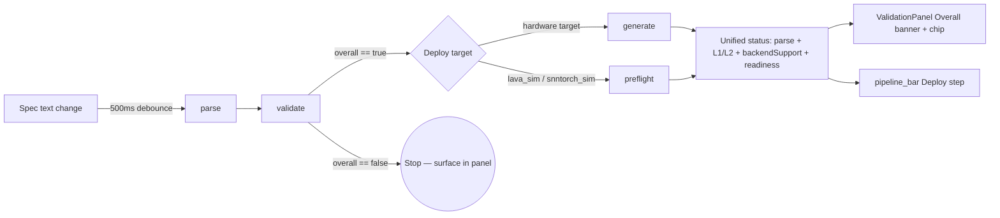

# Validation panel must surface deploy-readiness failures (auto)

**Created:** 2026-05-27
**Branch context:** `agents/training-pane-redesign-and-validation` (worktree) — change applies to the `neurocnl` submodule frontend.
**Related upcoming task:** Play-button removal (separate task — do not modify Play in this work).

## Problem Statement

After the recent `merged validation and parsing` change, `ValidationPanel` only surfaces parse + Layer 1/2 + Backend Support results. The Deploy step in `pipeline_bar.dart` can independently turn red from two failure modes the user pressed Play and observed, neither of which is mirrored in the validation panel:

1. **Generate failure (hardware targets):** `pipelineProvider.generateStatus == StepStatus.error`, with `errorMessage` like `"Generate failed: …"` (set in `pipeline_provider.dart` ~line 302). Today this only runs when the user presses Play.
2. **Simulator preflight failure (lava_sim / snntorch_sim):** `simulatorPreflightProvider` ends with `status == error` or `status == success` + `level == 'unsupported'`.

The result: a red Deploy step with a green Validation panel, no error visible to the user. Compounding the issue, the current Layer 1 invariants were authored for the biological-accuracy product surface; the project has since moved to NIR-only support, so several rules may no longer be meaningful and the panel's structure should be re-checked at the same time.

Because the Play button is being removed in a separate task and validation/deploy-readiness will run automatically, this work folds deploy-readiness *into* validation rather than rendering it as an external trailing section.

## Requirements (gathered)

- **R1:** Save the plan to `docs/current tasks/`. *(answer 1a)*
- **R2:** Surface generate / preflight failures **as part of the validation flow** (not as a separate panel or trailing section). *(answer 2d)*
- **R3:** As part of the same task, audit the current validation rules (Layer 1 invariants, Layer 2 checks, parse rules, BackendSupport) against the NIR-only product surface; drop or re-purpose rules that no longer apply; reorganise into NIR-relevant categories. *(answer 5a)*
- **R4:** Anticipate Play-button removal: validation + deploy-readiness will run automatically on debounced spec change. Do not modify the Play button itself in this task. *(answer 3c)*
- **R5:** Auto-flow runs `generate` (hardware targets) / `preflight` (simulator targets) only **after** validate passes, on the same 500 ms debounce that already governs `runParseAndValidate`. Cancel/dedupe in-flight requests when a newer spec arrives. *(answer 4b)*
- **R6:** The validation panel's `Overall` banner and the pipeline_bar `Deploy` step share a single source of truth: if any auto-step (parse, Layer 1/2, backend support, generate or preflight) is red, both indicators are red; if all are green, both are green. *(answer 6a)*
- **R7:** Keep the existing API contracts (`/api/parse`, `/api/validate`, `/api/generate`, `/api/simulators/preflight`) — no backend changes in scope here.

## Background (research findings)

- `pipelineProvider` (`neurocnl/frontend/lib/providers/pipeline_provider.dart`) already runs `parse → validate → preflight (simulator only)` automatically inside `runParseAndValidate`. `generate` is **only** called from `runGenerateAndSimulate`, which is reached today via the Play button (`_triggerRun` in `studio_screen.dart`, line ~132). Adding `generate` to the auto-chain when validate passes and a hardware target is active is a localised change in this single notifier.
- Spec text changes are debounced 500 ms in `spec_provider.dart` (`_debounce`, `_debounceDelay`). The new auto-generate step inherits that debounce for free.
- Simulator preflight already implements stale-request guards (`_currentKey`, `mounted` checks). The new generate call should follow the same pattern (a `_runningGenerateKey` field plus a `_runningForFileId` check, both already present partially).
- `pipeline_bar.dart` derives the Deploy step status from `_deployStatusFor(pipeline)` (hardware) / `_preflightDeployStatus(...)` (simulator). After this work both paths feed into a unified `pipelineProvider` field, and `pipeline_bar` reads only that field.
- `validation_panel.dart` already watches `pipelineProvider`; it just needs new sections + the `Overall` and `NmtkValidationChip` derivations updated to fold deploy-readiness in.
- NIR-only direction is documented in `neurocnl/docs/CODE_REVIEW_CRITICAL_2026-05-14.md` ("Phase 3 — Resolve the NIR-only vs legacy-Nengo contract") and confirmed by `backend/app/routers/simulate.py` returning HTTP 410. Layer 1 invariants live in `neurocnl/neurocnl/layers/layer1_invariants.py` (8 rules including `threshold_above_resting`, `refractory_period_positive`, `time_constant_positive`, `reset_at_or_below_threshold`, `membrane_potential_decays_toward_rest`, `biological_speed_multiplier_positive`, `adaptive_spiking_tau_positive`, plus hardware-specific groups `LOIHI_INVARIANTS`, `AKIDA_INVARIANTS`, `SPINNAKER_INVARIANTS`, `TEENSY_INVARIANTS`, `NIR_LIF_INVARIANTS`, `NIR_CUBALIF_INVARIANTS`). The audit needs to decide which of the LIF-physical invariants survive on a NIR-graph view of the world.

## Proposed Solution (high-level)

Concretely:

1. Audit the current rules first; produce a written record of what stays / changes / goes (R3).
2. Extend `pipelineProvider` with a single `deployReadinessStatus` + `deployReadinessResult` (a sum type covering generate-error / preflight-unsupported / preflight-error / ok) so consumers don't need to know whether the active target is hardware or simulator.
3. Hook the new readiness call into `runParseAndValidate` after the validate branch passes (R5). Debounce/dedupe with a key + `mounted` guard.
4. Render readiness as new sections inside `ValidationPanel`, between `_BackendSupportCard` and `Layer 1`. Friendly error formatting reuses the existing `_friendlyL2Message` style.
5. Re-derive `_OverallStatus` and `NmtkValidationChip` from the full chain; `pipeline_bar` reads the same derived status (R6).
6. Tests at each step; final integration test asserts the invariant `pipeline_bar Deploy red ⇔ ValidationPanel Overall red`.

## Task Breakdown

> Each task ends with a working, demoable increment, builds on the previous one, and closes with wiring so no orphaned code is left behind.

### Task 1: Audit current validation rules against NIR-only product surface (read-only)

- **Objective:** Produce a written audit at `docs/current tasks/2026-05-27-validation-deploy-readiness/audit.md` enumerating every rule currently surfaced in `ValidationPanel` (Layer 1 invariants, Layer 2 checks, parse error categories, `BackendSupport` verdicts) with a `keep / drop / re-label` decision and a one-line rationale per rule. Cross-reference each Layer 1 entry to `neurocnl/neurocnl/layers/layer1_invariants.py` and each Layer 2 entry to its source check.
- **Implementation guidance:** Read `layer1_invariants.py`, `layer1_validator.py`, the `INVARIANT_FAILURE_MESSAGES` dict, and the validation models in `neurocnl/frontend/lib/models/validation_result.dart`. Cross-check against `CODE_REVIEW_CRITICAL_2026-05-14.md` Phase 3 and the NIR-only routes in `backend/app/routers/simulate.py` and `routers/export.py`.
- **Test requirements:** None (audit is documentation).
- **Demo:** `audit.md` reviewed alongside the existing validation panel; user can read and approve the keep/drop list before any code changes.

### Task 2: Apply the audit — drop / re-label legacy biological invariants and reorganise panel sections

- **Objective:** Implement the keep/drop/re-label decisions from Task 1. Delete or move legacy biological-accuracy invariants to a clearly-named legacy module, rename Layer 1/2 panel headings to NIR-relevant terminology, and update friendly-error message helpers (`_friendlyInvariantMessage`, `_friendlyL2Message`) so they no longer reference biological framing for the surviving rules.
- **Implementation guidance:** Drive each change with a failing widget/integration test asserting the new label or absence of the dropped rule. Update `validation_result.dart` model (`Layer1Result`, `Layer2Result`, `BackendSupportResult`) only if categorisation truly needs to change; otherwise keep the wire format and only adjust UI labels. Do not touch backend `/api/validate` response shape.
- **Test requirements:** Update `neurocnl/frontend/test/widgets/validation_panel_no_nested_cards_test.dart` and `error_reporting_test.dart` to pin the new labels. Add a backend test asserting that any newly-deleted invariant is no longer registered in `ALL_INVARIANTS`.
- **Demo:** Open the studio with a passing spec — the Validation panel shows the new NIR-aligned section names and no longer surfaces the dropped biological-accuracy rules; existing flows still work end-to-end.

### Task 3: Extend `pipelineProvider` with a unified `deployReadiness` state field

- **Objective:** Add `deployReadinessStatus` (`StepStatus`) and `deployReadinessResult` (sealed class with variants `Ok`, `GenerateError(message)`, `PreflightUnsupported(unsupportedNodes, diagnostics)`, `PreflightError(message)`) to `PipelineState`. Wire `copyWith`, `clearDeployReadinessResult`, and JSON cache hooks (none needed — readiness is recomputed on each validate). No call sites yet — this task is pure plumbing.
- **Implementation guidance:** Mirror the existing pattern used for `validateResult` / `parseResult`. Place the sealed-class union next to `validation_result.dart` in the models layer to keep it framework-agnostic.
- **Test requirements:** Unit tests for the new state field's `copyWith`, the sealed class constructors, and equality.
- **Demo:** Build passes, all existing tests still green; `flutter test test/providers/pipeline_provider_test.dart` shows the new state-shape tests passing.

### Task 4: Auto-trigger generate-readiness after a passing validate (hardware targets)

- **Objective:** Inside `runParseAndValidate`, after `state.validateStatus == StepStatus.success`, branch on `selectedDeployTarget`: simulator targets continue to call the existing `simulatorPreflightProvider.runPreflight` and the result is mirrored into `deployReadinessStatus/Result`; hardware (or unset) targets call `apiClient.generate(spec)` and on success store `Ok`, on failure store `GenerateError`. Cancel/skip stale requests using a `_runningReadinessKey = '${target}:${spec.hashCode}'` guard analogous to `simulator_preflight_provider.dart`. Invalidate the readiness state on validate failure or empty spec, mirroring the existing preflight invalidation.
- **Implementation guidance:** Reuse the 500 ms debounce that already wraps `runParseAndValidate` via `specTextProvider`. Do **not** call `simulate` — it's deprecated on the NIR-only surface (returns 410). Make sure `_runningForFileId` semantics are preserved so a fast file switch doesn't write a stale readiness result.
- **Test requirements:** Provider tests with a fake `ApiClient`:
  - (a) hardware target + valid spec → `deployReadinessStatus == success`;
  - (b) hardware target + generate raises `ApiException` → `error` with formatted message;
  - (c) simulator target → mirrors preflight state;
  - (d) two rapid spec changes → only the latest readiness call's result is committed;
  - (e) validate failure → readiness cleared.
- **Demo:** With devtools open, type a spec that validates but causes generate to throw a 422; the `pipelineProvider` state shows `deployReadinessStatus == StepStatus.error` automatically within ~700 ms of the keystroke, no Play press required.

### Task 5: Render deploy-readiness inside the existing `ValidationPanel`

- **Objective:** Add a new section between `_BackendSupportCard` and the Layer 1 accordion item titled per the audit's chosen label (default proposal: "Deploy readiness — &lt;target label&gt;"). Render variants:
  - `Ok` → success banner ("Ready to deploy on &lt;target&gt;").
  - `GenerateError(message)` → danger banner with friendly remap of common backend errors (reuse `_friendlyL2Message` patterns: unexpected token, missing input, etc.).
  - `PreflightUnsupported(...)` → warning/danger banner listing unsupported NIR node types and any diagnostics, with chips matching `_BackendSupportCard` style.
  - `PreflightError(message)` → danger banner with the formatted message.
- **Implementation guidance:** Reuse `NmtkStatusBanner`, `NeurocnlMessageList`, and `ZetaAssistChip` so the new section visually matches existing ones. Idle state renders nothing (mirror current `_BackendSupportCard != null` pattern). Make the section keyed (`_keyFor('deploy_readiness')`) so `_ensureVisible` can scroll to it.
- **Test requirements:** Widget tests covering each variant render. Add to the existing snapshot/governance suites (`zeta_first_audit_test.dart`, `validation_panel_no_nested_cards_test.dart`).
- **Demo:** Reproduce the original bug (spec that validates but fails generate) — the validation panel now shows a red "Deploy readiness" section with a friendly message describing what went wrong, no Play press needed.

### Task 6: Unify the `Overall` status and the `pipeline_bar` Deploy step on a single derived value

- **Objective:** Add a derived getter `PipelineState.overallReady` that returns true iff parse, validate, backendSupport, and deployReadiness are all green (or idle in the empty-spec case). Update:
  - `_OverallStatus` in `validation_panel.dart` to read `overallReady`, with banner copy adjusted ("All checks passed" / "Validation failed — see &lt;first failing section&gt;").
  - `_countErrors` and `_collectErrors` in `validation_panel.dart` to include `deployReadinessResult` errors in the chip count and error list.
  - `_deployStatusFor` and `_preflightDeployStatus` in `pipeline_bar.dart` to read the unified `deployReadinessStatus` directly, removing their now-duplicated branching on simulator vs hardware.
- **Implementation guidance:** After this task `pipeline_bar` no longer imports `simulator_preflight_provider`; it gets everything from `pipelineProvider`. Confirm the Train step in `pipeline_bar` is unaffected.
- **Test requirements:** Integration test (`integration_test/` or widget test) loading the studio with:
  - (a) valid spec + hardware target with stub generate-success → both indicators green;
  - (b) valid spec + hardware target with stub generate-failure → both indicators red, validation panel shows the readiness error;
  - (c) valid spec + lava_sim with stub preflight unsupported → both indicators red, panel lists unsupported nodes.

  The test must assert the invariant directly: `pipeline_bar Deploy step status == ValidationPanel Overall status`.
- **Demo:** Toggle deploy targets in the studio with a spec that compiles for one but not the other — the validation panel and the pipeline-bar Deploy step always agree, in real time.

### Task 7: Cleanup, regression test, and task documentation

- **Objective:**
  - Delete now-unused fields and helpers (`_lastDeployValidationKeys` map in `studio_screen.dart` if it became dead, any duplicated formatting helpers).
  - Add a regression test that fails if a future change re-introduces a divergence between the panel and the bar (assertion-based, lives next to the Task 6 integration test).
  - Write `docs/current tasks/2026-05-27-validation-deploy-readiness/README.md` summarising the bug, the fix, the rule audit outcome, and a `next-steps.md` noting the planned Play-button removal so the next task can pick up cleanly.
- **Implementation guidance:** Run `flutter analyze` and the project's full test suite before closing; ensure no orphaned imports remain. Confirm the existing studio tests (`studio_screen_test.dart`, `studio_responsive_audit_test.dart`) still pass without modification.
- **Test requirements:** All previously added tests + the new regression invariant test must pass. Add a CHANGELOG entry under `neurocnl/CHANGELOG.md`.
- **Demo:** Full studio session: edit spec → both indicators update together every 500 ms; introduce a generate-only failure → validation panel shows the error inline, pipeline bar reflects it; fix the spec → both go green together. No Play press involved at any point.

## Open follow-ups (out of scope here, tracked for next tasks)

- **Play-button removal** — separate task, will rely on the auto-flow delivered here.
- **Backend `/api/generate-check` lightweight endpoint** — considered (4c) but rejected for now in favour of reusing the existing `/api/generate`. Revisit if telemetry shows generate latency hurts editor responsiveness.

## File map (where the changes will land)

- `neurocnl/neurocnl/layers/layer1_invariants.py` — Tasks 1–2 (audit + drop legacy rules)
- `neurocnl/neurocnl/layers/layer1_validator.py` — Task 2 (label/category updates)
- `neurocnl/frontend/lib/models/validation_result.dart` — Task 2 (UI label updates if needed) + Task 3 (new sealed class for readiness)
- `neurocnl/frontend/lib/providers/pipeline_provider.dart` — Tasks 3, 4, 6 (state field, auto-trigger, derived getter)
- `neurocnl/frontend/lib/providers/simulator_preflight_provider.dart` — Task 4 (mirror result into pipelineProvider)
- `neurocnl/frontend/lib/widgets/validation_panel.dart` — Tasks 2, 5, 6 (labels, new section, Overall + chip update)
- `neurocnl/frontend/lib/widgets/pipeline_bar.dart` — Task 6 (read unified status)
- `neurocnl/frontend/lib/screens/studio_screen.dart` — Task 7 (remove dead `_lastDeployValidationKeys` if applicable)
- `neurocnl/frontend/test/**` — Tasks 2–7 (widget, provider, integration tests)
- `neurocnl/CHANGELOG.md` — Task 7
- `docs/current tasks/2026-05-27-validation-deploy-readiness/audit.md` — Task 1
- `docs/current tasks/2026-05-27-validation-deploy-readiness/README.md` — Task 7
