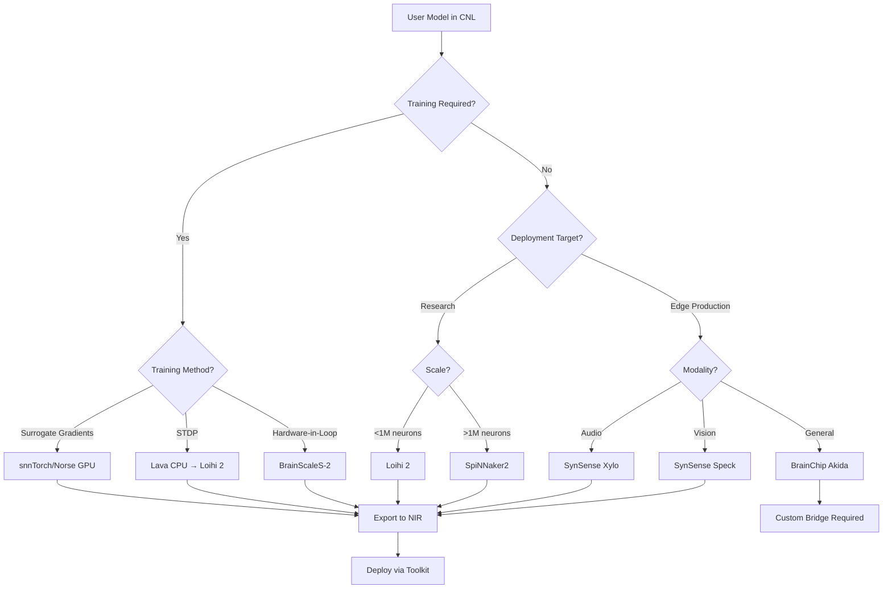

# Neuromorphic Toolkit: Unified Architecture Plan
## CNL → NIR → Multi-Backend Compilation System

**Document Version:** 2.0  
**Date:** May 8, 2026  
**Status:** Strategic Architecture & Implementation Roadmap (Revised for User-Owned Hardware Priority)

---

## Executive Summary

This document presents a comprehensive architectural plan for a **Neuromorphic Toolkit** that enables hardware-agnostic, write-once-deploy-anywhere capabilities for neuromorphic computing applications. The system uses **CNL (Computational Network Language)** as an intuitive frontend and **NIR (Neuromorphic Intermediate Representation)** as an intermediate bridge to diverse hardware and software backends.

### Vision

Create a unified development environment where researchers and engineers can:
- Define spiking neural networks once using intuitive CNL syntax
- Automatically translate models to NIR's platform-independent representation
- Deploy seamlessly to multiple neuromorphic platforms without code changes
- Leverage hardware-specific optimizations through intelligent compilation
- Maintain portability across digital, analog, research, and commercial systems

### Current Status

For the current NeuroCNL-specific implementation status and priority ordering, see [neurocnl_status_and_priorities.md](/Users/yoshimartodihardjo/NeuroMorphicToolKit/docs/neurocnl_status_and_priorities.md).

- [x] **CNL Frontend**: Developed with Flutter UI and Python backend
- [x] **Direct CNL → IR → NIR export path**: Present for the currently supported subset, with fail-closed export rejection for unsupported concepts
- [x] **Backend capability and support planning**: Implemented for NIR and hardware-facing targets including Akida, PYNQ, and Teensy
- [ ] **Broader semantic NIR lowering**: Still in progress for parser-recognized concepts that currently lower only approximately or as metadata
- [ ] **High-level CNL training/evaluation API**: `compile()`, `fit()`, and `evaluate()` style surfaces are still not implemented as the primary public API
- [ ] **Hybrid workload orchestration**: No repo-level heterogeneous CPU/neuromorphic runtime orchestrator is in place yet
- [x] **Implementation roadmap**: Phased roadmap remains useful, but several CNL/NIR slices below are now partially complete rather than purely aspirational

### Key Differentiators

1. **True Hardware Agnosticism**: Single model definition runs on digital (Loihi 2, SpiNNaker2), analog (BrainScaleS-2), and commercial edge (Akida, Xylo) platforms
2. **NIR-Native Architecture**: Built on Nature-published standard with 12+ simulator and 5+ hardware platform support
3. **Intelligent Compilation**: Hardware-aware optimizations preserve model semantics while maximizing platform efficiency
4. **Research-to-Production Pipeline**: Seamless transition from simulation to hardware deployment
5. **User-Owned Hardware First**: Early validation on BrainChip Akida and Pynq Z2 FPGA eliminates procurement delays and enables rapid iteration

---

## 1. Introduction

### 1.1 The Neuromorphic Computing Landscape (2026)

Neuromorphic computing has transitioned from pure research to early commercial deployment, driven by:

- **Energy Crisis in AI**: Conventional AI systems projected to double electricity consumption by 2026, creating urgent demand for energy-efficient alternatives
- **Hardware Maturity**: Multiple platforms reaching production readiness (Intel Loihi 2, BrainChip Akida, SynSense Xylo)
- **Training Breakthroughs**: SNNs achieving 90%+ accuracy using surrogate gradient descent and ANN-to-SNN conversion
- **Standardization Efforts**: NIR published in Nature (2024), NeuroBench framework, IEEE standards development

### 1.2 The Fragmentation Problem

Despite progress, the neuromorphic ecosystem remains highly fragmented:

**Hardware Diversity**
- Digital vs. analog implementations
- Research platforms vs. commercial edge devices
- General-purpose vs. domain-specific architectures
- Vastly different programming models and constraints

**Software Ecosystem Gaps**
- Framework lock-in (Lava for Loihi, custom tools for BrainScaleS)
- Incompatible model representations
- Manual porting required between platforms
- Limited interoperability between simulators and hardware

**Developer Pain Points**
- Steep learning curves for each platform
- Model reimplementation for different targets
- Difficulty comparing platform performance
- Limited portability of research code

### 1.3 Solution: CNL → NIR → Backend Pipeline

Our toolkit addresses fragmentation through a three-layer architecture:

```
┌─────────────────────────────────────────────────────────────┐
│                     CNL FRONTEND LAYER                       │
│  Intuitive model definition, visual editor, type safety     │
└─────────────────────────┬───────────────────────────────────┘
                          │ Translation
                          ▼
┌─────────────────────────────────────────────────────────────┐
│                  NIR INTERMEDIATE LAYER                      │
│  Platform-independent graph representation, optimization    │
└─────────────────────────┬───────────────────────────────────┘
                          │ Compilation
                          ▼
┌─────────────────────────────────────────────────────────────┐
│                    BACKEND LAYER                             │
│  Loihi 2 │ SpiNNaker2 │ BrainScaleS-2 │ Akida │ Simulators │
└─────────────────────────────────────────────────────────────┘
```

**Key Principles**
1. **Separation of Concerns**: Model definition (CNL) decoupled from execution (backends)
2. **Standards-Based**: NIR as common reference frame ensures broad compatibility
3. **Progressive Enhancement**: Basic portability guaranteed, platform-specific optimizations optional
4. **Fail-Closed Design**: Unsupported features detected early with clear error messages

---

## 2. Hardware Landscape Analysis

### 2.1 Platform Comparison Matrix

| Platform | Type | Status | Scale | Power | Key Strengths | Primary Use Cases |
|----------|------|--------|-------|-------|---------------|-------------------|
| **Intel Loihi 2** | Digital | Research | 1M neurons, 120M synapses | ~100mW | Programmability, ecosystem | Algorithm research, prototyping |
| **SpiNNaker2** | Digital | Commercial | 24 boards × 48 chips | ~1W/board | Massive parallelism, bio-realism | Large-scale brain simulation |
| **BrainScaleS-2** | Analog | Research | 512 neurons, 131k synapses | ~1W | 1000× real-time, on-chip training | Fast simulation, hardware-in-loop |
| **BrainChip Akida** | Digital | Commercial | Configurable | <1mW | Ultra-low power, edge deployment | IoT, mobile AI |
| **Pynq Z2** | FPGA | Development | Configurable (Zynq-7000) | ~2-3W | Full programmability, user-owned | Custom neuromorphic prototyping |
| **SynSense Xylo** | Digital | Commercial | Domain-specific | <1mW | Audio/MEMS optimized | Always-on audio processing |
| **SynSense Speck** | Digital | Commercial | Domain-specific | <1mW | Event camera optimized | Vision sensors |

### 2.2 Detailed Platform Profiles

#### 2.2.1 Intel Loihi 2

**Architecture**
- Digital neuromorphic processor on Intel 4 EUV process
- 128 neurocores per chip, hierarchical mesh network
- Programmable neuron and synapse models
- On-chip learning with 3-factor learning rules

**Software Ecosystem**
- **Lava Framework**: Open-source, Magma compiler architecture
- Python API with process-based programming model
- CPU and Loihi backends supported
- Growing community and documentation

**Strengths**
- Most mature software ecosystem
- Flexible neuron models (LIF, ALIF, adaptive, custom)
- Strong Intel backing and roadmap
- Active research community

**Limitations**
- Research access only (Intel INRC program)
- Not commercially available
- Relatively high power for edge deployment
- Limited to digital spiking models

**NIR Support**: ✅ Full support via Lava-NIR integration

---

#### 2.2.2 SpiNNaker2

**Architecture**
- Massively parallel ARM-based system
- 152 ARM cores per chip, 48 chips per board
- Packet-switched communication (AER protocol)
- Designed for biological real-time simulation

**Software Ecosystem**
- PyNN-based programming model
- Custom toolchain for mapping and routing
- Integration with NEST and Brian2 simulators
- Commercial deployment at Sandia National Labs

**Strengths**
- Unmatched scalability (millions of neurons)
- Biological realism (detailed neuron models)
- Proven large-scale deployments
- Real-time interaction capabilities

**Limitations**
- Complex programming model
- Power consumption at scale
- Requires expertise in distributed systems
- Limited on-chip learning support

**NIR Support**: ✅ Supported via PyNN integration

---

#### 2.2.3 BrainScaleS-2

**Architecture**
- Analog neuromorphic SoC (HICANN-X chip)
- 512 analog neurons, 131,072 synapses per chip
- 1000× biological real-time acceleration
- Mixed-signal design (analog compute, digital routing)

**Software Ecosystem**
- PyNN-based interface
- Custom calibration and configuration tools
- Supports surrogate gradient training
- Integration with PyTorch via hxtorch

**Strengths**
- Ultra-fast simulation (1000× speedup)
- Energy-efficient analog computation
- On-chip plasticity and learning
- Hardware-in-the-loop training

**Limitations**
- Small scale (512 neurons per chip)
- Analog variability requires calibration
- Limited availability (Heidelberg University)
- Steep learning curve for analog systems

**NIR Support**: ⚠️ Partial (via PyNN, limited primitives)

---

#### 2.2.4 BrainChip Akida

**Architecture**
- Commercial digital neuromorphic processor
- Event-based processing with temporal coding
- Supports CNNs, RNNs, and fully connected networks
- On-chip learning (one-shot, incremental)

**Software Ecosystem**
- MetaTF (TensorFlow integration)
- Akida Development Environment (ADE)
- Model zoo with pre-trained networks
- Edge deployment tools

**Strengths**
- Commercially available
- Ultra-low power (<1mW inference)
- Production-ready with SDK
- Supports standard CNN architectures

**Limitations**
- Proprietary ecosystem
- Limited neuron model flexibility
- Focused on edge inference
- Less suitable for research exploration

**NIR Support**: ⚠️ Limited (proprietary format, custom bridge required)

---

#### 2.2.5 Pynq Z2 (Xilinx Zynq FPGA)

**Architecture**
- Xilinx Zynq-7000 SoC (dual-core ARM Cortex-A9 + FPGA fabric)
- 85K programmable logic cells, 4.9Mb block RAM
- 650 DSP slices for arithmetic operations
- Programmable logic + processing system integration

**Software Ecosystem**
- PYNQ framework (Python productivity for Zynq)
- Vivado HLS for hardware synthesis
- Custom HDL implementations (Verilog/VHDL)
- Jupyter notebook-based development

**Strengths**
- Complete hardware programmability (custom architectures)
- User-owned hardware (no access restrictions)
- Flexible resource allocation
- Rapid prototyping and iteration
- Integration of ARM processors for control logic

**Limitations**
- Requires FPGA expertise for optimization
- Limited scale compared to dedicated neuromorphic chips
- Power consumption higher than ASICs
- Timing closure challenges for large designs
- No existing neuromorphic framework support

**NIR Support**: ❌ None (requires full custom backend implementation)

**Strategic Value for Toolkit**
- **Immediate Availability**: User-owned hardware enables day-one testing
- **Validation Platform**: Verify compilation pipeline without procurement delays
- **Flexibility**: Test custom neuron models and topologies
- **Cost Efficiency**: No cloud fees or access restrictions
- **Learning Platform**: Understand hardware constraints before scaling to production chips

---

#### 2.2.6 SynSense Xylo & Speck

**Architecture**
- Domain-specific neuromorphic processors
- **Xylo**: Audio and MEMS sensor processing
- **Speck**: Event-based vision (DVS cameras)
- Optimized for always-on, ultra-low-power operation

**Software Ecosystem**
- Rockpool framework (Python)
- Domain-specific model libraries
- Integration with Tonic (event data)
- Deployment tools for embedded systems

**Strengths**
- Lowest power consumption (<1mW)
- Optimized for specific modalities
- Production-ready with evaluation kits
- Strong performance on target tasks

**Limitations**
- Domain-specific (not general-purpose)
- Limited model flexibility
- Smaller community
- Focused on inference only

**NIR Support**: ✅ Supported via Rockpool-NIR integration

---

### 2.3 Key Hardware Divergences

Understanding platform differences is critical for abstraction design:

#### 2.3.1 Digital vs. Analog

**Digital Platforms** (Loihi 2, SpiNNaker2, Akida, SynSense)
- Discrete-time simulation
- Deterministic behavior
- Easier debugging and verification
- Standard programming models

**Analog Platforms** (BrainScaleS-2)
- Continuous-time dynamics
- Device variability and mismatch
- Requires calibration and compensation
- Ultra-fast, energy-efficient

**Abstraction Challenge**: NIR's continuous-time hybrid system model bridges this gap, but analog-specific calibration remains platform-dependent.

#### 2.3.2 Research vs. Commercial

**Research Platforms** (Loihi 2, BrainScaleS-2, SpiNNaker2)
- Flexible, programmable architectures
- Emphasis on exploration and experimentation
- Access restrictions (academic partnerships)
- Evolving software ecosystems

**Commercial Platforms** (Akida, SynSense)
- Production-ready with SDKs
- Optimized for specific use cases
- Commercially available hardware
- Stable, supported toolchains

**Abstraction Challenge**: Balancing research flexibility with commercial deployment requirements.

#### 2.3.3 General-Purpose vs. Domain-Specific

**General-Purpose** (Loihi 2, SpiNNaker2, BrainScaleS-2)
- Support diverse neuron models and topologies
- Suitable for algorithm research
- Higher flexibility, potentially lower efficiency

**Domain-Specific** (Xylo, Speck)
- Optimized for audio or vision
- Best-in-class efficiency for target domain
- Limited applicability outside domain

**Abstraction Challenge**: Detecting model-platform compatibility and guiding users to appropriate targets.

---

## 3. Software Framework Landscape

### 3.1 Framework Comparison Matrix

| Framework | Type | Backend Support | Training | License | Key Strengths |
|-----------|------|-----------------|----------|---------|---------------|
| **Lava** | Hardware-first | Loihi 2, CPU | Limited | BSD-3 | Production-ready, Magma compiler |
| **Nengo** | Simulator | CPU, GPU, Loihi, SpiNNaker | NEF-based | Custom (free research) | Multi-backend, NEF/SPA |
| **snnTorch** | Deep learning | PyTorch/GPU | Surrogate gradients | MIT | PyTorch integration, tutorials |
| **Norse** | Deep learning | PyTorch/GPU | Surrogate gradients | LGPL-3.0 | Modular, research-focused |
| **SpikingJelly** | Deep learning | PyTorch/GPU | Surrogate gradients | Apache-2.0 | Chinese community, docs |
| **NEST** | Simulator | CPU, HPC clusters | STDP, custom | GPL-2.0 | Large-scale, performance |
| **Brian2** | Simulator | CPU, GPU (limited) | Custom dynamics | CeCILL-2.1 | Intuitive, equation-based |
| **Rockpool** | Edge deployment | SynSense, JAX | Surrogate gradients | AGPL-3.0 | SynSense integration |

### 3.2 Detailed Framework Profiles

#### 3.2.1 Lava (Intel)

**Architecture**
- Process-based programming model (Communicating Sequential Processes)
- Magma compiler and runtime for multi-backend execution
- Hierarchical composition of processes
- Channel-based communication between processes

**Capabilities**
- Native Loihi 2 support with full feature access
- CPU backend for development and testing
- Growing library of pre-built processes (neurons, learning rules, I/O)
- Integration with conventional ML frameworks

**Strengths**
- Production-ready with Intel backing
- Clear path from simulation to hardware
- Open-source with active development
- Extensible architecture (Magma can target new backends)

**Limitations**
- Loihi-centric design (other backends secondary)
- Steeper learning curve (CSP paradigm)
- Smaller community compared to PyTorch-based frameworks
- Limited training algorithm support

**NIR Integration**: ✅ Full support via lava-dl NIR export/import

**Relevance to Toolkit**: Primary target for Loihi 2 deployment, reference implementation for process-based execution model.

---

#### 3.2.2 Nengo

**Architecture**
- Neural Engineering Framework (NEF) foundation
- Semantic Pointer Architecture (SPA) for cognitive modeling
- Backend abstraction layer (Nengo core + backend plugins)
- Declarative network construction

**Capabilities**
- Multiple backends: CPU, GPU, Loihi (NengoLoihi), SpiNNaker (NengoSpiNNaker)
- Rate-based and spiking neuron models
- Built-in learning rules (PES, BCM, Oja)
- Cognitive architecture support (working memory, reasoning)

**Strengths**
- Most versatile multi-backend framework
- Strong theoretical foundation (NEF)
- Excellent documentation and examples
- Proven track record in cognitive modeling

**Limitations**
- Custom license (free for research, paid for commercial)
- NEF paradigm may not suit all use cases
- Performance overhead from abstraction layers
- Limited deep learning integration

**NIR Integration**: ⚠️ Partial (via NengoLoihi, limited primitive coverage)

**Relevance to Toolkit**: Demonstrates mature multi-backend architecture, potential integration for cognitive modeling use cases.

---

#### 3.2.3 snnTorch

**Architecture**
- PyTorch extension with custom autograd functions
- Surrogate gradient implementations for backpropagation
- Modular neuron models (LIF, Synaptic, Leaky, Alpha)
- Integration with PyTorch training loops

**Capabilities**
- GPU-accelerated training via PyTorch
- Multiple surrogate gradient functions (fast sigmoid, arctangent, etc.)
- Support for convolutional and recurrent SNNs
- Extensive tutorials and documentation

**Strengths**
- Seamless PyTorch integration (familiar workflow)
- Excellent educational resources
- Active community and development
- CPU and GPU support out-of-the-box

**Limitations**
- Simulation-only (no direct hardware deployment)
- Limited to discrete-time models
- No built-in hardware backend support
- Requires NIR export for hardware deployment

**NIR Integration**: ✅ Full support via snnTorch.export module

**Relevance to Toolkit**: Primary training framework for GPU-accelerated model development, NIR export for hardware deployment.

---

#### 3.2.4 Norse

**Architecture**
- PyTorch-based with functional and modular design
- Stateful neuron modules with explicit state management
- Surrogate gradient support for training
- Emphasis on research flexibility

**Capabilities**
- Wide range of neuron models (LIF, ALIF, Izhikevich, adaptive)
- Functional and object-oriented APIs
- Integration with PyTorch ecosystem (torchvision, etc.)
- Support for custom neuron dynamics

**Strengths**
- Clean, modular codebase
- Research-oriented with flexibility
- Good performance on GPU
- Active development

**Limitations**
- Smaller community than snnTorch
- Less documentation and tutorials
- LGPL-3.0 license (copyleft)
- Simulation-only

**NIR Integration**: ✅ Supported via norse.export module

**Relevance to Toolkit**: Alternative PyTorch-based training option, useful for research-oriented users.

---

#### 3.2.5 SpikingJelly

**Architecture**
- PyTorch-based with clock-driven and event-driven modes
- Surrogate gradient training with multiple backends
- Cupy acceleration for event-driven simulation
- Comprehensive neuron and synapse models

**Capabilities**
- Clock-driven (time-step) and event-driven simulation
- ANN-to-SNN conversion tools
- Pre-trained model zoo
- Extensive Chinese documentation

**Strengths**
- Strong Chinese community
- Comprehensive feature set
- Good performance (Cupy backend)
- Active development and maintenance

**Limitations**
- Documentation primarily in Chinese
- Smaller English-speaking community
- Simulation-only
- Less integration with Western hardware platforms

**NIR Integration**: ⚠️ Limited (community-contributed, not official)

**Relevance to Toolkit**: Potential integration for Chinese market, ANN-to-SNN conversion capabilities.

---

#### 3.2.6 NEST

**Architecture**
- High-performance simulator for large-scale networks
- Hybrid parallelization (MPI + OpenMP)
- Event-driven simulation kernel
- Python interface (PyNEST) over C++ core

**Capabilities**
- Millions of neurons on HPC clusters
- Detailed biological neuron models (Hodgkin-Huxley, AdEx, etc.)
- Synaptic plasticity (STDP, short-term plasticity)
- Integration with SpiNNaker via PyNN

**Strengths**
- Unmatched scalability
- Optimized for performance
- Extensive neuron model library
- Strong neuroscience community

**Limitations**
- Steep learning curve
- Focused on simulation (not training)
- Limited deep learning integration
- Complex setup for distributed execution

**NIR Integration**: ⚠️ Partial (via PyNN bridge, limited coverage)

**Relevance to Toolkit**: Large-scale simulation backend, potential integration for neuroscience-oriented models.

---

#### 3.2.7 Brian2

**Architecture**
- Equation-based neuron and synapse definition
- Code generation for multiple targets (C++, Cython, GPU)
- Intuitive Python API
- Flexible simulation control

**Capabilities**
- Custom neuron dynamics via differential equations
- Synaptic plasticity with arbitrary rules
- Event-driven and clock-driven simulation
- GPU acceleration (experimental)

**Strengths**
- Most intuitive API for neuroscientists
- Maximum flexibility (arbitrary equations)
- Excellent documentation
- Active community

**Limitations**
- Performance limitations for large networks
- GPU support still experimental
- No direct hardware deployment
- Limited deep learning integration

**NIR Integration**: ⚠️ Limited (community interest, not implemented)

**Relevance to Toolkit**: Potential integration for users requiring custom neuron dynamics, educational use cases.

---

#### 3.2.8 Rockpool (SynSense)

**Architecture**
- JAX-based with functional programming style
- Modular network construction (Sequential, Combinatorial)
- Tight integration with SynSense hardware (Xylo, Speck)
- Surrogate gradient training support

**Capabilities**
- Training and deployment for SynSense chips
- JAX acceleration (GPU, TPU)
- Quantization-aware training
- Event-based data processing (Tonic integration)

**Strengths**
- Best-in-class SynSense integration
- Production-ready deployment tools
- JAX performance benefits
- Domain-specific optimizations (audio, vision)

**Limitations**
- Focused on SynSense ecosystem
- Smaller community
- AGPL-3.0 license (copyleft)
- Limited general-purpose use

**NIR Integration**: ✅ Full support via Rockpool NIR module

**Relevance to Toolkit**: Primary pathway for SynSense hardware deployment, reference for edge-optimized workflows.

---

### 3.3 Framework Ecosystem Gaps

Despite the rich framework landscape, several gaps hinder unified development:

#### 3.3.1 Interoperability Challenges

**Model Portability**
- Each framework uses proprietary model representations
- Manual translation required between frameworks
- Loss of metadata and hyperparameters during conversion
- No standard serialization format (until NIR)

**Training-to-Deployment Gap**
- Models trained in PyTorch frameworks (snnTorch, Norse) require manual porting to hardware frameworks (Lava, Rockpool)
- Hyperparameter tuning on simulators may not transfer to hardware
- Limited tools for cross-platform validation

**Backend Fragmentation**
- Hardware platforms require specific frameworks (Loihi → Lava, SynSense → Rockpool)
- No unified API for multi-hardware deployment
- Difficult to compare performance across platforms

#### 3.3.2 Training Ecosystem Maturity

**Limited Hardware-in-the-Loop Training**
- Most training happens on GPU simulators
- Hardware deployment is inference-only
- On-chip learning support varies widely (Loihi 2: yes, Akida: limited, SynSense: no)
- Sim-to-real gap not well addressed

**Surrogate Gradient Standardization**
- Each framework implements different surrogate functions
- No consensus on best practices
- Hyperparameter sensitivity not well documented
- Limited theoretical understanding of surrogate gradient impact

#### 3.3.3 Tooling and Infrastructure

**Debugging and Profiling**
- Limited visualization tools for spiking activity
- Difficult to debug timing-dependent behaviors
- No standard profiling tools across platforms
- Hardware debugging especially challenging

**Benchmarking and Evaluation**
- Inconsistent performance metrics across frameworks
- Difficult to compare energy efficiency
- Limited standardized benchmarks (NeuroBench emerging)
- Reproducibility challenges

**Deployment and MLOps**
- No standard deployment pipelines
- Limited CI/CD integration
- Versioning and model management immature
- Production monitoring tools lacking

---

## 4. NIR: The Unification Layer

### 4.1 NIR Overview

**Neuromorphic Intermediate Representation (NIR)** is a platform-independent specification for spiking neural networks, published in Nature Communications (2024). NIR provides a common reference frame for digital neuromorphic systems, enabling "build once, run anywhere" portability.

**Key Publications**
- Abreu et al., "Neuromorphic intermediate representation: A unified instruction set for interoperable brain-inspired computing," Nature Communications, 2024 [citation:Nature Paper](https://www.nature.com/articles/s41467-024-52259-9)

### 4.2 NIR Design Principles

#### 4.2.1 Computational Primitives as Hybrid Systems

NIR represents each computational unit as a **continuous-time hybrid system** with:

**Continuous Dynamics**
```
τ dv/dt = f(v, x, θ)
```
- `v`: internal state (membrane potential, adaptation variables)
- `x`: input (weighted spikes, currents)
- `θ`: parameters (time constants, thresholds)
- `f`: dynamics function (linear, nonlinear)

**Discrete Events**
```
if v ≥ v_threshold:
    emit spike
    v ← v_reset
```

**Composability**
- Primitives connect via directed edges (synaptic connections)
- Graph structure defines network topology
- Hierarchical composition supported

#### 4.2.2 Core Primitive Set

NIR defines a minimal set of primitives covering common neuromorphic operations:

**Neuron Models**
- `LIF` (Leaky Integrate-and-Fire): Basic spiking neuron
- `CubaLIF` (Current-Based LIF): Explicit current dynamics
- `LIFRecurrent`: LIF with recurrent connections
- `Izhikevich`: Two-variable adaptive neuron

**Synaptic Operations**
- `Linear`: Dense weight matrix (fully connected)
- `Conv2d`: Convolutional connections
- `Affine`: Linear transformation with bias

**Activation and Pooling**
- `SumPool2d`: Spatial pooling
- `Flatten`: Reshape operations

**Input/Output**
- `Input`: Network input nodes
- `Output`: Network output nodes

**Stateful Operations**
- `Delay`: Temporal delays
- `Scale`: Scaling factors

#### 4.2.3 Graph Representation

NIR networks are **static directed acyclic graphs (DAGs)** where:

**Nodes**
- Each node is a computational primitive instance
- Nodes have unique identifiers
- Nodes store parameters (weights, time constants, thresholds)

**Edges**
- Directed edges represent data flow (spike trains, currents)
- Edges connect output of one node to input of another
- Multiple edges can converge (summation) or diverge (broadcasting)

**Example: Simple 3-Layer Network**
```python
import nir

# Define nodes
input_node = nir.Input(shape=(784,))
linear1 = nir.Linear(weight=W1)  # 784 → 128
lif1 = nir.LIF(tau=20.0, v_threshold=1.0, v_reset=0.0)
linear2 = nir.Linear(weight=W2)  # 128 → 10
lif2 = nir.LIF(tau=20.0, v_threshold=1.0, v_reset=0.0)
output_node = nir.Output(shape=(10,))

# Define edges
edges = [
    (input_node, linear1),
    (linear1, lif1),
    (lif1, linear2),
    (linear2, lif2),
    (lif2, output_node)
]

# Create graph
graph = nir.NIRGraph(nodes, edges)

# Save to file
nir.write("model.nir", graph)
```

### 4.3 NIR Ecosystem Support

#### 4.3.1 Supported Platforms (as of 2026)

**Simulators** (12+)
- ✅ snnTorch (PyTorch)
- ✅ Norse (PyTorch)
- ✅ Lava (Intel)
- ✅ Nengo (partial)
- ✅ Rockpool (JAX)
- ✅ sinabs (SynSense)
- ✅ snnax (JAX)
- ✅ Exodus (event-driven)
- ⚠️ SpikingJelly (community)
- ⚠️ NEST (via PyNN bridge)
- ⚠️ Brian2 (planned)

**Hardware Platforms** (5+)
- ✅ Intel Loihi 2 (via Lava)
- ✅ SynSense Xylo (via Rockpool)
- ✅ SynSense Speck (via Rockpool)
- ⚠️ SpiNNaker2 (via PyNN)
- ⚠️ BrainScaleS-2 (via PyNN, limited)
- ❌ BrainChip Akida (proprietary, bridge needed)

**Support Levels**
- ✅ Full: Native NIR import/export, all primitives supported
- ⚠️ Partial: Some primitives supported, may require workarounds
- ❌ None: No NIR support, custom bridge required

#### 4.3.2 NIR Workflow

**Typical Usage Pattern**
```python
# 1. Train model in source framework (e.g., snnTorch)
import snntorch as snn
model = train_model()  # PyTorch training loop

# 2. Export to NIR
import snntorch.export as export
nir_graph = export.to_nir(model, sample_input)
nir.write("model.nir", nir_graph)

# 3. Import in target framework (e.g., Lava for Loihi 2)
import lava.lib.dl.netx as netx
nir_graph = nir.read("model.nir")
lava_net = netx.from_nir(nir_graph)

# 4. Deploy to hardware
lava_net.run(input_data, num_steps=100)
```

### 4.4 NIR Limitations and Challenges

#### 4.4.1 Primitive Coverage Gaps

**Unsupported Neuron Models**
- Complex multi-compartment models (Hodgkin-Huxley, detailed dendrites)
- Custom dynamics defined by arbitrary differential equations
- Analog-specific models (BrainScaleS-2 calibrated neurons)

**Workaround**: Approximate with supported primitives or extend NIR specification

#### 4.4.2 Platform-Specific Features

**Hardware Constraints**
- Loihi 2: Specific learning rule implementations (3-factor)
- BrainScaleS-2: Analog parameter ranges, calibration data
- Akida: Proprietary encoding schemes

**Workaround**: Platform-specific metadata extensions, compilation hints

#### 4.4.3 Training Information Loss

**Missing Metadata**
- Training hyperparameters (learning rate, optimizer state)
- Surrogate gradient functions used
- Normalization statistics
- Data preprocessing pipelines

**Workaround**: Separate metadata files, extended NIR annotations

#### 4.4.4 Dynamic Behavior Representation

**Limitations**
- Static graphs only (no dynamic topology changes)
- No explicit representation of temporal dynamics beyond neuron models
- Limited support for recurrent connections with delays

**Workaround**: Explicit delay nodes, unrolled recurrent structures

---

## 5. CNL → NIR → Backend Architecture

### 5.1 System Overview

The toolkit implements a three-stage compilation pipeline:

```
┌──────────────────────────────────────────────────────────────────┐
│                        STAGE 1: CNL FRONTEND                      │
│  ┌────────────────────────────────────────────────────────────┐  │
│  │ Flutter UI + Python Backend                                │  │
│  │ - Visual network editor                                    │  │
│  │ - Type-safe model definition                              │  │
│  │ - Syntax validation                                        │  │
│  │ - Parameter constraints                                    │  │
│  └────────────────────┬───────────────────────────────────────┘  │
└─────────────────────────┼──────────────────────────────────────────┘
                          │ CNL AST
                          ▼
┌──────────────────────────────────────────────────────────────────┐
│                    STAGE 2: IR TRANSLATION                        │
│  ┌────────────────────────────────────────────────────────────┐  │
│  │ CNL → Internal IR → NIR                                    │  │
│  │ - Semantic analysis                                        │  │
│  │ - Type checking                                            │  │
│  │ - Graph construction                                       │  │
│  │ - Optimization passes                                      │  │
│  └────────────────────┬───────────────────────────────────────┘  │
└─────────────────────────┼──────────────────────────────────────────┘
                          │ NIR Graph
                          ▼
┌──────────────────────────────────────────────────────────────────┐
│                   STAGE 3: BACKEND COMPILATION                    │
│  ┌────────────────────────────────────────────────────────────┐  │
│  │ Platform-Specific Code Generation                          │  │
│  │ - Hardware constraint checking                             │  │
│  │ - Platform-specific optimizations                          │  │
│  │ - Resource allocation                                      │  │
│  │ - Deployment packaging                                     │  │
│  └────────────────────┬───────────────────────────────────────┘  │
└─────────────────────────┼──────────────────────────────────────────┘
                          │ Executable Code
                          ▼
┌──────────────────────────────────────────────────────────────────┐
│                      STAGE 4: EXECUTION                           │
│  Loihi 2 │ SpiNNaker2 │ BrainScaleS-2 │ Akida │ Simulators      │
└──────────────────────────────────────────────────────────────────┘
```

### 5.2 Stage 1: CNL Frontend

#### 5.2.1 CNL Language Design

**Design Goals**
- Intuitive syntax for neuroscientists and ML engineers
- Type safety with compile-time error detection
- Visual and textual representations
- Extensible for custom neuron models

**Core Constructs**

```python
# Population definition
population = Population(
    name="excitatory_layer",
    size=1000,
    neuron_type=LIF(
        tau_mem=20.0,      # ms
        tau_syn=5.0,       # ms
        v_threshold=1.0,
        v_reset=0.0,
        v_rest=0.0
    )
)

# Connection definition
connection = Connection(
    source=input_layer,
    target=excitatory_layer,
    weight=0.5,
    delay=1.0,           # ms
    topology="all_to_all"
)

# Network composition
network = Network(
    populations=[input_layer, excitatory_layer, output_layer],
    connections=[conn1, conn2, conn3],
    simulation_time=1000.0  # ms
)
```

**Type System**
- **Primitive Types**: float, int, bool, string
- **Neuron Types**: LIF, ALIF, Izhikevich, AdEx, Custom
- **Topology Types**: all_to_all, one_to_one, convolutional, random
- **Learning Rules**: STDP, BCM, reward_modulated

**Validation Rules**
- Population sizes must be positive integers
- Time constants must be positive floats
- Threshold > reset voltage
- Connection weights within specified ranges
- Delay values non-negative

#### 5.2.2 Visual Editor (Flutter)

**Features**
- Drag-and-drop population creation
- Visual connection drawing
- Real-time parameter validation
- Interactive network visualization
- Export to CNL text format

**UI Components**
- **Canvas**: Network topology visualization
- **Palette**: Neuron types, connection templates
- **Inspector**: Parameter editing panel
- **Console**: Validation messages, warnings
- **Toolbar**: Save, load, export, simulate

#### 5.2.3 Python Backend

**Responsibilities**
- Parse CNL text to Abstract Syntax Tree (AST)
- Validate syntax and semantics
- Maintain project state
- Coordinate with IR translator
- Manage user sessions

**API Endpoints**
```python
POST /api/parse          # Parse CNL text → AST
POST /api/validate       # Validate network definition
POST /api/translate      # CNL → NIR translation
GET  /api/backends       # List available backends
POST /api/compile        # NIR → Backend compilation
POST /api/deploy         # Deploy to hardware/simulator
```

### 5.3 Stage 2: IR Translation & NIR Bridge

*(Note: This section integrates the specific repository strategy for bridging CNL and NIR capabilities)*

# NIR and CNL Capability Analysis and Bridge Plan

## Scope

This note analyzes the current bridge between NeuroCNL (`cnl`) and NIR inside this repo and proposes an implementation plan to close the remaining gaps.

Primary sources inspected:

- `neurocnl/neurocnl/cnl/cnl_parser.py`
- `neurocnl/neurocnl/cnl/cnl_grammar.md`
- `neurocnl/neurocnl/ir/lowering.py`
- `neurocnl/neurocnl/ir/materializer.py`
- `neurocnl/neurocnl/export/nir_exporter.py`
- `neurocnl/neurocnl/pipeline.py`
- `neurocnl/neurocnl/backends/capabilities.py`
- `neurocnl/docs/support_matrix.md`
- `neurocnl/neurocnl/export/test_nir_integration.py`

## Current CNL Capabilities

### What CNL does well today

- CNL has a broad parser surface. The grammar document enumerates thresholding, refractory behavior, membrane decay, synaptic weight, delay, STDP, inhibitory links, population coding, topology, timing declarations, Akida declarations, and several more advanced neuro concepts.
- Multi-line parsing is already normalized through `parse_spec_text()` in `neurocnl/neurocnl/pipeline.py`.
- There is a typed semantic IR boundary. `lower_to_ir()` converts parsed sentences into `NetworkIR`, `PopulationIR`, `ConnectionIR`, `LearningRuleIR`, and timing declarations.
- CNL can already compile directly to NIR without going through Nengo. `compile_to_nir()` lowers parsed specs to IR and calls `export_to_nir()`.

### Where CNL stops today

- The parser surface is significantly wider than the lowering surface.
- `neurocnl/neurocnl/ir/lowering.py` only advertises lowering support for:
  - `threshold_firing`
  - `refractory_period`
  - `membrane_potential_decay`
  - `synaptic_weight`
  - `axonal_delay`
  - `stdp_learning`
  - `inhibitory_connection`
  - `population_coding`
  - `network_topology`
  - `timing_declaration`
  - `akida_hardware`
  - `akida_spatiotemporal`
- Several parser-recognized concepts are therefore not part of the CNL->IR->NIR bridge yet, including:
  - `lateral_inhibition`
  - `homeostatic_plasticity`
  - `neuromodulation`
  - `population_coding_range`
  - `adaptive_spiking`
  - `receptor_dynamics`
  - `short_term_plasticity`
  - `background_noise`
  - `spatial_connectivity`
- There is also doc drift: `cnl_grammar.md` says the parser recognizes 19 concepts, but the table currently lists more than that.

## Current NIR Capabilities

### What the NIR path does well today

- NIR export is no longer Nengo-dependent for the core path.
- `Materializer.materialize()` converts `NetworkIR` into a `nir.NIRGraph`.
- Population roles are mapped cleanly:
  - `role="input"` -> `nir.Input`
  - `role="output"` -> `nir.Output`
  - otherwise -> `nir.LIF`
- Connections are materialized as explicit `nir.Linear` nodes with deterministic dense weight matrices.
- Provenance and extra semantics are preserved as metadata on nodes and edges.
- STDP and unscoped learning rules are preserved as metadata.
- Integration coverage exists for the direct CNL->IR->NIR path in `neurocnl/neurocnl/export/test_nir_integration.py`.

### Where the NIR path stops today

- NIR is treated as an export format, not an executable backend inside NeuroCNL.
- `neurocnl/docs/support_matrix.md` calls `nir` faithful, but `nir` is not present in `neurocnl/neurocnl/backends/capabilities.py`, so planner-backed capability reporting does not currently own that claim.
- The materializer is semantically narrow:
  - connections become full dense matrices filled from a scalar weight
  - delays are preserved in metadata, not as active NIR delay semantics
  - learning rules are preserved in metadata, not executable graph behavior
  - refractory period is preserved in metadata on `nir.LIF`, not an explicit separate dynamic
  - advanced plasticity, noise, receptor, and spatial semantics are not represented as NIR nodes
- The bridge is therefore structurally valid for simple feedforward LIF graphs, but not semantically complete for the full parser surface.

## Gap Summary

The gap is not "CNL cannot export to NIR." That part already exists.

The real gap is that the current bridge only covers a relatively small semantic subset faithfully:

1. Parser breadth is larger than IR lowering breadth.
2. IR lowering breadth is larger than materialized NIR semantics.
3. Capability docs claim more alignment than the planner and backend registry currently encode.
4. Fidelity is preserved mostly as metadata once the design leaves the core LIF-plus-dense-weights subset.

## Recommended Bridge Strategy

### Phase 1: Make the contract honest

Goal: eliminate ambiguity before expanding functionality.

Work:

- Add an explicit `nir` capability profile to `neurocnl/neurocnl/backends/capabilities.py`.
- Decide whether `nir` should be classified as:
  - `faithful` for the currently supported IR subset only, or
  - `approximate` until delay, learning, and advanced dynamics have first-class representation.
- Align `neurocnl/docs/support_matrix.md`, planner output, and export headers with the same claim.
- Fix the concept-count drift in `neurocnl/neurocnl/cnl/cnl_grammar.md`.
- Document the exact "CNL subset that round-trips to NIR without semantic loss".

Why first:

- The repo currently has a source-of-truth mismatch between docs and capability code.
- Expanding functionality before fixing claims will make downstream consumers trust the wrong fidelity signals.

### Phase 2: Separate supported, metadata-only, and unsupported concepts

Goal: make lowering outcomes explicit instead of silently partial.

Work:

- Introduce concept-level lowering verdicts:
  - `lowered_faithfully`
  - `lowered_as_metadata`
  - `not_lowered`
- Extend `NetworkIR` or lowering results to carry those verdicts.
- For each parser-recognized concept, declare one of:
  - first-class IR concept
  - metadata-only annotation
  - rejected for NIR export
- Fail closed when a user requests NIR export for a concept that is parser-recognized but neither lowered nor intentionally downgraded.

Files likely touched:

- `neurocnl/neurocnl/ir/types.py`
- `neurocnl/neurocnl/ir/lowering.py`
- `neurocnl/neurocnl/planner.py`
- `neurocnl/backend/app/routers/export.py`

Why this matters:

- Today the parser can accept concepts that the NIR bridge does not actually carry through.
- That is the highest-risk source of user misunderstanding.

### Phase 3: Expand the semantic IR to cover the missing concepts intentionally

Goal: close the parser->IR gap.

Recommended order:

1. `population_coding_range`
2. `background_noise`
3. `spatial_connectivity`
4. `lateral_inhibition`
5. `adaptive_spiking`
6. `receptor_dynamics`
7. `short_term_plasticity`
8. `homeostatic_plasticity`
9. `neuromodulation`

Rationale:

- The first group mainly affects topology, parameterization, or annotations.
- The later group needs new dynamics or control channels and is harder to encode honestly in NIR.

Design rule:

- Do not add parser support from memory.
- For each concept added to lowering, define:
  - the IR fields
  - planner semantics
  - NIR encoding strategy
  - tests proving either faithful or approximate preservation

### Phase 4: Upgrade the materializer from "dense LIF scaffolding" to "semantic NIR lowering"

Goal: close the IR->NIR gap.

Work:

- Replace metadata-only delay handling with actual NIR delay nodes where possible.
- Distinguish scalar broadcast weights from true dense connectivity.
- Preserve sparse or local connectivity instead of converting every projection into a full dense matrix.
- Encode inhibitory and receptor semantics with explicit node patterns where NIR supports them; otherwise downgrade them explicitly.
- Preserve timing declarations in a machine-checked way, not just as incidental metadata.
- Define how learning rules should be represented:
  - native NIR node semantics if available
  - otherwise standardized metadata schema plus planner downgrade

Files likely touched:

- `neurocnl/neurocnl/ir/materializer.py`
- `neurocnl/neurocnl/export/nir_exporter.py`
- any NIR converter backends that consume the produced graph

Success criterion:

- A reviewer should be able to inspect a generated `nir.NIRGraph` and determine which semantics are executable versus advisory.

### Phase 5: Add round-trip and consumer validation

Goal: prove the bridge works for real downstream use.

Work:

- Add golden tests for representative CNL families:
  - simple feedforward
  - inhibitory projection
  - delay
  - STDP metadata
  - branching topology
  - input/output populations
- Add negative tests for concepts that must currently reject NIR export.
- Add round-trip tests where practical:
  - CNL -> IR -> NIR
  - NIR -> consumer conversion path
  - resulting consumer artifact preserves the intended subset
- Add planner tests asserting truthful verdicts for NIR exports.

Priority test files:

- `neurocnl/neurocnl/export/test_nir_integration.py`
- new `neurocnl/neurocnl/ir/test_materializer.py`
- planner capability tests under `neurocnl/neurocnl/tests/`

### Phase 6: Surface fidelity in the product UX

Goal: make export limitations visible to operators.

Work:

- Return per-concept fidelity annotations from the backend export routes.
- Show "faithful", "metadata-only", and "unsupported" markers in the Studio export UI.
- Make NIR export warnings actionable, not generic.

Why:

- Users need to know whether a `.nir` artifact is a faithful computational graph or just a structurally compatible container with advisory metadata.

## Concrete Deliverables

Recommended implementation slices:

1. Capability alignment slice
   - add `nir` backend profile
   - align support matrix and planner verdicts
   - fix grammar doc drift

2. Lowering honesty slice
   - add lowering verdict metadata
   - reject parser-only concepts during NIR export

3. Materializer semantics slice
   - implement explicit delay lowering
   - standardize metadata schema for non-executable concepts

4. Missing-concepts slice
   - add one concept family at a time from parser to IR to NIR

5. UX and API slice
   - expose fidelity annotations in export responses and frontend labels

## Recommended Order of Execution

1. Fix capability truthfulness first.
2. Make partial lowering explicit second.
3. Improve NIR semantic lowering for already-supported concepts third.
4. Expand parser-recognized concepts into IR and NIR one family at a time.
5. Expose fidelity annotations in API and UI last, once the backend semantics are stable.

## Bottom Line

The bridge from CNL to NIR already exists and is useful today for simple population-and-connection graphs.

What is missing is not the file export itself, but a trustworthy semantic contract:

- which CNL concepts truly survive into NIR,
- which survive only as metadata,
- which must reject export,
- and how those verdicts are communicated consistently in code, tests, docs, and UI.


### 5.4 Stage 3: Backend Compilation

#### 5.4.1 Backend Abstraction Layer

**Backend Interface**

```python
class NeuromorphicBackend(ABC):
    @abstractmethod
    def compile(self, nir_graph: NIRGraph) -> CompiledModel:
        """Compile NIR graph to backend-specific format."""
        pass
    
    @abstractmethod
    def deploy(self, model: CompiledModel, input_data) -> Results:
        """Deploy and execute model on backend."""
        pass
    
    @abstractmethod
    def get_capabilities(self) -> BackendCapabilities:
        """Return backend capabilities and constraints."""
        pass
```

**Backend Registry**

```python
BACKENDS = {
    "loihi2": Loihi2Backend(),
    "spinnaker2": SpiNNaker2Backend(),
    "brainscales2": BrainScaleS2Backend(),
    "akida": AkidaBackend(),
    "xylo": XyloBackend(),
    "snntorch": snnTorchBackend(),
    "lava_cpu": LavaCPUBackend()
}

def get_backend(name: str) -> NeuromorphicBackend:
    if name not in BACKENDS:
        raise ValueError(f"Unknown backend: {name}")
    return BACKENDS[name]
```

#### 5.4.2 Platform-Specific Compilation

**Loihi 2 Backend (via Lava)**

```python
class Loihi2Backend(NeuromorphicBackend):
    def compile(self, nir_graph: NIRGraph) -> CompiledModel:
        # Use Lava's NIR import
        import lava.lib.dl.netx as netx
        lava_net = netx.from_nir(nir_graph)
        
        # Apply Loihi-specific optimizations
        lava_net = self._optimize_for_loihi(lava_net)
        
        # Compile to Loihi executable
        executable = lava_net.compile(target="loihi2")
        
        return CompiledModel(
            backend="loihi2",
            executable=executable,
            metadata=self._extract_metadata(lava_net)
        )
    
    def _optimize_for_loihi(self, net):
        # Quantize weights to Loihi precision (8-bit)
        net = quantize_weights(net, bits=8)
        
        # Map to neurocores efficiently
        net = optimize_neurocore_mapping(net)
        
        # Configure learning rules if present
        net = configure_learning(net)
        
        return net
```

**SynSense Xylo Backend (via Rockpool)**

```python
class XyloBackend(NeuromorphicBackend):
    def compile(self, nir_graph: NIRGraph) -> CompiledModel:
        # Use Rockpool's NIR import
        from rockpool.devices import xylo
        rockpool_net = xylo.from_nir(nir_graph)
        
        # Quantization-aware optimization
        rockpool_net = self._quantize_for_xylo(rockpool_net)
        
        # Generate Xylo configuration
        config = rockpool_net.to_xylo_config()
        
        return CompiledModel(
            backend="xylo",
            executable=config,
            metadata={"power_estimate": self._estimate_power(config)}
        )
    
    def _quantize_for_xylo(self, net):
        # Xylo uses 16-bit fixed-point
        return quantize_network(net, bits=16, fixed_point=True)
```

**snnTorch Backend (Simulation)**

```python
class snnTorchBackend(NeuromorphicBackend):
    def compile(self, nir_graph: NIRGraph) -> CompiledModel:
        # Use snnTorch's NIR import
        import snntorch.import_nir as import_nir
        snntorch_net = import_nir.from_nir(nir_graph)
        
        # Wrap in PyTorch module
        model = SNNTorchWrapper(snntorch_net)
        
        # Optional: JIT compilation
        if self.use_jit:
            model = torch.jit.script(model)
        
        return CompiledModel(
            backend="snntorch",
            executable=model,
            metadata={"device": "cuda" if torch.cuda.is_available() else "cpu"}
        )
```

#### 5.4.3 Hardware-Specific Optimizations

**Optimization Categories**

**1. Precision Optimization**
- Loihi 2: 8-bit weights, 24-bit states
- Xylo: 16-bit fixed-point
- BrainScaleS-2: Analog calibration curves
- Akida: 4-bit or 8-bit quantization

**2. Topology Optimization**
- Loihi 2: Minimize inter-neurocore communication
- SpiNNaker2: Optimize packet routing
- BrainScaleS-2: Fit within 512-neuron constraint
- Xylo: Maximize layer fusion

**3. Memory Optimization**
- Weight compression (pruning, quantization)
- Activation reuse
- Gradient checkpointing (for training)

**4. Energy Optimization**
- Spike sparsity maximization
- Clock gating (digital platforms)
- Voltage scaling (analog platforms)

**Example: Loihi 2 Neurocore Mapping**

```python
def optimize_neurocore_mapping(network, num_neurocores=128):
    """
    Map network to Loihi 2 neurocores to minimize communication.
    
    Strategy:
    1. Partition graph into clusters (spectral clustering)
    2. Assign clusters to neurocores
    3. Minimize inter-neurocore edges
    """
    # Build adjacency matrix
    adj_matrix = build_adjacency(network)
    
    # Spectral clustering
    clusters = spectral_clustering(adj_matrix, n_clusters=num_neurocores)
    
    # Assign neurons to neurocores
    mapping = {}
    for neuron_id, cluster_id in enumerate(clusters):
        mapping[neuron_id] = cluster_id
    
    # Compute communication cost
    comm_cost = compute_communication_cost(network, mapping)
    
    return mapping, comm_cost
```

### 5.5 Stage 4: Execution and Deployment

#### 5.5.1 Unified Execution API

```python
class ExecutionEngine:
    def __init__(self, backend: str):
        self.backend = get_backend(backend)
    
    def run(self, model: CompiledModel, input_data, num_steps: int):
        """Execute model on backend."""
        results = self.backend.deploy(model, input_data)
        return results
    
    def benchmark(self, model: CompiledModel, input_data):
        """Benchmark model performance."""
        metrics = {
            "latency": measure_latency(model, input_data),
            "throughput": measure_throughput(model, input_data),
            "energy": measure_energy(model, input_data),
            "accuracy": measure_accuracy(model, input_data)
        }
        return metrics
```

#### 5.5.2 Cross-Platform Validation

**Validation Strategy**
1. Run same model on multiple backends
2. Compare output spike trains
3. Detect numerical divergence
4. Report compatibility issues

```python
def cross_platform_validate(nir_graph, backends=["snntorch", "lava_cpu"]):
    """Validate model produces consistent results across backends."""
    
    results = {}
    for backend_name in backends:
        backend = get_backend(backend_name)
        model = backend.compile(nir_graph)
        output = backend.deploy(model, test_input)
        results[backend_name] = output
    
    # Compare outputs
    reference = results[backends[0]]
    for backend_name, output in results.items():
        similarity = compute_spike_similarity(reference, output)
        if similarity < 0.95:
            warnings.warn(
                f"Backend '{backend_name}' output differs from reference "
                f"(similarity: {similarity:.2f})"
            )
    
    return results
```

---

## 6. Hardware-Software Compatibility Matrix

### 6.1 Platform Support Matrix

| Platform | NIR Support | Primary Framework | Training Support | Deployment Maturity | Recommended Use Cases |
|----------|-------------|-------------------|------------------|---------------------|----------------------|
| **Intel Loihi 2** | ✅ Full | Lava | Limited (on-chip) | 🟡 Research | Algorithm research, prototyping |
| **SpiNNaker2** | ⚠️ Partial | PyNN, NEST | STDP | 🟢 Production | Large-scale brain simulation |
| **BrainScaleS-2** | ⚠️ Partial | PyNN, hxtorch | ✅ Surrogate gradients | 🟡 Research | Fast simulation, hardware-in-loop |
| **BrainChip Akida** | ❌ None | MetaTF | Limited | 🟢 Production | Edge inference, IoT |
| **SynSense Xylo** | ✅ Full | Rockpool | ❌ Inference only | 🟢 Production | Audio processing, always-on |
| **SynSense Speck** | ✅ Full | Rockpool | ❌ Inference only | 🟢 Production | Event-based vision |
| **snnTorch (GPU)** | ✅ Full | PyTorch | ✅ Surrogate gradients | 🟢 Mature | Training, development |
| **Norse (GPU)** | ✅ Full | PyTorch | ✅ Surrogate gradients | 🟢 Mature | Research, training |
| **Lava CPU** | ✅ Full | Lava | Limited | 🟢 Mature | Development, testing |

**Legend**
- ✅ Full: Complete support, production-ready
- ⚠️ Partial: Limited support, may require workarounds
- ❌ None: No support, custom bridge required
- 🟢 Production: Stable, commercially deployed
- 🟡 Research: Active development, academic access

### 6.2 Feature Compatibility Matrix

| Feature | Loihi 2 | SpiNNaker2 | BrainScaleS-2 | Akida | Xylo | Speck | snnTorch | Norse |
|---------|---------|------------|---------------|-------|------|-------|----------|-------|
| **LIF Neurons** | ✅ | ✅ | ✅ | ✅ | ✅ | ✅ | ✅ | ✅ |
| **ALIF/Adaptive** | ✅ | ✅ | ✅ | ❌ | ⚠️ | ⚠️ | ✅ | ✅ |
| **Izhikevich** | ✅ | ✅ | ⚠️ | ❌ | ❌ | ❌ | ✅ | ✅ |
| **Custom Dynamics** | ✅ | ✅ | ⚠️ | ❌ | ❌ | ❌ | ✅ | ✅ |
| **Dense Connections** | ✅ | ✅ | ✅ | ✅ | ✅ | ✅ | ✅ | ✅ |
| **Convolutional** | ✅ | ✅ | ⚠️ | ✅ | ✅ | ✅ | ✅ | ✅ |
| **Recurrent** | ✅ | ✅ | ✅ | ✅ | ✅ | ✅ | ✅ | ✅ |
| **STDP Learning** | ✅ | ✅ | ✅ | ⚠️ | ❌ | ❌ | ✅ | ✅ |
| **Surrogate Gradients** | ⚠️ | ❌ | ✅ | ❌ | ❌ | ❌ | ✅ | ✅ |
| **On-chip Learning** | ✅ | ⚠️ | ✅ | ⚠️ | ❌ | ❌ | N/A | N/A |
| **Delays** | ✅ | ✅ | ✅ | ⚠️ | ⚠️ | ⚠️ | ✅ | ✅ |
| **Max Network Size** | 1M neurons | 10M+ neurons | 512 neurons | Configurable | ~1k neurons | ~1k neurons | GPU memory | GPU memory |
| **Power Consumption** | ~100mW | ~1W/board | ~1W | <1mW | <1mW | <1mW | ~200W (GPU) | ~200W (GPU) |

### 6.3 Backend Prioritization

Based on NIR support, ecosystem maturity, **user-owned hardware availability**, and use case coverage, we prioritize backends in three tiers:

#### Tier 1: Initial Release (Highest Priority)

**1. snnTorch (GPU Simulator)**
- **Rationale**: Best training ecosystem, full NIR support, extensive documentation
- **Use Case**: Primary development and training platform
- **Implementation Effort**: Low (native NIR export)
- **Target Timeline**: Phase 1 (Month 1-2)

**2. Lava CPU (Simulator)**
- **Rationale**: Intel-backed, production-ready, path to Loihi 2
- **Use Case**: Development, testing, Loihi 2 preparation
- **Implementation Effort**: Low (native NIR import)
- **Target Timeline**: Phase 1 (Month 1-2)

**3. BrainChip Akida (Hardware) ⭐ USER-OWNED**
- **Rationale**: User-owned hardware enables immediate validation, commercial edge deployment target
- **Use Case**: Early hardware validation, edge inference, IoT applications
- **Implementation Effort**: High (no NIR support, custom MetaTF/Akida SDK bridge)
- **Strategic Value**: Eliminates procurement delays, enables rapid iteration
- **Target Timeline**: Phase 2 (Month 3-4)

**4. Pynq Z2 FPGA (Hardware) ⭐ USER-OWNED**
- **Rationale**: User-owned FPGA provides maximum flexibility for custom neuromorphic implementations
- **Use Case**: Custom architecture prototyping, algorithm validation, hardware constraint exploration
- **Implementation Effort**: Very High (full custom backend, HDL implementation)
- **Strategic Value**: Complete control, no access restrictions, cost-free experimentation
- **Target Timeline**: Phase 2 (Month 3-4)

#### Tier 2: Extended Release (Medium Priority)

**5. Intel Loihi 2 (Hardware)**
- **Rationale**: Most mature neuromorphic hardware, strong ecosystem
- **Use Case**: Hardware deployment for research, algorithm benchmarking
- **Implementation Effort**: Medium (via Lava, requires INRC access)
- **Target Timeline**: Phase 3 (Month 5-6)

**6. SynSense Xylo (Hardware)**
- **Rationale**: Commercial edge deployment, full NIR support
- **Use Case**: Audio processing, ultra-low-power applications
- **Implementation Effort**: Medium (via Rockpool)
- **Target Timeline**: Phase 3 (Month 5-6)

**7. Norse (GPU Simulator)**
- **Rationale**: Research flexibility, alternative to snnTorch
- **Use Case**: Advanced research, custom neuron models
- **Implementation Effort**: Low (native NIR export)
- **Target Timeline**: Phase 3 (Month 5-6)

**8. SynSense Speck (Hardware)**
- **Rationale**: Event-based vision, complements Xylo
- **Use Case**: DVS camera processing
- **Implementation Effort**: Low (same as Xylo via Rockpool)
- **Target Timeline**: Phase 3 (Month 5-6)

#### Tier 3: Future Expansion (Lower Priority)

**9. SpiNNaker2 (Hardware)**
- **Rationale**: Large-scale simulation, proven deployments
- **Use Case**: Massive networks, biological modeling
- **Implementation Effort**: High (PyNN bridge, complex toolchain)
- **Target Timeline**: Phase 4 (Month 7-9)

**10. BrainScaleS-2 (Hardware)**
- **Rationale**: Unique analog capabilities, fast simulation
- **Use Case**: Hardware-in-the-loop training, analog research
- **Implementation Effort**: High (limited NIR support, calibration complexity)
- **Target Timeline**: Phase 5 (Month 10-12)

**11. NEST (Simulator)**
- **Rationale**: Large-scale neuroscience simulation
- **Use Case**: Detailed biological models
- **Implementation Effort**: High (PyNN bridge, limited NIR)
- **Target Timeline**: Phase 6 (Month 13+)

### 6.3.1 Strategic Rationale for User-Owned Hardware Priority

**Immediate Validation Benefits**
- **Zero Procurement Delay**: Akida and Pynq Z2 available day one for testing
- **Rapid Iteration**: No access requests, no queue times, no usage quotas
- **Cost Efficiency**: Eliminates cloud fees and hardware rental costs during development
- **Risk Mitigation**: Identify integration challenges early before scaling to additional platforms

**Diverse Testing Environment**
- **Akida**: Commercial neuromorphic ASIC with proprietary toolchain (tests real-world deployment path)
- **Pynq Z2**: Programmable FPGA fabric (tests custom architecture flexibility)
- **Complementary Constraints**: Different hardware limitations expose portability issues early

**Technical Learning**
- **Hardware Constraints**: Understand resource limitations, timing requirements, quantization effects
- **Compilation Challenges**: Debug NIR translation issues with immediate hardware feedback
- **Optimization Strategies**: Develop hardware-aware optimization passes with real measurements

### 6.4 Compatibility Decision Tree



---

## 7. Implementation Roadmap

### 7.1 Phased Development Strategy

The toolkit implementation follows a 6-phase approach over 12-18 months:

```
Phase 1: Foundation (Months 1-2)
├── CNL parser and validator
├── Internal IR design and implementation
├── NIR translation layer
└── Tier 1 backends (snnTorch, Lava CPU)

Phase 2: User-Owned Hardware Integration (Months 3-4) ⭐ REVISED
├── Akida backend (MetaTF/Akida SDK bridge)
├── Pynq Z2 FPGA backend (custom HDL implementation)
├── Cross-platform validation framework
└── Hardware-specific optimization passes

Phase 3: Research Hardware Expansion (Months 5-6) ⭐ REVISED
├── Loihi 2 backend (via Lava)
├── SynSense Xylo backend (via Rockpool)
├── Norse backend integration
└── Surrogate gradient training workflows

Phase 4: Scale and Performance (Months 7-9)
├── SpiNNaker2 backend (large-scale)
├── SynSense Speck backend (event vision)
├── Advanced optimization passes
├── Performance profiling and benchmarking
└── Energy estimation tools

Phase 5: Production Readiness (Months 10-12)
├── BrainScaleS-2 analog backend
├── ANN-to-SNN conversion tools
├── Deployment automation (CI/CD)
├── Model zoo and examples
└── Documentation and tutorials

Phase 6: Ecosystem Expansion (Months 13+)
├── NEST simulator integration
├── Community contributions
├── Hardware-in-the-loop training
└── Commercial support offerings
```

### 7.2 Phase 1: Foundation (Months 1-2)

**Objectives**
- Establish core architecture (CNL → IR → NIR)
- Implement Tier 1 backends for development workflow
- Validate end-to-end pipeline with simple models

**Deliverables**

**WS-1: CNL Frontend**
- ✅ CNL syntax specification (EBNF grammar)
- ✅ Python parser (using Lark or PLY)
- ✅ Type system and validation rules
- ✅ Flutter visual editor (basic version)
- ✅ REST API for frontend-backend communication

**WS-2: Internal IR**
- ✅ IR data structures (nodes, edges, attributes)
- ✅ CNL AST → IR translator
- ✅ Semantic analysis passes
- ✅ Graph optimization framework
- ✅ Error reporting with source location tracking

**WS-3: NIR Translation**
- ✅ IR → NIR mapping rules
- ✅ NIR graph construction
- ✅ Primitive coverage (LIF, Linear, Conv2d, Input, Output)
- ✅ Fail-closed validation (unsupported features detected)
- ✅ NIR serialization (save/load .nir files)

**WS-4: snnTorch Backend**
- ✅ NIR → snnTorch import (using snntorch.import_nir)
- ✅ Execution wrapper (forward pass, spike recording)
- ✅ Training integration (surrogate gradients)
- ✅ Example models (MNIST, DVS Gesture)

**WS-5: Lava CPU Backend**
- ✅ NIR → Lava import (using lava.lib.dl.netx)
- ✅ CPU execution (development mode)
- ✅ Process-based model construction
- ✅ Example models (simple feedforward, recurrent)

**Success Criteria**
- [ ] CNL model → NIR → snnTorch → Training → 90%+ MNIST accuracy
- [ ] CNL model → NIR → Lava CPU → Inference → Correct outputs
- [ ] Cross-platform validation: snnTorch and Lava CPU produce similar outputs
- [ ] Documentation: Getting started guide, API reference

**Risks and Mitigations**
- **Risk**: NIR primitive coverage insufficient for common models
  - **Mitigation**: Start with simple models (feedforward, basic recurrent), expand primitives incrementally
- **Risk**: CNL syntax too complex or unintuitive
  - **Mitigation**: User testing with neuroscience and ML practitioners, iterate on syntax

### 7.3 Phase 2: User-Owned Hardware Integration (Months 3-4) ⭐ REVISED

**Strategic Shift**: Prioritize user-owned hardware (Akida + Pynq Z2) for immediate validation without procurement delays, access restrictions, or cloud costs.

**Objectives**
- Enable deployment to user-owned neuromorphic hardware
- Validate compilation pipeline with real hardware feedback
- Implement hardware-specific optimizations for ASIC and FPGA targets
- Establish cross-platform validation methodology
- Identify integration challenges early before scaling to additional platforms

**Deliverables**

**WS-6: BrainChip Akida Backend ⭐ USER-OWNED HARDWARE**
- ✅ NIR → MetaTF translation layer (custom bridge, no native NIR support)
- ✅ Akida SDK integration (model compilation, deployment)
- ✅ Quantization pipeline (4-bit/8-bit weights, event-driven encoding)
- ✅ Edge deployment tools (model packaging, inference API)
- ✅ Power profiling and measurement
- ✅ Example: MNIST classification on Akida hardware
- ✅ Example: Keyword spotting for edge deployment

**Technical Challenges**
- No native NIR support requires custom translation layer
- Event-driven execution model differs from time-stepped simulation
- Limited recurrent SNN support (CNN/RNN focus)
- Proprietary toolchain integration complexity
- Quantization constraints (4-bit/8-bit precision)

**WS-7: Pynq Z2 FPGA Backend ⭐ USER-OWNED HARDWARE**
- ✅ Custom neuromorphic architecture design (LIF neuron HDL implementation)
- ✅ NIR → FPGA mapping strategy (resource allocation, timing optimization)
- ✅ Vivado HLS integration or custom Verilog/VHDL implementation
- ✅ PYNQ framework integration (Python control, Jupyter notebooks)
- ✅ Memory management (block RAM allocation, weight storage)
- ✅ Timing closure optimization (clock constraints, pipelining)
- ✅ Example: Simple SNN on FPGA fabric (100-500 neurons)
- ✅ Example: Real-time spike processing demonstration

**Technical Challenges**
- No existing neuromorphic framework support (full custom implementation)
- FPGA resource constraints (85K LUTs, 106K flip-flops, 4.9Mb BRAM)
- Timing closure for large networks (clock frequency optimization)
- Power budget management (~12W typical, 3W minimum)
- Debugging complexity (limited observability vs. simulation)
- HDL expertise required for optimization

**WS-8: Cross-Platform Validation**
- ✅ Spike train similarity metrics (Victor-Purpura distance, van Rossum distance)
- ✅ Automated validation suite (same model on snnTorch, Lava CPU, Akida, Pynq Z2)
- ✅ Divergence detection and reporting (quantization effects, timing differences)
- ✅ Performance benchmarking framework (latency, throughput, energy)
- ✅ Hardware vs. simulation accuracy analysis

**WS-9: Hardware-Specific Optimization Framework**
- ✅ Akida-specific optimizations (event sparsity maximization, layer fusion)
- ✅ FPGA-specific optimizations (resource utilization, pipelining, parallelization)
- ✅ Weight quantization passes (4-bit, 8-bit, 16-bit, custom fixed-point)
- ✅ Pruning strategies (magnitude-based, structured, hardware-aware)
- ✅ Topology optimization (connection pruning, layer merging)
- ✅ Backend-specific optimization selection and recommendation

**Success Criteria**
- [ ] MNIST model runs on Akida hardware with <5% accuracy drop vs. snnTorch
- [ ] Simple SNN (100-500 neurons) runs on Pynq Z2 FPGA in real-time
- [ ] Cross-platform validation detects incompatibilities automatically
- [ ] Optimization passes reduce model size by 50%+ without accuracy loss
- [ ] Hardware deployment workflow documented end-to-end
- [ ] Power measurements collected for both platforms

**Risks and Mitigations**
- **Risk**: Akida custom bridge complexity (no NIR support)
  - **Mitigation**: Incremental development, start with simple models, leverage MetaTF documentation
- **Risk**: Pynq Z2 FPGA resource limitations (small networks only)
  - **Mitigation**: Focus on proof-of-concept, document scalability path to larger FPGAs
- **Risk**: Hardware debugging difficulty (limited observability)
  - **Mitigation**: Extensive simulation validation before hardware deployment, logging infrastructure
- **Risk**: Timing closure challenges on FPGA
  - **Mitigation**: Conservative clock frequencies initially, iterative optimization
- **Risk**: Hardware-software accuracy gap (quantization, timing)
  - **Mitigation**: Quantization-aware training, calibration tools, clear documentation of expected gaps

**Strategic Value**
- **Immediate Feedback**: User-owned hardware enables day-one testing without access delays
- **Cost Efficiency**: No cloud fees, no hardware rental, no access request bureaucracy
- **Risk Mitigation**: Identify integration issues early before investing in additional platform support
- **Diverse Validation**: ASIC (Akida) + FPGA (Pynq Z2) provide complementary testing environments
- **Development Velocity**: Continuous hardware access accelerates iteration cycles

### 7.4 Phase 3: Research Hardware Expansion + Training Ecosystem (Months 5-7)

**Objectives**
- Expand to research-grade neuromorphic platforms (Loihi 2, Xylo)
- Establish institutional hardware partnerships
- Expand training capabilities (surrogate gradients, STDP, hybrid)
- Integrate alternative frameworks (Norse)
- Enable hardware-in-the-loop training

**Rationale**
Research hardware platforms (Loihi 2, Xylo) require institutional access and longer lead times compared to user-owned hardware (Phase 2). This phase combines hardware expansion with training ecosystem development to enable research workflows on platforms requiring partnerships with Intel, SynSense, and academic institutions.

**Deliverables**

**WS-10: Intel Loihi 2 Backend ⭐ RESEARCH HARDWARE**
- ✅ NIR → Lava → Loihi 2 compilation pipeline
- ✅ Neurocore mapping and routing optimization
- ✅ On-chip learning rule support (3-factor STDP)
- ✅ Multi-chip scaling for large networks
- ✅ Example: Deploy 100K neuron network to Loihi 2 hardware
- **Hardware Access**: Intel INRC (Neuromorphic Research Community) partnership
- **Timeline**: 2-3 weeks (hardware access + compilation pipeline)

**WS-11: SynSense Xylo Backend ⭐ RESEARCH HARDWARE**
- ✅ NIR → Rockpool → Xylo compilation
- ✅ 16-bit fixed-point quantization for Xylo constraints
- ✅ Audio/MEMS sensor preprocessing integration
- ✅ Ultra-low-power deployment (<1mW)
- ✅ Example: Deploy keyword spotting model to Xylo hardware
- **Hardware Access**: SynSense developer program or academic partnership
- **Timeline**: 1-2 weeks (Rockpool integration + quantization)

**WS-12: Norse Backend (Training Framework)**
- ✅ NIR → Norse compilation
- ✅ Surrogate gradient training support (SuperSpike, SLAYER)
- ✅ Custom neuron model support (adaptive LIF, Izhikevich)
- ✅ GPU-accelerated training with PyTorch backend
- ✅ Example: Train DVS Gesture classifier with Norse
- **Timeline**: 1-2 weeks (Norse integration + training workflows)

**WS-13: Training Workflows**
- ✅ Surrogate gradient descent (SurrGD) integration
- ✅ STDP learning rule support (pair-based, triplet, reward-modulated)
- ✅ ANN-to-SNN conversion pipeline (rate coding, temporal coding)
- ✅ Hybrid training (ANN pretraining + SNN fine-tuning)
- ✅ Training-to-deployment workflow (train in Norse/snnTorch, deploy to Loihi 2/Xylo)
- **Timeline**: 2-3 weeks (training method integration + validation)

**WS-14: BrainScaleS-2 Backend (Hardware-in-Loop)**
- ✅ NIR → PyNN → BrainScaleS-2 compilation
- ✅ Analog neuron calibration tools (membrane time constants, thresholds)
- ✅ Hardware-in-the-loop training (fast mode: 1000× biological real-time)
- ✅ Noise-aware training for analog hardware robustness
- ✅ Example: Train small network on BrainScaleS-2, validate on snnTorch
- **Hardware Access**: Heidelberg University HBP infrastructure (remote access)
- **Timeline**: 2-3 weeks (PyNN integration + calibration tools)

**Success Criteria**
- [ ] Loihi 2 backend deploys 100K neuron network with <10% accuracy drop vs. simulation
- [ ] Xylo backend achieves <1mW power consumption on keyword spotting task
- [ ] Norse backend trains DVS Gesture classifier to >85% accuracy
- [ ] Training workflows support 3+ training methods (SurrGD, STDP, conversion)
- [ ] BrainScaleS-2 backend runs hardware-in-the-loop training loop
- [ ] Same model trains on Norse, deploys to Loihi 2/Xylo with <5% accuracy drop

**Risks and Mitigations**
- **Risk**: BrainScaleS-2 access limited (Heidelberg University)
  - **Mitigation**: Remote access via HBP infrastructure, focus on simulation mode initially
- **Risk**: Hardware-in-the-loop training unstable (analog noise, calibration drift)
  - **Mitigation**: Robust gradient estimation, noise-aware training algorithms

### 7.5 Phase 4: Scale and Performance (Months 7-9)

**Objectives**
- Enable large-scale networks (millions of neurons)
- Optimize performance (latency, throughput, energy)
- Establish benchmarking methodology

**Deliverables**

**WS-15: SpiNNaker2 Backend**
- ✅ NIR → PyNN → SpiNNaker2 compilation
- ✅ Multi-board mapping and routing
- ✅ Real-time interaction capabilities
- ✅ Example: Large-scale cortical model (1M+ neurons)

**WS-16: Advanced Optimizations**
- ✅ Graph partitioning for distributed execution
- ✅ Communication minimization (inter-chip, inter-board)
- ✅ Memory hierarchy optimization
- ✅ Dynamic voltage and frequency scaling (DVFS)

**WS-17: Performance Profiling**
- ✅ Latency profiling (per-layer, end-to-end)
- ✅ Throughput measurement (spikes/second, inferences/second)
- ✅ Energy profiling (hardware power meters, estimation models)
- ✅ Bottleneck identification and recommendations

**WS-18: Benchmarking Suite**
- ✅ Standard benchmarks (MNIST, CIFAR-10, DVS Gesture, N-MNIST)
- ✅ Multi-backend comparison (accuracy, latency, energy)
- ✅ NeuroBench integration
- ✅ Automated reporting and visualization

**Success Criteria**
- [ ] SpiNNaker2 backend runs 1M neuron network in real-time
- [ ] Optimization passes reduce energy consumption by 2× on Loihi 2
- [ ] Benchmarking suite covers 10+ models across 5+ backends
- [ ] Performance profiling identifies bottlenecks with <5% overhead

**Risks and Mitigations**
- **Risk**: SpiNNaker2 toolchain complexity (mapping, routing)
  - **Mitigation**: Leverage existing PyNN tools, collaborate with SpiNNaker team
- **Risk**: Energy measurement accuracy (hardware variability, measurement overhead)
  - **Mitigation**: Multiple measurement methods (hardware meters, simulation models), statistical analysis

### 7.6 Phase 5: Production Readiness (Months 10-12)

**Objectives**
- Prepare toolkit for production deployment
- Build model zoo and documentation
- Establish CI/CD and release processes

**Deliverables**

**WS-19: Production Features**
- ✅ Model versioning and management
- ✅ Deployment automation (scripts, containers)
- ✅ Monitoring and logging (inference metrics, errors)
- ✅ A/B testing framework (compare backends, model versions)

**WS-20: Model Zoo**
- ✅ Pre-trained models (MNIST, CIFAR-10, DVS Gesture, keyword spotting)
- ✅ Model cards (architecture, training, performance)
- ✅ Deployment guides (per backend)
- ✅ Fine-tuning tutorials

**WS-21: Documentation**
- ✅ User guide (getting started, tutorials, examples)
- ✅ API reference (CNL syntax, Python API, REST API)
- ✅ Backend guide (capabilities, limitations, optimization tips)
- ✅ Troubleshooting guide (common errors, debugging)

**WS-22: CI/CD**
- ✅ Automated testing (unit, integration, cross-platform)
- ✅ Continuous benchmarking (performance regression detection)
- ✅ Release automation (versioning, packaging, distribution)
- ✅ Community contribution guidelines

**Success Criteria**
- [ ] Model zoo contains 20+ pre-trained models
- [ ] Documentation covers 100% of public API
- [ ] CI/CD pipeline runs on every commit, <10 minute feedback
- [ ] Community contributions: 5+ external contributors

**Risks and Mitigations**
- **Risk**: Documentation maintenance burden
  - **Mitigation**: Auto-generate API docs, community contributions, dedicated technical writer
- **Risk**: CI/CD complexity (multiple backends, hardware access)
  - **Mitigation**: Tiered testing (simulators in CI, hardware in nightly builds), mock backends

### 7.7 Phase 6: Ecosystem Expansion (Months 13+)

**Objectives**
- Expand backend coverage (Akida, NEST)
- Foster community ecosystem
- Explore commercial opportunities

**Deliverables**

**WS-23: NEST Backend**
- ⚠️ NIR → PyNN → NEST compilation
- ⚠️ HPC cluster deployment
- ⚠️ Large-scale biological models
- ⚠️ Example: Cortical microcircuit simulation

**WS-24: Community Ecosystem**
- ✅ Plugin system (custom backends, neuron models, optimizations)
- ✅ Community model zoo (user-contributed models)
- ✅ Forum and support channels
- ✅ Hackathons and competitions

**WS-25: Commercial Offerings**
- ⚠️ Enterprise support (SLA, priority bug fixes)
- ⚠️ Managed deployment (cloud-hosted toolkit)
- ⚠️ Custom backend development (partnerships)
- ⚠️ Training and consulting services

**Success Criteria**
- [ ] NEST backend runs on HPC cluster with 10M+ neurons
- [ ] Community contributions: 50+ external contributors, 100+ community models
- [ ] Commercial pilot: 3+ paying customers

---

## 8. Technical Challenges and Solutions

### 8.1 Abstraction Challenges

#### 8.1.1 Semantic Gap: CNL ↔ NIR

**Challenge**: CNL is high-level (populations, connections), NIR is low-level (nodes, edges, primitives)

**Example**
```python
# CNL: High-level population
Population(size=1000, neuron_type=LIF(tau=20.0))

# NIR: Low-level node (no explicit "population" concept)
nir.LIF(tau=20.0, v_threshold=1.0, ...)
# Size encoded in weight matrix dimensions
```

**Solution**
- Internal IR bridges the gap with explicit population semantics
- Translation phase expands populations into NIR node instances
- Metadata annotations preserve high-level structure for debugging

#### 8.1.2 Hardware Constraint Heterogeneity

**Challenge**: Each platform has different constraints (neuron count, precision, connectivity)

| Constraint | Loihi 2 | Xylo | BrainScaleS-2 | SpiNNaker2 |
|------------|---------|------|---------------|------------|
| Max neurons/chip | 131,072 | ~1,000 | 512 | ~18,000 |
| Weight precision | 8-bit | 16-bit fixed | Analog (calibrated) | 16-bit |
| Max fanout | 4,096 | Limited | 256 | Configurable |
| Time resolution | 1μs | 1ms | 1μs (1000× accel) | 1ms |

**Solution**
- Backend capability registry (declarative constraints)
- Pre-compilation validation (fail-closed design)
- Automatic partitioning for multi-chip deployment
- Clear error messages with alternative backend suggestions

#### 8.1.3 Training-Deployment Gap

**Challenge**: Models trained on GPU simulators may not transfer to hardware

**Causes**
- Quantization effects (32-bit float → 8-bit integer)
- Timing discretization (continuous → discrete time)
- Hardware noise and variability (especially analog)
- Limited on-chip learning support

**Solution**
- Quantization-aware training (QAT) in snnTorch/Norse
- Hardware-in-the-loop validation (BrainScaleS-2 fast mode)
- Cross-platform validation suite (detect divergence early)
- Calibration tools for analog platforms

#### 8.1.4 Dynamic Behavior Representation

**Challenge**: NIR represents static graphs, but some models require dynamic behavior

**Examples**
- Adaptive network topology (structural plasticity)
- Dynamic routing (attention mechanisms)
- Conditional execution (gating)

**Solution**
- Explicit delay nodes for temporal dynamics
- Unrolled recurrent structures (limited depth)
- Backend-specific extensions for advanced features
- Future: NIR 2.0 with dynamic graph support

### 8.2 Performance Challenges

#### 8.2.1 Compilation Time

**Challenge**: CNL → IR → NIR → Backend compilation can be slow for large networks

**Bottlenecks**
- Graph optimization passes (O(n²) for some algorithms)
- Weight matrix construction (large dense layers)
- Backend-specific code generation

**Solution**
- Incremental compilation (cache intermediate results)
- Parallel optimization passes
- Lazy weight materialization (generate on-demand)
- Compilation progress reporting

#### 8.2.2 Cross-Platform Validation Overhead

**Challenge**: Running same model on multiple backends for validation is time-consuming

**Solution**
- Tiered validation (fast simulators first, hardware later)
- Sampling-based validation (subset of test cases)
- Parallel execution (multiple backends simultaneously)
- Cached validation results (reuse for unchanged models)

#### 8.2.3 Hardware Deployment Latency

**Challenge**: Deploying to hardware platforms can take seconds to minutes

**Causes**
- Network transfer (model upload to hardware)
- Hardware initialization (chip configuration)
- Compilation on hardware (Loihi 2, SpiNNaker2)

**Solution**
- Model caching on hardware (reuse for repeated runs)
- Incremental updates (only changed parameters)
- Batch deployment (multiple models at once)
- Asynchronous deployment (non-blocking API)

### 8.3 Ecosystem Challenges

#### 8.3.1 NIR Primitive Coverage

**Challenge**: NIR doesn't support all neuron models and operations

**Missing Primitives**
- Multi-compartment neurons (Hodgkin-Huxley, detailed dendrites)
- Custom dynamics (arbitrary differential equations)
- Advanced learning rules (reward-modulated STDP, eligibility traces)
- Attention mechanisms (transformer-style)

**Solution**
- Approximate with supported primitives (e.g., Izhikevich ≈ Hodgkin-Huxley)
- Contribute to NIR specification (propose new primitives)
- Platform-specific extensions (metadata annotations)
- Fallback to native framework code (escape hatch)

#### 8.3.2 Framework Version Compatibility

**Challenge**: NIR support varies across framework versions

**Example**
- snnTorch 0.7.0: Full NIR support
- snnTorch 0.6.0: Partial NIR support
- Lava 0.9.0: NIR import/export
- Lava 0.8.0: No NIR support

**Solution**
- Version pinning (specify minimum framework versions)
- Compatibility matrix (document tested versions)
- Automated testing (CI/CD across framework versions)
- Graceful degradation (detect unsupported features)

#### 8.3.3 Hardware Access Barriers

**Challenge**: Many neuromorphic platforms have restricted access

**Access Models**
- Loihi 2: Intel INRC program (academic partnerships)
- BrainScaleS-2: HBP infrastructure (European researchers)
- SpiNNaker2: Purchase or academic collaboration
- Akida, Xylo, Speck: Commercial purchase

**Solution**
- Cloud-hosted hardware (remote access via API)
- Academic partnerships (shared hardware access)
- Simulator-first development (hardware deployment optional)
- Evaluation kits (low-cost hardware for testing)

### 8.4 Usability Challenges

#### 8.4.1 Learning Curve

**Challenge**: Users must understand CNL, NIR, and backend-specific constraints

**Solution**
- Tiered documentation (beginner → advanced)
- Interactive tutorials (Jupyter notebooks)
- Visual editor (drag-and-drop, no code required)
- Example gallery (copy-paste starting points)

#### 8.4.2 Error Messages and Debugging

**Challenge**: Errors can occur at multiple stages (CNL, IR, NIR, backend)

**Solution**
- Source location tracking (errors point to CNL code)
- Contextual error messages (explain why, suggest fixes)
- Validation preview (check before compilation)
- Debug mode (inspect IR and NIR graphs)

#### 8.4.3 Performance Tuning

**Challenge**: Users need to optimize models for specific backends

**Solution**
- Automated optimization passes (default optimizations)
- Performance profiling (identify bottlenecks)
- Optimization guides (backend-specific tips)
- Hyperparameter search (automated tuning)

---

## 9. Strategic Recommendations

### 9.1 Initial Backend Selection

**Recommended Tier 1 Targets** (Months 1-4)

**1. snnTorch (GPU Simulator)** - HIGHEST PRIORITY
- **Rationale**: Best training ecosystem, full NIR support, extensive documentation, active community
- **Use Case**: Primary development and training platform
- **Risk**: Low (mature, stable, well-documented)
- **Dependencies**: PyTorch, CUDA (optional)

**2. Lava CPU (Simulator)** - HIGH PRIORITY
- **Rationale**: Intel-backed, production-ready, clear path to Loihi 2 hardware
- **Use Case**: Development, testing, Loihi 2 preparation
- **Risk**: Low (stable, open-source, good documentation)
- **Dependencies**: Lava framework

**3. Intel Loihi 2 (Hardware)** - HIGH PRIORITY
- **Rationale**: Most mature neuromorphic hardware, strong ecosystem, research access available
- **Use Case**: Hardware deployment for research, algorithm validation
- **Risk**: Medium (requires INRC access, limited availability)
- **Dependencies**: Lava framework, Intel INRC membership

**4. SynSense Xylo (Hardware)** - MEDIUM PRIORITY
- **Rationale**: Commercial edge deployment, full NIR support, ultra-low power
- **Use Case**: Audio processing, always-on applications, production edge AI
- **Risk**: Medium (commercial hardware, purchase required)
- **Dependencies**: Rockpool framework, Xylo evaluation kit

**Justification**
- snnTorch + Lava CPU provide complete simulation workflow
- Loihi 2 enables hardware validation for research
- Xylo enables commercial edge deployment
- All four have full or strong NIR support (low integration effort)

### 9.2 Development Priorities

**Phase 1 Focus** (Months 1-2)
1. CNL parser and validator (foundation)
2. Internal IR with semantic analysis (bridge layer)
3. NIR translation with fail-closed validation (safety)
4. snnTorch backend (training workflow)
5. Lava CPU backend (Intel ecosystem)

**Phase 2 Focus** (Months 3-4)
1. Loihi 2 backend (hardware deployment)
2. Xylo backend (edge deployment)
3. Cross-platform validation (quality assurance)
4. Basic optimization passes (performance)

**Rationale**
- Establish end-to-end pipeline early (Phase 1)
- Add hardware targets incrementally (Phase 2)
- Validate quality before expanding (cross-platform validation)
- Optimize after correctness established (optimization passes)

### 9.3 Risk Mitigation Strategies

**Risk 1: NIR Primitive Coverage Insufficient**
- **Likelihood**: Medium
- **Impact**: High (blocks model translation)
- **Mitigation**: 
  - Start with simple models (feedforward, basic recurrent)
  - Contribute to NIR specification (propose new primitives)
  - Implement approximation strategies (e.g., Izhikevich ≈ complex models)
  - Provide escape hatch (native framework code)

**Risk 2: Hardware Access Barriers**
- **Likelihood**: High
- **Impact**: Medium (delays hardware validation)
- **Mitigation**:
  - Prioritize simulators (snnTorch, Lava CPU)
  - Partner with academic institutions (Loihi 2, BrainScaleS-2 access)
  - Use evaluation kits (Xylo, Speck)
  - Cloud-hosted hardware (future)

**Risk 3: Training-Hardware Accuracy Gap**
- **Likelihood**: Medium
- **Impact**: High (models fail on hardware)
- **Mitigation**:
  - Quantization-aware training (QAT)
  - Hardware-in-the-loop validation (BrainScaleS-2 fast mode)
  - Cross-platform validation suite
  - Clear documentation of expected gaps

**Risk 4: User Adoption Challenges**
- **Likelihood**: Medium
- **Impact**: High (low usage, limited feedback)
- **Mitigation**:
  - Excellent documentation (tutorials, examples, API reference)
  - Visual editor (lower barrier to entry)
  - Model zoo (copy-paste starting points)
  - Community building (forum, Discord, workshops)

**Risk 5: Framework Version Incompatibilities**
- **Likelihood**: High
- **Impact**: Medium (breaks existing workflows)
- **Mitigation**:
  - Version pinning (specify minimum versions)
  - Automated testing (CI/CD across versions)
  - Compatibility matrix (document tested versions)
  - Graceful degradation (detect unsupported features)

### 9.4 Success Metrics

**Technical Metrics**
- **Model Coverage**: 90%+ of common SNN architectures supported (feedforward, convolutional, recurrent)
- **Backend Coverage**: 4+ backends in Tier 1 (snnTorch, Lava CPU, Loihi 2, Xylo)
- **Accuracy Preservation**: <5% accuracy drop from training (snnTorch) to hardware (Loihi 2, Xylo)
- **Compilation Speed**: <10 seconds for typical models (1000 neurons, 10 layers)
- **Cross-Platform Validation**: 95%+ spike train similarity across simulators

**Usability Metrics**
- **Time to First Model**: <30 minutes from installation to running first model
- **Documentation Coverage**: 100% of public API documented
- **Example Coverage**: 20+ examples covering common use cases
- **Error Message Quality**: 90%+ of errors include actionable suggestions

**Ecosystem Metrics**
- **Community Size**: 100+ GitHub stars, 20+ contributors in first 6 months
- **Model Zoo**: 20+ pre-trained models by end of Phase 5
- **Academic Adoption**: 5+ research papers using toolkit in first year
- **Commercial Adoption**: 3+ commercial pilots by end of Phase 6

**Performance Metrics**
- **Energy Efficiency**: 10× improvement vs. GPU for inference (on Loihi 2, Xylo)
- **Latency**: <10ms inference latency for typical models (on hardware)
- **Throughput**: 1000+ inferences/second (on Loihi 2)

### 9.5 Partnership Opportunities

**Academic Partnerships**
- **Intel INRC**: Loihi 2 access, joint research, co-marketing
- **Heidelberg University**: BrainScaleS-2 access, analog computing research
- **University of Manchester**: SpiNNaker2 access, large-scale simulation
- **Stanford, MIT, ETH**: Early adopters, feedback, case studies

**Industry Partnerships**
- **SynSense**: Xylo/Speck integration, edge deployment, commercial support
- **BrainChip**: Akida integration (pending), commercial edge AI
- **Cloud Providers**: Hosted hardware (AWS, Azure, GCP)
- **Semiconductor Companies**: Next-gen hardware integration (TSMC, Samsung)

**Open-Source Partnerships**
- **NIR Consortium**: Contribute to specification, ensure compatibility
- **PyTorch**: Integration with PyTorch ecosystem, official extension
- **Lava Community**: Collaboration on Magma compiler, backend development
- **NeuroBench**: Benchmarking integration, standardized evaluation

### 9.6 Commercialization Strategy

**Open-Core Model**
- **Open-Source Core**: CNL frontend, IR, NIR translation, Tier 1 backends (MIT license)
- **Commercial Extensions**: Enterprise support, managed deployment, custom backends, training services

**Revenue Streams**
1. **Enterprise Support**: SLA, priority bug fixes, dedicated support engineer ($10k-50k/year)
2. **Managed Deployment**: Cloud-hosted toolkit, hardware access, CI/CD integration ($5k-20k/year)
3. **Custom Backend Development**: Integration with proprietary hardware ($50k-200k/project)
4. **Training and Consulting**: Workshops, onboarding, optimization services ($5k-20k/engagement)

**Target Customers**
- **Research Institutions**: Universities, national labs (open-source, support contracts)
- **Edge AI Companies**: IoT, mobile, automotive (managed deployment, custom backends)
- **Semiconductor Companies**: Neuromorphic chip vendors (custom backend development)
- **Defense and Aerospace**: High-reliability applications (enterprise support, custom features)

**Go-to-Market Strategy**
1. **Phase 1-2**: Open-source release, academic adoption, community building
2. **Phase 3-4**: Case studies, benchmarks, conference presentations
3. **Phase 5-6**: Commercial pilots, enterprise support offerings
4. **Phase 7+**: Managed deployment, custom backend services, training programs

---

## 10. Conclusion

### 10.1 Summary

This architecture document presents a comprehensive plan for a **Neuromorphic Toolkit** that addresses the critical fragmentation problem in neuromorphic computing. By leveraging **CNL** as an intuitive frontend and **NIR** as a standards-based intermediate representation, the toolkit enables true hardware-agnostic, write-once-deploy-anywhere capabilities across diverse neuromorphic platforms.

**Key Contributions**
1. **Unified Development Experience**: Single model definition (CNL) runs on multiple backends (Loihi 2, SpiNNaker2, BrainScaleS-2, Akida, Xylo, simulators)
2. **Standards-Based Architecture**: Built on NIR (Nature 2024), ensuring broad compatibility and future-proofing
3. **Intelligent Compilation**: Hardware-aware optimizations preserve model semantics while maximizing platform efficiency
4. **Research-to-Production Pipeline**: Seamless transition from GPU training (snnTorch) to hardware deployment (Loihi 2, Xylo)

**Strategic Approach**
- **Phased Implementation**: 6 phases over 12-18 months, prioritizing high-value, low-risk backends
- **Tier 1 Targets**: snnTorch (training), Lava CPU (development), Loihi 2 (research hardware), Xylo (edge deployment)
- **Fail-Closed Design**: Unsupported features detected early with clear error messages and alternative suggestions
- **Community-Driven**: Open-source core with commercial extensions, fostering ecosystem growth

### 10.2 Impact and Vision

**Near-Term Impact** (6-12 months)
- Accelerate neuromorphic research by eliminating platform lock-in
- Enable researchers to compare algorithms across hardware platforms
- Lower barrier to entry for neuromorphic computing (visual editor, tutorials)
- Establish toolkit as reference implementation for NIR-based workflows

**Medium-Term Impact** (1-3 years)
- Drive adoption of neuromorphic computing in edge AI applications
- Facilitate technology transfer from research to production
- Contribute to NIR specification evolution (new primitives, dynamic graphs)
- Build thriving open-source community (100+ contributors, 1000+ users)

**Long-Term Vision** (3-5 years)
- Become the de facto standard for neuromorphic development (like PyTorch for deep learning)
- Enable neuromorphic computing to achieve 100× energy efficiency vs. conventional AI
- Support next-generation neuromorphic hardware (analog, photonic, quantum-inspired)
- Democratize access to neuromorphic computing (cloud-hosted hardware, managed services)

### 10.3 Call to Action

**For Researchers**
- Adopt the toolkit for your neuromorphic research
- Contribute models to the model zoo
- Provide feedback on usability and features
- Collaborate on NIR specification evolution

**For Hardware Vendors**
- Integrate your platform as a backend
- Provide hardware access for validation
- Co-develop optimization strategies
- Support community adoption

**For Industry**
- Pilot the toolkit for edge AI applications
- Provide real-world use cases and requirements
- Invest in commercial support and services
- Partner on production deployments

**For Open-Source Community**
- Contribute code, documentation, and examples
- Report bugs and suggest features
- Help with testing and validation
- Spread the word and build the ecosystem

### 10.4 Next Steps

**Immediate Actions** (Next 2 weeks)
1. Finalize CNL syntax specification (EBNF grammar)
2. Set up development infrastructure (GitHub repo, CI/CD, documentation site)
3. Implement CNL parser and validator (Phase 1, WS-1)
4. Design internal IR data structures (Phase 1, WS-2)
5. Establish partnerships (Intel INRC, SynSense, academic institutions)

**Short-Term Milestones** (Months 1-2)
1. Complete Phase 1 implementation (CNL → IR → NIR → snnTorch/Lava CPU)
2. Validate end-to-end pipeline with MNIST example
3. Release alpha version for early adopters
4. Gather feedback and iterate on design

**Medium-Term Milestones** (Months 3-6)
1. Complete Phase 2 (Akida, Pynq Z2 user-owned hardware backends)
2. Complete Phase 3 research hardware expansion (Loihi 2, Xylo) and training ecosystem
3. Implement cross-platform validation suite
4. Release beta version with documentation and tutorials
5. Present at neuromorphic computing conferences (ICONS, Telluride)

**Long-Term Milestones** (Months 7-12)
1. Complete Phases 4-5 (SpiNNaker2, advanced optimizations, production features)
2. Build model zoo (20+ pre-trained models)
3. Release v1.0 with full documentation
4. Establish commercial support offerings

---

## Appendices

### Appendix A: Glossary

**CNL (Computational Network Language)**: High-level, intuitive language for defining spiking neural networks, developed as the frontend for this toolkit.

**NIR (Neuromorphic Intermediate Representation)**: Platform-independent specification for SNNs, published in Nature Communications (2024), serving as the bridge layer in this toolkit.

**SNN (Spiking Neural Network)**: Neural network model that uses discrete spikes (events) for computation, inspired by biological neurons.

**LIF (Leaky Integrate-and-Fire)**: Basic spiking neuron model with membrane potential that leaks over time and fires when threshold is reached.

**Surrogate Gradient**: Approximation technique enabling backpropagation through non-differentiable spike functions, key to training SNNs.

**ANN-to-SNN Conversion**: Technique for converting trained artificial neural networks to spiking neural networks, preserving accuracy.

**STDP (Spike-Timing-Dependent Plasticity)**: Biological learning rule where synaptic strength changes based on relative timing of pre- and post-synaptic spikes.

**Neuromorphic Computing**: Computing paradigm inspired by biological neural systems, emphasizing event-driven, low-power computation.

**Quantization-Aware Training (QAT)**: Training technique that simulates quantization effects during training, improving hardware deployment accuracy.

**Hardware-in-the-Loop (HIL)**: Training or validation approach that incorporates real hardware in the loop, addressing sim-to-real gap.

### Appendix B: Reference Architecture Diagram

```
┌─────────────────────────────────────────────────────────────────────┐
│                         USER INTERFACE LAYER                         │
│  ┌────────────────────┐              ┌─────────────────────────┐   │
│  │  Flutter Visual    │              │   Python CLI / API      │   │
│  │  Editor (Drag &    │◄────────────►│   (Programmatic         │   │
│  │  Drop Networks)    │              │    Access)              │   │
│  └────────────────────┘              └─────────────────────────┘   │
└────────────────────────────┬────────────────────────────────────────┘
                             │
                             ▼
┌─────────────────────────────────────────────────────────────────────┐
│                        CNL FRONTEND LAYER                            │
│  ┌──────────────────────────────────────────────────────────────┐  │
│  │  CNL Parser → AST → Validator → Type Checker                 │  │
│  └──────────────────────────────────────────────────────────────┘  │
└────────────────────────────┬────────────────────────────────────────┘
                             │ CNL AST
                             ▼
┌─────────────────────────────────────────────────────────────────────┐
│                    INTERNAL IR LAYER (BRIDGE)                        │
│  ┌──────────────────────────────────────────────────────────────┐  │
│  │  Semantic Analysis → Graph Construction → Optimization       │  │
│  │  - Population semantics preserved                            │  │
│  │  - Source location tracking                                  │  │
│  │  - Fail-closed validation                                    │  │
│  └──────────────────────────────────────────────────────────────┘  │
└────────────────────────────┬────────────────────────────────────────┘
                             │ Internal IR Graph
                             ▼
┌─────────────────────────────────────────────────────────────────────┐
│                      NIR TRANSLATION LAYER                           │
│  ┌──────────────────────────────────────────────────────────────┐  │
│  │  IR → NIR Mapping → Primitive Selection → Graph Export       │  │
│  │  - Platform-independent representation                       │  │
│  │  - Standards-based (Nature 2024)                             │  │
│  │  - Serializable (.nir files)                                 │  │
│  └──────────────────────────────────────────────────────────────┘  │
└────────────────────────────┬────────────────────────────────────────┘
                             │ NIR Graph
                             ▼
┌─────────────────────────────────────────────────────────────────────┐
│                    BACKEND COMPILATION LAYER                         │
│  ┌──────────────┬──────────────┬──────────────┬─────────────────┐  │
│  │  Loihi 2     │  SpiNNaker2  │ BrainScaleS-2│  Akida          │  │
│  │  Compiler    │  Compiler    │  Compiler    │  Compiler       │  │
│  │  (via Lava)  │  (via PyNN)  │  (via PyNN)  │  (Custom)       │  │
│  └──────┬───────┴──────┬───────┴──────┬───────┴──────┬──────────┘  │
│  ┌──────┴───────┬──────┴───────┬──────┴───────┬──────┴──────────┐  │
│  │  Xylo        │  Speck       │  snnTorch    │  Norse          │  │
│  │  Compiler    │  Compiler    │  Compiler    │  Compiler       │  │
│  │  (Rockpool)  │  (Rockpool)  │  (PyTorch)   │  (PyTorch)      │  │
│  └──────────────┴──────────────┴──────────────┴─────────────────┘  │
└────────────────────────────┬────────────────────────────────────────┘
                             │ Executable Code
                             ▼
┌─────────────────────────────────────────────────────────────────────┐
│                       EXECUTION LAYER                                │
│  ┌──────────────┬──────────────┬──────────────┬─────────────────┐  │
│  │  Hardware    │  Hardware    │  Hardware    │  Simulators     │  │
│  │  Platforms   │  Platforms   │  Platforms   │  (GPU/CPU)      │  │
│  │  (Digital)   │  (Analog)    │  (Edge)      │                 │  │
│  └──────────────┴──────────────┴──────────────┴─────────────────┘  │
└─────────────────────────────────────────────────────────────────────┘
```

### Appendix C: Technology Stack

**Frontend**
- Flutter (Dart) - Visual editor UI
- Material Design - UI components
- WebSockets - Real-time communication

**Backend**
- Python 3.9+ - Core implementation
- FastAPI - REST API server
- Pydantic - Data validation
- NetworkX - Graph algorithms

**CNL Parser**
- Lark or PLY - Parser generator
- EBNF grammar - Syntax specification

**NIR Integration**
- nir-python - NIR reference implementation
- NumPy - Numerical operations
- HDF5 - NIR file format

**Backend Frameworks**
- PyTorch 2.0+ - snnTorch, Norse
- Lava 0.9+ - Loihi 2, Lava CPU
- Rockpool - SynSense Xylo, Speck
- PyNN - SpiNNaker2, BrainScaleS-2

**Development Tools**
- Git - Version control
- GitHub Actions - CI/CD
- pytest - Testing framework
- Sphinx - Documentation generation
- Docker - Containerization

**Deployment**
- Kubernetes - Orchestration (cloud deployment)
- Terraform - Infrastructure as code
- Prometheus - Monitoring
- Grafana - Visualization

### Appendix D: Key References

**NIR Specification**
- Abreu et al., "Neuromorphic intermediate representation: A unified instruction set for interoperable brain-inspired computing," Nature Communications, 2024
- NIR Documentation: https://neuroir.org
- NIR GitHub: https://github.com/neuromorphs/NIR

**Neuromorphic Hardware**
- Intel Loihi 2: Davies et al., "Advancing Neuromorphic Computing with Loihi," IEEE Micro, 2021
- SpiNNaker2: Mayr et al., "SpiNNaker 2: A 10 Million Core Processor System," arXiv, 2019
- BrainScaleS-2: Pehle et al., "The BrainScaleS-2 Accelerated Neuromorphic System," arXiv, 2022
- BrainChip Akida: https://brainchip.com/akida-neural-processor/
- SynSense Xylo: https://www.synsense.ai/products/xylo/

**SNN Training**
- Neftci et al., "Surrogate Gradient Learning in Spiking Neural Networks," IEEE Signal Processing Magazine, 2019
- Diehl et al., "Fast-classifying, high-accuracy spiking deep networks through weight and threshold balancing," IJCNN, 2015

**Software Frameworks**
- snnTorch: Eshraghian et al., "Training Spiking Neural Networks Using Lessons From Deep Learning," arXiv, 2021
- Lava: https://lava-nc.org
- Norse: https://norse.github.io/norse/
- Rockpool: https://rockpool.ai

---

**Document End**

*For questions, feedback, or contributions, please contact the development team or visit the project repository.*
